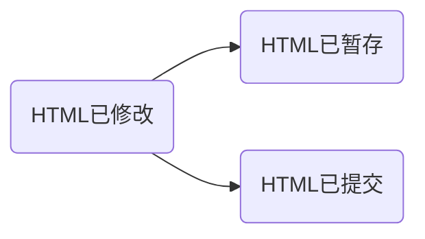
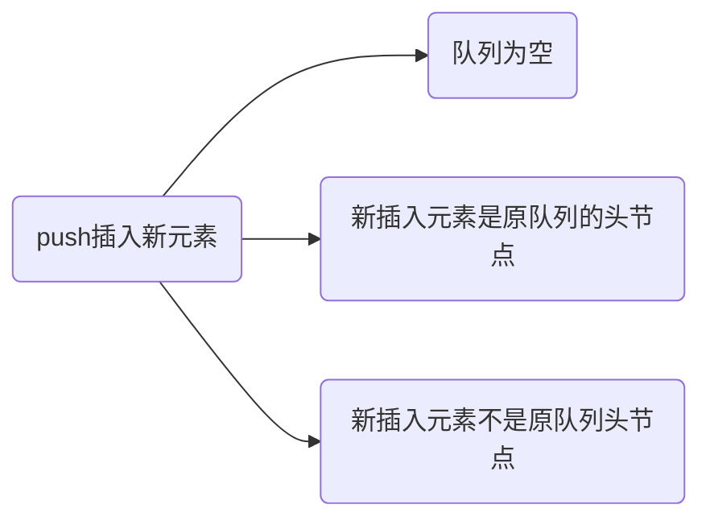
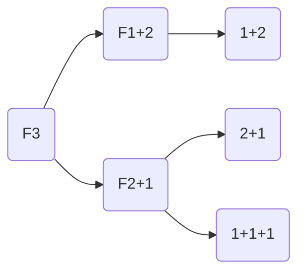
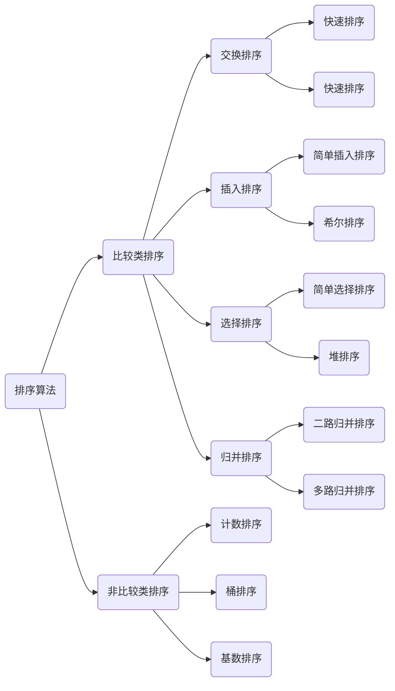

# JavaScript-LeetCode

## 我的LeetCode刷题笔记


#### 什么是Git？

git是一个分布式的版本控制软件——作者Linus


#### 什么是版本控制？

多人协作，共同修改，修改版本


#### Git提交流程：



提交本低修改文件到暂存区

```sh
git add +文件名
```

将文件放到提交区

```shell
git commit -m ""
```

查看仓库的提交状态

```shell
git status
```


```shell
git log
```

查看提交记录：


#### 训练营作业提交流程


原仓库与现仓库之间彼此独立，原仓库不会影响到fork的仓库


#### 如何高效学习算法和数据结构

三分看视频理解，七分联系

##### 视频

最佳办法：1.5~2.0倍速播放、难点（暂定+反复）

最差办法：类似看剧，原速看完，仅一遍

##### 类比

Keep健身


#### Leetcode高效刷题

##### 刷哪些题？

1. 高频题目

   leetcode热题100

   剑指offer 67

   GitHub：https://github.com/CyC2018/CS-Notes/blob/master/notes/Leetcode%20%E9%A2%98%E8%A7%A3%20-%20%E7%9B%AE%E5%BD%95.md

2. 针对弱项刷题 ---> 刷20道

   二分查找/dp/bfs/dfs/字符串匹配算法

3. 针对面试的公司刷题

   面试公司的题库

##### 刷题三部曲

1. 选择一门合适的语言

2. 深入理解基础的数据结构

    知道具体每一个步骤是干什么的，例入二分，使用场景是哪里，时间复杂度

    推荐网站：https://visualgo.net/zh/bst

3. 按照特定模块进行系统性刷题

    按照不同的算法（大话数据结构）

4. 每天刷多长时间

   （1）选择一个固定的时间段

   （2）可以给自己一个做题时间，做不出就去看答案

5. 刷题

   （1）理解题目意思

   （2）看数据量选择算法

   （3）判断临界条件

   （4）有思路就写，没有思路就将自己知道的算法想一遍，看看哪个更匹配这道题

   （5）看题解过程

#### 最后

再次刷题

对之前做过的题目进行巩固

按照科学的方法刷题，事半功倍


#### 承认其复杂性

1. 数据结构和算法有其客观存在的复杂度
2. 一遍或两遍不理解，很正常（**坚持五毒神掌**）
3. **脑图+反复（五毒神掌）是最为有效的办法**


#### 摒弃“旧”习惯-最重要

##### 不要死磕（传统方法）

五毒神掌（敢于放手，敢于死记硬背代码）

不懒于看高手代码（高赞题解、评论）

##### 最佳方法

5分钟想不出来，直接看题解或者高票代码，用五毒神掌变成自己的东西。

这个过程：觉得自己很菜甚至有点自卑，但是有借势而起的感觉。

##### 最差方式

看到题目自己单挑一下，不借助外部帮助自己解决；以为15-30分钟可以搞定，谁知道死磕了2-3小时或者一晚上，终于“通过” --> 精疲力尽，没精力学习高票程序答案，就开始做下一题（或放弃）


#### 误区

1. 忘记践行五毒神掌（有规律地过遍数）
2. 谨记“通过”只是开始，关键要看高票代码和高质量题解！（官方题解较为复杂）先广度优先再深度优先
3. LeetCode题目不能只做一遍


#### 线上课程

预习——基础知识自己预习和查看

课堂互动——跟着一起思考、回答问题

课后作业——按照切题办法


#### 期待效果

职业顶尖级别-对于算法数据结构地理解

一线互联网公司面试

**LeetCode 300+积累**


#### 学习步骤

1. chunk it up 切碎知识点
2. 刻意练习
3. feedback 总结反馈（看高手代码-->学习）


#### 数据结构知识脉络

1. 一维数据结构

   基础：数组（Array），链表(linked list)

   高级：栈stack，队列queue，双端队列deque，集合set，映射map（hash or map）

2. 二维数据结构

   基础：树tree，图graph

   高级：二叉搜索树binary search tree（red-black tree，AVL），堆heap，并查集disjoint set，字典树Trie

3. 特殊数据结构

   位运算Bitwise，布隆过滤器BloomFilter

   LRU Cache


#### 算法

If-else,switch --> brand

for, while loop --> Iteration 

递归Recursion (Divide/Conqur/Backtree)

搜素search：深度优先搜索Depth first search，广度优先搜索 Breadth first search

动态规划 Dynamic Programming

二分查找 Binary Search

贪心 Greedy

数学 Math，几何 Geometry


#### 刻意练习

过遍数 --> 五毒神掌

练习缺陷、弱点地方

不舒服，枯燥 --> 在成长


#### 反馈

及时反馈

主动型反馈（自己去找）

   -高手代码（GitHub，leetcode）

   -第一视角

被动式反馈（高手给你指点）

   -code review

   -评语


#### 刷题技巧（五遍刷题法）

##### 切题四件套

Clarification - 确保对题目的理解是正确的

Possible solutions - 把所有可能的方法过一遍（时间&空间复杂度）

Coding - 多写

Test cases - 测试样例

##### 五遍刷题法（任何一个题目做5遍）

**1.刷题第一遍：**

5分钟：读题+思考

直接看解法：注意！多解法，比较解法优劣

背诵、默写好的解法

**2.刷题第二遍：**

马上自己写 -> LeetCode提交

多种解法比较、体会 -> 优化！

**3.刷题第三遍：**

过了一天，再重复做题

不同解法的熟练程度 -> 专项练习

**4.刷题第四遍：**

过了一周：反复回来练习相同题目

**5.刷题第五遍**

面试前一周恢复性训练


#### 小结

职业训练：拆分知识点、刻意练习、反馈

五步刷题法（五毒神掌）

做算法题的最大误区：只做一遍


#### 训练环境设置

默认浏览器：chrome

Windows：Microsoft new terminal

编译器：Vscode

插件：Leetcode插件

LeetCode：去掉网址中的CN，可以去到国际站的讨论区的最优解（Most Votes）

##### Code Style - google research

if ( ) 

##### 快捷键

跳转到行头、行尾

全选粘贴


##### 自顶向下的编程方式

现代代码写作方式：类似于新闻的方式；最关键的函数写在上面，子函数写在下面

以主干逻辑为主，先解决主干逻辑


#### 算法的时间复杂度

Big O notation

O(1): Constant Complexity 常数复杂度

```java
int n = 1000; 
System.out.println("Hey - your input is: " + n);
```

O(log n): 对数复杂度

当n=4时，循环只会执行两次

```java
for (int i = 1; i < n; i = i * 2) { 
    System.out.println("Hey - I'm busy looking at: " + i);}
```

O(n): 线性时间复杂度

```java
for (int i = 1; i <= n; i++) { 
    System.out.println("Hey - I'm busy looking at: " + i);}
```

O(n^2): 平方

```java
for (int i = 1; i <= n; i++) { 
    for (int j = 1; j <=n; j++) { 
        System.out.println("Hey - I'm busy looking at: " + i + " and " +
j); }
}
```

O(n^3): 立方

O(2^n): 指数

O(n!): 阶乘

注意：只看最高复杂度的运算

**O(k^n): 指数**

```java
int fib(int n){
    if(n<2)return n;
    return fib(n-1) + fib(n-2);
}
```


写程序要对时间复杂度和空间复杂度有理解；用最简单的时间和空间复杂度写代码就是最优解


#### 递归

时间复杂度计算：画出递归树


计算时间复杂度：查看return 后面一共加了多少项

每层有两个节点，每增加一个节点，所需要计算的数是按2^n上升的


##### 主定理（重要）


思考


二叉树的每个节点访问且仅访问一次

图的每个节点访问且只访问一次

搜索算法（DFS/BFS）访问的节点只访问一次

二分查找：参考递归


#### 算法的空间复杂度

1. 数组的长度（数组的长度就是空间的复杂度）
2. 递归的深度（递归的深度就是空间的复杂度）

#### Example

爬楼梯问题的空间复杂度分析

```java
class Solution {
    public int climbStairs(int n) {
        if(n==1)
            return 1;
        if(n==2)
            return 2;
        int a=1,b=2,temp;
        //从第三阶开始 都是前两阶的和
        // 因为要么爬一步上去(此时在n-1阶)  要么爬两步上去(在n-2阶)
        for(int i=3;i<=n;i++){
            temp=a;
            a=b;
            b=temp+a;
        }
        return b;
        //实际上就是斐波那契数列 但是递归会超出时间限制 climbStairs(n-1)+climbStairs(n-2);
    }
}
```


空间复杂度---->查看树的深度，树形递归有n层因此空间复杂度为O(n)

#### 小结

常用工具配置

基本功和编程指法


#### Week01

##### Array

javascript

```javascript
let x = [1,2,3];
```

**内存地址**

 

在内存中开辟了一段内存地址，访问任何一个元素的时间复杂度都是一样O(1)

##### Array增加元素


时间复杂度O(n) --> 好的情况下只需要插入末尾O(1), 坏的情况下要挪动整个数组

##### Array删除元素


##### Linked List


##### 链表的类型


##### 创建链表（用Java实现）

```java
public class LinkedList{
    static class ListNode( //每个节点包括value，next指针
        int val;
        ListNode next;)
        public ListNode(int val){
           this.val = val;
    }
    ListNode head;
    ListNode tail;
    int size;
    public LinkedList(){ //初始化链表
        head = null;
        tail = null;
        size = 0;
    }
}
```

##### 用JavaScript创建单链表

每个node中包含element和next指针

```javascript
function LinkedList(){
    var length =0;
    var head = null;

    var Node = function (element) { //define Node --> Node includs element,next
        this.element = element;
        this.next = null;
    };

    this.size = function () {
        return length;
    };

    this.head = function () {
        return head;
    };
```

最后一个元素的next指针指向空

双向链表：前后都有指针

循环链表：尾指针指向头指针

##### Linked List 增加结点

##### 插入元素的3种方式：


##### Java实现

```java
public void insert(int position,int number){
    if(position > size){
        return;
    }
    ListNode newNode = new ListNode(number);
    if(position == 0){ //采用头插法
        newNode.next = head;
        head = newNode;
        if(tail == null){ //整个链表只插入了一个元素
            tail = newNode;
        }
        size++
    }else if(position == size){//采用尾插法
        this.append(number);
    }else{
        ListNode prev = head; //ListNode用来寻找插入位置
        for(int i=0;i<position - 1;i++){
            prev = prev.next;
        }
        ListNode next= prev.next;
        newNode.next = next;
        prev.next = newNode;
    }
}

public void append(int number){
    ListNode newNode = new ListNode(number);
    if(tail == null){
        tail = newNode;
    }else{
        tail.next = newNode;
        tail = newNode;
    }
    size++;
}
```

##### JavaScript创建

```javascript
// Add function
    this.add = function (element) {
        var node = new Node(element);
        if(head ===null){//如果head指向null说明原链表中没有结点，因此add结点后head指向新结点node
            head = node;
        }else{
            var currentNode = head;
            while(currentNode.next){
                currentNode = currentNode.next; //依次向后移动
            }
            currentNode.next = Node;
        }
        length++;
    };
```

##### Linked List 删除结点


缺点：访问链表中的任何一个数的操作变得不简单

```java
public void delete(int number){
    if(head!=null && head.val == number){ //头节点就是想要删除的结点
        head = head.next;
        size--;
        if(size==0){ //删除结点后不存在其他节点
            tail=head;
        }
    }else{
        ListNode prev = head; //ListNode->去寻找要删除的节点
        ListNode cur = head;
        while(prev!=null && cur !=null){
            if(cur.val==number){
                if(cur==tail){ //要删除的元素在tail
                    tail = prev;
                }
                prev.next = cur.next;
                size--;
                return;
            }
            prev = prev.next;
            cur = cur.next; //没找到就一直继续
        }
    }
}
```

##### Linked List - Insert

```java
public int search(int number){
    ListNode cur = head;
    for(int index=0;cur!=null;index++){
        if(cur.val == number){
            return index;
        }
        cur = cur.next;
    }
    return -1;
}
```

##### Linked List - Update

```java
public int search(int oldValue, int newValue){
    ListNode cur = head;
    for(int index=0;cur!=null;index++){
        if(cur.val == oldValue){
            cur.val = newValue;
            return index;
        }
        cur = cur.next;
    }
    return -1;
}
```

##### Linked List时间复杂度


prepend --> 在头节点插入

append --> 在末尾插入

insert & delete --> 只需要做两个操作（常数次）

##### Array List 时间复杂度


##### Linked List 时间复杂度

插入：O(n)

删除：O(n)

查找：O(n)

更新：O(n)


#### 跳表

链表元素有序的时候

跳表的特点


##### 如何提高链表线性查找的效率？

添加第一级索引


通过第一级索引对原始链表进行索引，元素就locate在大于且小于之间


##### 添加第二级索引


##### 添加多级索引


##### 跳表查询的时间复杂度


##### 跳表的空间复杂度的分析


#### 小结

跳表：升维思想 + 空间换时间


#### 题目练习

##### 移动零

练习步骤：

1. 5-10分钟：读题和思考

2. 有思路：自己开始做和写代码；不然，马上看题解

3. 默写背诵，熟练

4. 第二遍开始自己写


思路：

1. 每次在走的时候就统计0的个数，对于非0元素挪到没有0的元素去
2. 开一个新数组，碰到0往后放  //不符合题意
3. 索引方式

方法I：暴力解法   

首先对数组进行遍历，判断每一个元素是否为0，0的排到后面去，非0的排在前面

（时间慢）

解题思路：

(1) 寻找数组中不为0的元素--j用来统计数组中不为0的数

(2) 找到后存放在tmp中

(3) 将这个数原本的位置存放成

(4) 将这个不为0的数放到前面

```javascript
var moveZeroes = function(nums) {
    let j=0;
    for(i=0;i<nums.length;i++){
        if(nums[i] != 0){
           var tmp = nums[i];
           nums[i] = 0;
           nums[j] = tmp;
            j++;
        }
    }
}
```

方法II --> 优解

首先将非0的元素移动到数组的前面，计算0的个数

从count计数后面开始向nums数组补零

```javascript
var moveZeroes = function(nums) {
    let count=0;
    for(let i=0;i<nums.length;i++){
        if(nums[i]!=0){
            nums[count] = nums[i];
            count++;
        }
    }
    for(let j=count;j<nums.length;j++){
        nums[j] = 0;
    }
}
```

##### 更改测试样例-leetcode


#### 去国际站找最优解

复制网址-去掉网址中的cn-去找最优解

##### 盛水最多的容器

https://leetcode-cn.com/problems/container-with-most-water/

解题思路：

1. 枚举：left bar, right bar, (x-y) * height_diff  --->O(n^2)

```javascript
var maxArea = function(height) {
    let max = 0;
    for(var i=0;i<height.length-1;i++){
        for(var j=i+1;j<height.length;j++){
            var area = (j-i)*Math.min(height[i],height[j]);
            max = Math.max(max,area);
        }   
    }
    return max;
};
```

2. 双指针夹逼：

根据面积计算规则，面积是由两个柱子的距离和柱子最低高度决定的。

所以，一开始前后指针指向第一根柱子和最后一根柱子，计算这两根柱子的面积，此时他们距离是最大的。
由于高度收到最低的限制，所以前后指针中高度最低的往中间移动，知道找到比它高的柱子（因为距离在减少，所以只有高度增大才有机会比之前的大），再重新计算面积，并和前面的比较，取最大值。

知道前后指针重合。

```javascript
var maxArea = function(height) {
    let max = 0;
    for(let i=0,j=height.length-1;i<j;){
        //先判断再减
        let minHeight = height[i] < height[j] ? height[i++]:height[j--];
        //此时已经进行横坐标缩小操作了，因此需要把1再加上
        let area = (j-i+1) * minHeight;
        max = Math.max(max,area);
    }
    return max;
};
```

最大误区：做题只做一遍

**优化的思想：空间换时间**

懵逼的时候：

（1）是否能暴力

（2）基本情况 --> 化繁为简

找最近重复子问题

if else/ for while/ recursion


##### 爬楼梯(本质：斐波那契数列)


**方法I：递归**

n = 1;  1

n = 2;  2

n = 3;  f(1) + f(2)   //第三级台阶是上到第二级台阶走两步；或者是上到第一级台阶走一步

n = 4; f(2) + f(3)

f(n) = f(n-1) + f(n-2)

```javascript
var climbStairs = function(n) {
    let result = [0,1,2];
    for(var i=3;i<=n;i++){
       result[i] = result[i-1] + result[i-2];
    }
    return result[n];
};
```

**方法II：滚动数组**

```javascript
var climbStairs = function(n) {
    let p=0,q=1
    for(let i=1;i<=n;i++){
        var r=p+q;
        p=q;
        q=r;
    }
    return r;
};
```


##### 加一


**解题思路：**

(1) 先判断最后一位是否等于9；如果不等于9的话，直接最后位+1并返回数组值

(2) 当最后一位为9时，令最后一位为0，并返回循环继续向上+1，直到return

(3) 当遍历完整个数组都无法找到不为9的数时，说明数组为[9,9,9,...,9];此时需要在第一位push0并返回数组

```javascript
var plusOne = function(digits) {
    for(let i=digits.length-1;i>=0;i--){
        // 0-8 -----> +1
        if(digits[i]!=9){
            digits[i]++;
            return digits;
        }
        // 9 ----> 0
        digits[i] = 0;
    }
    // [9,9,9,9] ---->第一位进位1
    digits[0] =1; // 把digits[0]=1 
    digits.push(0); // 在后面补一个0
    return digits;
};
```

##### 两数之和（高频考题）


**方法I：两层循环，枚举a和b如果a+b = target 那么返回**

```javascript
var twoSum = function(nums, target) {
    for(let i=0;i<nums.length-1;i++){
        for(let j=i+1;j<nums.length;j++){
            if(nums[i]+nums[j]== target){
                return [i,j];
            }
        }
    }
};
```

**方法II：哈希表O(n)**

(1) 将nums[i] 放入到hash table中

(2) 查看target - nums[i] 是否在hash table里

```javascript
var twoSum = function(nums, target) {
    let map={};
    for(let i=0;i<nums.length;i++){
        let n=target - nums[i];
        if(n in map) return [i,map[n]]; 
        map[nums[i]] = i; 
    }
};
```


##### 验证回文


**解题思路：**

正则+双指针

注意：数字也可以当做回文，因此在正则中需要把数字也匹配上

```js
var isPalindrome = function(s) {
    s = s.toLowerCase().match(/[a-z0-9]+/g)
    // 如果s是空字符串的话，那么它是回文字符
    if(!s) return true
    s = s.join('')
    let left = 0;
    let right = s.length - 1;
    while(left<right){
        if(s[left]!==s[right]){
            return false;
        }
        left++;
        right--;
    }
    return true
};
```


##### 验证回文字符串II


**解题思路**：

由于可以进行删除操作，那么将指针向左移动一位或向右移动一位时，依然符合回文字符串的

就符合题意

```js
function f(s) {
    s.split("")   //[a,b,c,d,c,b,a]
    let count = 0
    let left = 0;
    let right = s.length - 1;
    function isRem(left,right,s) {
        while(left<right){
            if(s[left] !== s[right]){
                return false;
            }
            left++;
            right--;
        }
        return true;
    }

    while(left<right){
        if(s[left] !== s[right]){
            return  isRem(left+1,right,s) || isRem(left,right-1,s)
        }
        left++;
        right--;
    }
    return true
}
```


##### 三数之和（高频考题）


**审题：**

1. 返回**不重复**的三元组
2. 会有复数，无序
3. 可能不存在（实际要求返回空数组）
4. a + b = -c
5. 数组内有重复数字，结果有可能有重复

**解题思路：**

方法I ： 暴力求解

找出两个数 a+b = -c (target不是一个定值)

方法II：hash + 两重暴力（将target--> -c 保存到hash表里）

方法III：双指针左右夹逼


https://leetcode-cn.com/problems/3sum/solution/3sumpai-xu-shuang-zhi-zhen-yi-dong-by-jyd/

Code: 

```javascript
var threeSum = function (nums) {
    const res = []
    const len = nums.length
    nums.sort((a, b) => a - b) // 升序排列

    for (let i = 0; i < len - 2; i++) {
        if (nums[i] === nums[i - 1]) continue // 如果第一位位i有一样的，就直接进位

        let left = i + 1, right = len - 1

        while (left < right) {
            let sum = nums[i] + nums[left] + nums[right]
            if (sum === 0) {
                // 这一行注意
                // 在push的时候，用后++法传入原始值并做双指针+-
                res.push([nums[i], nums[left++], nums[right--]])

                // 判断左右指针是否和上一次一样，一样就跳到下一个去重
                while (nums[left] === nums[left - 1]) left++
                
                // 看其他人没写right++，其实要写的，因为left变了，right一定要变
                // 如果right还和上次一样，肯定不会sum = 0
                while (nums[right] === nums[right + 1]) right--
            } else {
                // 如果三个数没凑成0，就看是大了还是小了，大了就-right，小了+left
                if (sum > 0) right--
                if (sum < 0) left++
            }
        }
    }
    return res;
};
```

##### 合并两个有序数组


**方法I：暴力解法-->O(n)**

```javascript
 var merge = function(nums1, m, nums2, n) {
     if(n==0) return nums1;
     for(let i=0;i<n;i++){
         nums1[m+i] = nums2[i];
     }
     return nums1.sort((a,b)=>(a - b));
 }
```

**方法II：快速解法**

从num1中取m个数，从num2中取n个数，最终数组的长度m+n-1

分别从1和2中选取较大的数依次填入num1中

```javascript
var merge = function(nums1, m, nums2, n) {
    if(n==0) return nums1;
    let idx1 =m-1,idx2=n-1,idx3=m+n-1
    while(idx2>=0){    
        nums1[idx3--]=nums1[idx1]>nums2[idx2]?nums1[idx1--]:nums2[idx2--];
    }
    return nums1;
};
```

##### 旋转数组


**需要思考的点：**

(1) 当k=0时，返回的值

(2) 当k>nums.length时，数组如何移动5

**方法I：暴力解法（LeetCode不让通过）**

array.pop() ---->删除数组中最后一个元素

array.unshift()  ---> 向数组开头加入一个元素

```javascript
 var rotate = function(nums, k) {
     for (let i = 0; i < k; i++) {
         nums.unshift(nums.pop());
     }
     return nums;
 };
```

**方法II：快速解法**

nums.splice(-k)   --->从尾部移除倒数第k个元素

... => 将二维数组降维成一维数组

```javascript
var rotate = function(nums, k) {
    k %= nums.length; //找出k移动的距离
    if(k === 0) return;
    nums.unshift(...nums.splice(-k));
    return nums;
};
```

**方法III：空间复杂度O(1)**

**reverse-3:**

(1) 将数组从结尾向头进行翻转

nums=[1,2,3,4,5,6,7] ----> nums=[7,6,5,4,3,2,1]

(2) 对0->k-1 的数组进行反转(k=3)

nums=[5,6,7,4,3,2,1]

(3) 再对 k->length -1 的数组进行反转

nums=[5,6,7,1,2,3,4]

```javascript
const reverse = (nums, from, to) => {
    for (let i = from, j = to; i < j; i++, j--) {
        let t = nums[i];
        nums[i] = nums[j];
        nums[j] = t;
    }
}

var rotate = (nums, k) => {
    k = k % nums.length; //当k值大于数组时，取余为0，返回的是数组原来的值
    reverse(nums, 0, nums.length - 1);
    reverse(nums, 0, k - 1);
    reverse(nums, k, nums.length - 1);
    return nums;
};
```

##### 删除有序数组中的重复项


**解题思路：**

方法I：“移动零解法”---->时间复杂度O(n)/空间复杂度O(1)

首先将非重复的元素放到数组的前面，并计录非元素的个数count

将count数组后面的元素从数组中移除

```javascript
var removeDuplicates = function(nums) {
    let count = 0;
    for(let i=0;i<nums.length;i++){
        if(nums[i]!=nums[i-1]){
            nums[count] = nums[i];
            count++;
        }
    }
    for(let j=nums.length-1;j>=count;j--){
        nums.pop(nums[j]);
    }
};
```


##### Linked List定义

链表中的每一个元素指向下一个元素，每一个node里包含element 和 next元素

##### 用JavaScript手动实现链表的功能

```javascript
function LinkedList(){
    var length =0;
    var head = null;

    var Node = function (element) { //define Node --> Node includs element,next
        this.element = element;
        this.next = null; //next指针指向空
    };

    this.size = function () {
        return length;
    };

    this.head = function () {
        return head;
    };
```

##### 用JavaScript实现add / remove / isEmpty / Find 功能

##### Add Function

```javascript
this.add = function (element) {
    var node = new Node(element);
    if(head ===null){//如果head指向null说明原链表中没有结点，因此add结点后head指向新结点node
        head = node;
    }else{
        var currentNode = head;
        while(currentNode.next){
            currentNode = currentNode.next; //依次向后移动
        }
        currentNode.next = Node;
    }
    length++;
};
```

##### Remove Function

```javascript
this.remove = function (element) {
    var currentNode = head;
    var previousNode;
    if(currentNode.element ===element)//如果要删除的元素就在头节点
        head = currentNode.next; //那么直接让头节点指向下一个节点处
else{
    while(currentNode.element !== element){ //一直找到要删除的element的所在地
          previousNode = currentNode;
          currentNode = currentNode.next;
    }
         previousNode.next = currentNode.next;
  }
   length --;
};
```

##### isEmpty Function

```javascript
this.isEmpty = function () {
    return length ===0;
};
```

##### Addat Function

```javascript
this.addAt = function (index,element) {
    var node = new Node(element); //想要插入的node

    var currentNode = head; //在一开始的时候，currentNode在head
    var previousNode;
    var currentIndex = 0;

    if(index>lenght) { //如果要插入的index大于linkedlist长度
        return false; 
    }
    if(index ==0){ //插入头结点
        node.next = currentNode; //var currentNode = head;
        head = node; //将node放在head的位置
    }else{
        while(currentNode < index){ //go through each index until we find the correct index
            currentIndex++;
            previousNode = currentNode;
            currentNode = currentNode.next;
        }
        node.next = currentNode; //插入node
        previousNode.next = node;
    }
    length++;
}
```

##### Linked List 题目：

面试前一定要再写一遍高频题！！

##### 链表的解题法：


##### 1.反转链表


##### 方法I：双指针


##### 解题思路：

curr是一个帮助prev & next 定位的指针

curr & next 永远指向同一个节点； prev指向curr的前一个节点

##### 移动需要4个步骤：

(1) next走到curr.next

(2) curr.next 指向prev

(3) prev走到curr的位置

(4) curr走到next现在的位置

##### 需要prev,curr,next三种元素的原因：

next需要去占住位置，prev必须要在curr移动前去到next所占住的位置

##### Attention：最后的返回值应该是prev，指针的位置---> 因为改变的是指针的指向，因此应该返回prev

```javascript
var reverseList = function(head) {
    let prev=null;
    let curr= next = head;
    while(curr){
        next = curr.next;
        curr.next = prev;
        prev = curr;
        curr = next;
    }
    return prev;
};
```

##### 2. 两两交换链表中的结点


```javascript
var swapPairs = function(head) {
    if(head ===null) return null;
    if(head.next ===null) return head;
    let n1 = head.next;
    let n2 = head.next.next;
    n1.next = head;
    head.next = swapPairs(n2);
    //为什么返回值是n1？
    //因为在进行节点交换之后，n1变成了头节点的指针
    return n1;
};
```

##### 3. 环形链表


方法I：遍历列表，hash/ set 记录下来访问过的所有节点，查看原来的指针是否有重复元素，有则

方法II：快慢指针，快指针一次走一个格，慢指针一次走两个格，如果有环的话，快慢指针会相遇


https://leetcode-cn.com/problems/linked-list-cycle/solution/141-huan-xing-lian-biao-shuang-zhi-zhen-zhao-huan-/

Attention: && 和 & and | 和||的区别

**在JavaScript中“&&”和“||”是逻辑运算符；“&”和“|”是位运算符**

```javascript
var hasCycle = function(head) {
    if(head ===null) {
        return false;
    }
    let slow = head;
    let fast = head;
    // 因为快指针一次走两步，因此需要对fast.next.next也进行判断
    while(fast.next !==null && fast.next.next !==null){
         slow = slow.next;
         fast = fast.next.next;
         if(slow ===fast){
             return  true;
         }
    }
    // 如果fast指针走到头，快慢指针还没有相遇，那么链表中没环
    return  false;
};
```

##### 4. 环形链表II


##### 解题思路：

弗洛伊迪算法：

分别设置slow, fast两个指针，当两个指针相遇时，另fast回到链表的头部; 当slow，fast再次相遇时的点就是环形链表的入口位置

##### 分析有效性：


fast ---> 8 & slow --->4 ---> fast比slow每次都多走一步

环状链表---> fast想要追赶上slow需要走d-l步，当slow走了d-l步时，slow==fast，此时 l =d -l => d = l

因此想要知道环形链表的入口位置，只需要另fast回到起始位置，当fast==slow时，位置就是环形链表的入口位置

##### Code:

```javascript
/**
 * Definition for singly-linked list.
 * function ListNode(val) {
 *     this.val = val;
 *     this.next = null;
 * }
 */

/**
 * @param {ListNode} head
 * @return {ListNode}
 */
var detectCycle = function(head) {
    if(!head || !head.next) return null;
    let slow = head;
    let fast = head;
    let isCycle = false;
    while(fast.next && fast.next.next){
        slow = slow.next;
        fast = fast.next.next;
        if(slow == fast) {
            isCycle = true;
            break;
        }
    }
    if(!isCycle) return null;
    fast = head;
    while(fast !== slow){
        slow = slow.next;
        fast = fast.next;
    }
    return fast;
};
```

##### 5. 合并两个有序链表


**解题思路**：

方法I：暴力解法 --->时间复杂度O(M+N)  &  空间复杂度O(1)

设置一个prev指针，分别遍历L1 & L2链表，prev指向L1 / L2中较大的值

方法II：开辟新链表法 ----> 时间复杂度O(Math.max(M,N)) & 空间复杂度O(N)

```javascript
var mergeTwoLists = function(l1, l2) {
    let curr = new ListNode();
    //最后返回的是整个链表，但是curr此时已经走到链表的最后；因此需要在开头设置一个变量最后return链表的值
    let dummy = curr;
    while(l1 !==null && l2!==null){
        if(l1.val<l2.val){
            curr.next = l1;
            l1 = l1.next;
        }else{ // l2中的值小于l1
            curr.next = l2;
            l2 = l2.next;
        }
        curr = curr.next; //新开辟的链表往后挪动一位
    }
    //当完成遍历之后，此时会出现l1 or l2中仍然有值得情况
    if(l1 !==null){
        curr.next = l1;
    }
    if(l2 !== null){
        curr.next = l2;
    }
    return dummy.next;
};
```

##### 6. 删除有序链表中的重复项


##### 解题思路：

链表中的删除操作 => 当发现重复元素时，指针跳过当前元素直接指向下一个不重复的元素

```javascript
var deleteDuplicates = function(head) {
    var cur = head;
    while(cur && cur.next) {
        if(cur.val == cur.next.val) {
            cur.next = cur.next.next;
        } else {
            cur = cur.next;
        }
    }
    return head;
};
```

##### 7. 反转链表II


##### 解题思路：

两个步骤：

(1) 反转left至right之间的链表

(2) 将反转后的链表与原链表拼接

```javascript
var reverseBetween = function(head, left, right) {
    let prev = null;
    let curr = head;
    let next = head;
    
    //第一步：找到left的位置
    for(let i=1;i<left;i++){
        prev = curr;
        curr = curr.next;
    }
    
    //在这里需要占住prev和curr的起始位置
    let prev2 = prev;
    let curr2 = curr;
    
    //反转中间部分的链表
    for(let j=left;j<=right;j++){
        next = curr.next;
        curr.next = prev;
        prev = curr;
        curr = next;
    }
    
    // 将反转后的链表与之前的部分进行拼接
    if(prev2 !==null){
        prev2.next = prev; //段的拼接
    }else{
        head = prev; //如果是从head部分开始反转，则需要将头部进行拼接
    }
    curr2.next = curr;
    return head;
};
```


#### Week 02

#### 栈、队列、双端队列、优先队列


##### 用JavaScript实现Queue

```javascript
//创建一个队列的类
class Queue{
    constructor(){
        this.count = 0;//记录队列的数量
        this.lowestCount = 0;//记录当前队列头部的位置
        this.items = [];//用来存储元素。
    }
    
    //Add element
    enqueue(element){
        this.items[this.count] = element;
        this.count++;
    }

    //delete element
    dequeue(){
        if(this.isEmpty()){
            return null;
        }
        let resulte = this.items[this.lowestCount];
        delete this.items[this.lowestCount];
        this.lowestCount++;
        return resulte;
    }

    //查看队列头部元素
    peek(){
        return this.items[this.lowestCount];
    }

    // 判断队列是否为空
    isEmpty(){
        return this.count - this.lowestCount === 0;
    }

    //清除队列中的所有元素
    clear(){
        this.count = 0;
        this.lowestCount = 0;
        this.items = [];
    }

    // 查看队列的长度
    size(){
        return this.count - this.lowestCount;
    }

    //查看队列中所有的元素
    toString(){
        if(this.isEmpty())return "queue is null";
        let objString = this.items[this.lowestCount];
        for(let i = this.lowestCount+1; i < this.count;i++){
            objString = `${objString},${this.items[i]}`;
        }
        return objString;
    }
}
```


查询O(n) --> 因为队列无序


#### Priority Queue


优先队列：优先从大到小排列，将头结点指向数字最大的位置

Define Priority Queue

```java
public class PriorityQueue{
    static class Node{
        int value;
        int priority;
        Node next;
    
    public Node(int value,int priority){
        this.value = value;
        this.priority = priority;
    }
  }
   Node head = null;
}
```

push：插入一个新的元素（时间复杂度O(n)）



```java
public void push(int value,int priority){
    if(head == null){
        head = new Node(value,priority);
        return;
    }
    Node cur = head;
    Node newNode = new Node(value,priority);
    if(head.priority<priority){
        newNode.next = head;
        this.head = newNode;
    }else{
        while(cur.next!= null && cur.next.priority>priority){
            cur = cur.next;
        }
        newNode.next = cur.next;
        cur.next = newNode;
    }
}
```

插入push的时间复杂度：O(1)

找出peek的时间复杂度：O(log n) --> 按照优先级取出

```java
public Node peek(){
    return head;
}
public Node pop(){
    if(head == null){
        return null;
    }
    Node temp = head;
    head = head.next;
    return temp;
}
public boolean isEmpty(){
    return head == null;
}
```


##### 实战题目：

**1.有效的括号**


##### 解题思路：

1. 暴力：不断replace匹配的括号，一直到最后不能替换的时候字符串为空

```javascript
var isValid = function (s) {
    while(s.length){
        var temp = s;
        s = s.replace('()','');
        s = s.replace('[]',"");
        s = s.replace('{}','');
        if(s == temp) return false
    }
    return  true;
}
```

2. Stack：判断如果元素是左括号则进行入栈操作，如果是右括号则与之前进栈的元素进行比较，匹配则进行删除操作，如果都匹配则栈为空

```javascript
var isValid = function(s) {
    let map = { // 定义一个匹配库，并且利用键值和，进行比较判断是否匹配
        '(':-1,
        ')':1,
        '{':-2,
        '}':2,
        '[':-3,
        ']':3
    }

    let stack = [] 
    for(let i=0;i < s.length;i++){ 
        if(map[s[i]] < 0){ 
            stack.push(s[i]) 
        }else { 
            let last = stack.pop() 
            if(map[last] + map[s[i]] != 0){ 
                return false;
            }
        }
    }
    if(stack.length > 0) return false; 
    return true 
};
```

##### 2.最小栈


##### 思路分析:

题目中的push(x)，pop()，top()操作都可以直接调用Stack的API实现。getMin()检索栈中最小元素这个方法的实现，可以借助一个辅助栈。

初始化两个栈，一个是stack用于对元素x进行入栈、出栈操作；一个是辅助栈min，用于存储stack中已存元素中的最小元素。这里辅助栈的入栈操作是和元素x放入栈stack同步的，也就说stack中每入栈一个元素，min中相应的要存入当前最小元素。

##### 如何判断当前最小元素

两种情况：

（1）min栈中没有值，任何值都是起始栈的最小值因此需要存入Infinity

（2）min栈中有值，需要讲min中值提出来与新加入的x进行对比，将较小者放进栈中

##### 动画演示：https://leetcode-cn.com/problems/min-stack/solution/dong-hua-yan-shi-155-zui-xiao-zhan-by-ha-dnp9/

```javascript
var MinStack = function() {
    this.stack = [];
    this.min = []; //min中只保存比stack中小的元素
};

MinStack.prototype.push = function(x) {
    //初始化最小栈值的操作，如果最小栈内没元素则min=Infinity;若有元素，则另min=min[this.min.length-1]
    let min = this.min.length > 0 ? this.min[this.min.length-1] : Infinity;
    this.stack.push(x);
    this.min.push(Math.min(x, min));
};

MinStack.prototype.pop = function() {
    this.stack.pop();
    this.min.pop();
};

MinStack.prototype.top = function() {
    return this.stack[this.stack.length-1];
};

MinStack.prototype.getMin = function() {
    return this.min[this.min.length-1];
};
```

##### 3. 用队列实现栈


##### 解题思路：

push() ----> 从数组尾部添加元素

pop()  -----> 从数组尾部移除元素

```javascript
/**
 * Initialize your data structure here.
 */
var MyStack = function() {
    this.queue = [];
};

/**
 * Push element x onto stack.
 * @param {number} x
 * @return {void}
 */
MyStack.prototype.push = function(x) {
    this.queue.push(x);
};

/**
 * Removes the element on top of the stack and returns that element.
 * @return {number}
 */
MyStack.prototype.pop = function() {
    // pop()从尾部弹出一个元素
    return this.queue.pop();
};

/**
 * Get the top element.
 * @return {number}
 */
MyStack.prototype.top = function() {
    return this.queue[this.queue.length-1];
};

/**
 * Returns whether the stack is empty.
 * @return {boolean}
 */
MyStack.prototype.empty = function() {
   return this.queue.length ==0;
};
```


##### 4. 用栈实现队列


```javascript

var MyQueue = function() {
    this.is = [];
    this.os = [];
};

MyQueue.prototype.push = function(x) {
    this.is.push(x);
};

MyQueue.prototype.pop = function() {
    if(!this.os.length){
        while(this.is.length){
            this.os.push(this.is.pop());
        }
    }
    return this.os.pop();
};

MyQueue.prototype.peek = function() {
    if(!this.os.length){
        while(this.is.length){
            this.os.push(this.is.pop());
        }
    }
    return this.os[this.os.length - 1];
};

MyQueue.prototype.empty = function() {
    return !this.is.length && !this.os.length;
};
```


##### 5. 设计循环队列


##### 解题思路：

用数组模拟队列

定义：queue数组，size长度，count记录数组中的数

enQueue: 当queue不为full时，queue.push(value) ，count++，返回true；否则返回false

deQueue: 当queue不为空时，queue.shift(),count--,返回true；否则返回false

Front: 当queue不为空时，return queue[0]

Rear: 当queue不为空时，return queue[this.queue.length-1]

isEmpty: this.count == 0

isFull: this.count == this.size

```javascript
/**
 * @param {number} k
 */
var MyCircularQueue = function(k) {
    this.queue = [];
    this.size = k;
    this.count = 0;
};

/**
 * @param {number} value
 * @return {boolean}
 */
MyCircularQueue.prototype.enQueue = function(value) {
     if(!this.isFull()){
         this.queue.push(value);
         this.count++;
         return true;
     }
     return false;
};

/**
 * @return {boolean}
 */
MyCircularQueue.prototype.deQueue = function() {
     if(!this.isEmpty()){
         this.queue.shift();
         this.count--;
         return true;
     }
     return false;
};

/**
 * @return {number}
 */
MyCircularQueue.prototype.Front = function() {
      if(!this.isEmpty()){
          return this.queue[0];
      }
      return -1;
};

/**
 * @return {number}
 */
MyCircularQueue.prototype.Rear = function() {
      if(!this.isEmpty()){
          return this.queue[this.queue.length-1];
      }
      return -1;
};

/**
 * @return {boolean}
 */
MyCircularQueue.prototype.isEmpty = function() {
     if(this.count == 0){
         return true;
     }
     return false;
};

/**
 * @return {boolean}
 */
MyCircularQueue.prototype.isFull = function() {
     if(this.count == this.size){
         return true;
     }
     return false;
};
```


##### 6. 设计循环双端队列


```javascript
/**
 * Initialize your data structure here. Set the size of the deque to be k.
 * @param {number} k
 */
var MyCircularDeque = function(k) {
    this.queue = [];
    this.size = k;
    this.count = 0;
};

/**
 * Adds an item at the front of Deque. Return true if the operation is successful.
 * @param {number} value
 * @return {boolean}
 */
MyCircularDeque.prototype.insertFront = function(value) {
    if(!this.isFull()){
        // unshift() 从头部插入一个元素
        this.queue.unshift(value);
        this.count++;
        return  true;
    }
    return  false;
};

/**
 * Adds an item at the rear of Deque. Return true if the operation is successful.
 * @param {number} value
 * @return {boolean}
 */
MyCircularDeque.prototype.insertLast = function(value) {
     if(!this.isFull()){
         // push()从数组尾部添加元素
         this.queue.push(value);
         this.count++;
         return true;
     }
     return false;
};

/**
 * Deletes an item from the front of Deque. Return true if the operation is successful.
 * @return {boolean}
 */
MyCircularDeque.prototype.deleteFront = function() {
     if(!this.isEmpty()){
         //shift() 从数组头部删除元素
         this.queue.shift();
         this.count--;
         return true;
     }
     return  false;
};

/**
 * Deletes an item from the rear of Deque. Return true if the operation is successful.
 * @return {boolean}
 */
MyCircularDeque.prototype.deleteLast = function() {
     if(!this.isEmpty()){
         //pop() 从数组尾部删除元素
         this.queue.pop();
         return true;
     }
     return false;
};

/**
 * Get the front item from the deque.
 * @return {number}
 */
MyCircularDeque.prototype.getFront = function() {
    if(!this.isEmpty()){
        return  this.queue[0]
    }
    return -1;
};

/**
 * Get the last item from the deque.
 * @return {number}
 */
MyCircularDeque.prototype.getRear = function() {
    if(!this.isEmpty()){
        return this.queue[this.queue.length-1];
    }
    return -1;
};

/**
 * Checks whether the circular deque is empty or not.
 * @return {boolean}
 */
MyCircularDeque.prototype.isEmpty = function() {
    if(this.queue.length == 0){
        return true;
    }
    return false;
};

/**
 * Checks whether the circular deque is full or not.
 * @return {boolean}
 */
MyCircularDeque.prototype.isFull = function() {
     if(this.queue.length ==this.size){
         return true;
     }
     return  false;
};
```


##### 7.柱状图中最大的矩形


##### 解题思路：

##### 方法I：暴力解法 --> 时间复杂度O(n^2)

```java
for i ->0, n-2
     for j -> i+1, n-1
          (i , j) --> 最小高度， area
           update max -> area
```
```javascript
var largestRectangleArea = function(heights) {
     let maxArea = 0;
     for(let i=0;i<heights.length;i++){
         let minHeight = heights[i];
         for(let j=i;j<heights.length;j++){
             minHeight = minHeight>heights[j]? heights[j]:minHeight;
             let area = minHeight * (j-i+1);
             maxArea = Math.max(maxArea,area);
         }
    }
    return maxArea;
};
```
##### 方法II：暴力加速法 -->  O(n^2)

确定矩形的高，分别向左右延申查看左右的边界

```java
for i -> 0, n-1
      //找到 left bound，right bound，
       area = height[i] * (right - left)
       update maxArea;
```

```javascript
var largestRectangleArea = function(heights) {
    let maxArea = 0;
    for(let i=0;i<heights.length;i++){
       let left = i-1;
       let right = i+1;
       while(left>=0 && heights[left]>=heights[i]){left--};
       while(right<heights.length && heights[right]>=heights[i]){right++};
       let area = heights[i] * (right - left-1);
       maxArea = Math.max(area,maxArea);
    }
    return maxArea;
};
```

##### 方法III：栈方法 ---->时间复杂度O(n)

优化思想--->找到左右边界的时候并不需要用循环，因为前面已经探过一遍了，因此可以使用栈去记录左右边界

维护栈---->从小到大--->大于则进栈，小于则处理栈


```javascript
var largestRectangleArea = function(heights) {
    // Add a zero-height element
    // so that we don't need to deal with last element of heights outside the for loop
    heights.push(0);
    // so that stack always have an extra element, thus `stack[stack.length - 1]` is always valid
    let stack = [-1];
    let maxArea = 0;
    for (let i = 0; i < heights.length; i++) {
        let stackTopElement;
        let minHeight = 0;
        while ((stackTopElement = stack[stack.length - 1]) !== -1 && heights[i] < heights[stackTopElement]) {
            stack.pop();
            minHeight = heights[stackTopElement];
            let count = i - stack[stack.length - 1] - 1;
            maxArea = Math.max(maxArea, minHeight * count);
        }
        stack.push(i);
    }
    heights.pop();
    return maxArea;
};
```


##### 8.滑动窗口最大值


##### 方法I：暴力解法O(n*k)

枚举窗口的起点位置 0 ---> length - k
写两个嵌套循环去

```javascript
var maxSlidingWindow = function(nums, k) {
    let res=[];
    let max=-Infinity;
    for(let i=0;i<nums.length-k+1;i++){
        for(let j=i;j<i+k;j++){
            let windows = nums[j];
            if(nums[j]>max) max=nums[j]
        }
        res.push(max);
        max = -Infinity;
    }
    return res;
};
```

##### 方法II：双端队列 O(n+k)

##### 解题思路：

双端队列q[0]用来存储遍历过的最大值

```javascript
var maxSlidingWindow = function(nums, k) {
    let res=[];
    let q=[];
    for(let i=0;i<nums.length;i++){
       while(q.length-1>=0 && nums[i]>q[q.length-1]) q.pop();
       q.push(nums[i]);
       const j=i-k+1;
       if(j>=0){
           res.push(q[0]);
           if(nums[j] ===q[0]) q.shift();//解决测试用例：[1,-1] 1
       }
    }
    return res;
};
```


#### Week03

#### 哈希表、映射、集合

哈希表（Hash table），也叫散列表，是根据关键码值（Key value ）而直接进行访问的数据结构。 它通过把关键码值映射到表中一个位置来访问记录，以加快查找的速度。 这个映射函数叫作散列函数（Hash Function），存放记录的数组叫 作哈希表（或散列表）

“lies”通过ASCII表中字母数据相加和，放入hash function中进行计算，最后返回int值是9；


哈希碰撞：经过hash function得到相同的index值时


拉链式解决冲突：在相同的位置拉出一个链表，将会发生冲突的元素依次存放在链表中


时间复杂度：增删改查O(1) --在不冲突的情况下

##### Java Code

•Map：key-value对，key不重复value可以重复

```java
- new HashMap() / new TreeMap()
- map.set(key, value)
- map.get(key)
- map.has(key)
- map.size()
- map.clear()
```

•Set：不重复元素的集合

```java
- new HashSet() / new TreeSet()
- set.add(value)
- set.delete(value)
- set.hash(value)
```

##### Python

```python
list_x = [1, 2, 3, 4]

map_x = {
‘jack’: 100,
‘张三’: 80,
‘selina’: 90,
…
}

set_x = {‘jack’, ‘selina’, ‘Andy’}
set_y = set([‘jack’, ‘selina’, ‘jack’])
```

##### map和set的区别 (JavaScript)

set和map的主要应用场景在 数据重构和数据存储

set是一种叫做集合的数据结构，map是一种叫做字典的数据结构

##### 集合和字典的区别

共同点：集合、字典 可以储存不重复的值

不同点：集合是以[value , value]的方式存储，字典是以[value , key]的方式进行存储

##### 集合（set）

ES6 新增的一种新的数据结构，类似于数组，但成员是唯一且无序的，**没有重复的值**

Set 本身是一种构造函数，用来生成 Set 数据结构

Set 对象允许你储存任何类型的唯一值，无论是原始值或者是对象引用

```javascript
// 定义一个集合
const numberSet = new Set();
// add function
numberSet.add(1);
numberSet.add(2);
numberSet.add(4);
numberSet.add(7);
console.log(numberSet); //{1,2,4,7}

// delete function
numberSet.delete(4);
console.log(numberSet); // {1,2,7}

// has function
console.log(numberSet.has(7)) //true

// 返回set的长度
console.log(numberSet.size) //3
```

注意：向 Set 加入值的时候，不会发生类型转换，所以`5`和`"5"`是两个不同的值。Set 内部判断两个值是否不同，使用的算法叫做“Same-value-zero equality”，它类似于**精确相等**运算符（`===`），主要的区别是**`NaN`等于自身，而精确相等运算符认为`NaN`不等于自身。**

##### 操作方法

```javascript
add(value);     //新增，相当于 array里的push
delete(value);   //存在即删除集合中value
has(value);  //判断集合中是否存在 value
clear(); //清空集合
```

##### 遍历方法

```javascript
keys(); //返回一个包含集合中所有键的迭代器。
values();  //返回一个包含集合中所有值得迭代器。
entries();  //返回一个包含Set对象中所有元素得键值对迭代器。
forEach(callbackFn, thisArg); 
//用于对集合成员执行callbackFn操作，如果提供了 thisArg 参数，回调中的this会是这个参数，没有返回值
```

#### 实战题目

##### 1.有效的字母词异位


异位词：字母出现次数一样，但是顺序不一样

##### 切题4步：

1.看清题意

2.找出最优（时间&空间复杂度最优）

3.写代码

4.测试样例

##### 解题思路

1. 暴力：将字符串按照从大到小sort，比较sorted array ==？ O（NlogN）

   ```javascript
   var isAnagram = function(s, t) {
       if(Array.from(s).sort().join(" ") == Array.from(t).sort().join(" ")){
           return true
       }else{
           return false
       }
   };
   ```

   

2. 哈希表：统计每个字符的频次，在s中进行加法，在t中进行减法，看最后结果是不是0

   step:

   构建 countS 和 countT两个列表，0-25分别代表26个字母

   统计不同的字母出现的频次 --> 建立26个数组分别代表a-z

   再对两个数组进行比较 --> 数组相等 => 两个数组中出现字母的频次相等
   
   ```javascript
   var isAnagram = function(s, t) {
       if(s.length !== t.length) return false
       let count = [];
       let ca = 97;
       for(let i=0;i<26;i++){
           count.push(0)
       }
       for(let j=0;j<s.length;j++){
           count[s.charCodeAt(j) - ca]++;
           count[t.charCodeAt(j) - ca]--;
       }
       for(let k=0;k<count.length;k++){
           if(count[k] !== 0) return  false
       }
       return true
   }
   ```

##### 2.字母异位词分组


##### 解题思路：

对于数组中的每一个单词，分别按照字母顺序排序

```javascript
var groupAnagrams = function(strs) {
    let map = {}
    for(let str of strs){
        let temp = str.split("").sort()
        if(!map[temp]) map[temp] = [str]
        else map[temp].push(str)
    }
    return Object.values(map)
};
```

##### 3. 两数之和


hash --> a + b == target -->存在

for each a 去检查 target - a是否也存在于数组中 -->hash table 

```javascript
var twoSum = function(nums, target) {
    let map={};
    for(let i=0;i<nums.length;i++){
        let n= target - nums[i];
        if(n in map) return [map[n],i];
        map[nums[i]] = i;
    }
};
```


#### Week03

#### 树、二叉树和二叉搜索树


也可以从level3-->level1

##### 树和图的区别：树没有环，而图永远都有环

##### 二叉树 Binary Tree


##### Graph


##### Java Code

```java
public class TreeNode {
public int val;
public TreeNode left, right;
public TreeNode(int val) {
this.val = val;
this.left = null;
this.right = null;
}
}
```

##### 二叉树遍历 Pre-order/In-order/Post-order

1.前序（Pre-order）：根-左-右 

2.中序（In-order）：左-根-右 

3.后序（Post-order）：左-右-根

**树的遍历基于递归**

```python
def preorder(self, root):
if root:
self.traverse_path.append(root.val)
self.preorder(root.left)
self.preorder(root.right)

def inorder(self, root):
if root:
self.inorder(root.left)
self.traverse_path.append(root.val)
self.inorder(root.right)

def postorder(self, root):
if root:
self.postorder(root.left)
self.postorder(root.right)
self.traverse_path.append(root.val)
```

##### 二叉搜索树 Binary Search Tree


二叉搜索树，也称二叉排序树、有序二叉树（Ordered Binary Tree）、排序二叉树（Sorted Binary Tree），是指一棵空树或者具有下列性质的二叉树： 

1. 左子树上**所有结点**的值均小于它的根结点的值； (10&19&14<27)

2. 右子树上**所有结点**的值均大于它的根结点的值；(31&42&35>27)

3. 以此类推：左、右子树也分别为二叉查找树 （这就是 重复性！） 

   **中序遍历：升序排列**

   

##### 二叉搜索树常见操作

查询  O(logN) -->每次只搜索一半的结点

插入新结点  O(logN)

删除 O(logN)

--当删除一些关键性结点时：找到第一个大于所删除结点将其作为新根节点


演示：https://visualgo.net/zh/bst

##### 时间复杂度

查询、插入、删除：O(logN); 当退化成单列树时，时间复杂度为O(N)


#### 实战题目

##### 树的遍历

前序遍历：根-左-右

中序遍历：在每一个结点中都优先从左边开始遍历，当左结点全部遍历完成后再对右结点进行遍历

后序遍历：左-右-根

##### 已知二叉树的前序遍历和中序遍历，如何得到它的后序遍历

其实，只要知道其中任意两种遍历的顺序，我们就可以推断出剩下的一种遍历方式的顺序，这里我们只是以：知道前序遍历和中序遍历，推断后序遍历作为例子，其他组合方式原理是一样的。要完成这个任务，我们首先要利用以下几个特性

- 特性A，对于前序遍历，第一个肯定是根节点；
- 特性B，对于后序遍历，最后一个肯定是根节点；
- 特性C，利用前序或后序遍历，确定根节点，在中序遍历中，根节点的两边就可以分出左子树和右子树；
- 特性D，对左子树和右子树分别做前面3点的分析和拆分，相当于做递归，我们就可以重建出完整的二叉树；

我们以一个例子做一下这个过程，假设：

- 前序遍历的顺序是: **C**ABGHEDF
- 中序遍历的顺序是: GHBA**C**DEF

第一步，我们根据特性A，可以得知根节点是C，然后，根据特性C，我们知道左子树是：GHBA，右子树是：DEF。

            C
           /   \
        GHBA  DEF

第二步，取出左子树，左子树的前序遍历是：ABGH，中序遍历是：GHBA，根据特性A和C，得出左子树的父节点是A，并且A没有右子树。

            C
           /   \
          A   DEF
    
         /
    
      GBH

第三步，使用同样的方法，前序是BGH，中序是GHB，得出父结点是B，H是G的右子树

           C
           /   \
          A   DEF
    
         /
    
      B
    
     /   
    
    G    

/

H

第四步，回到右子树，它的前序是EDF，中序是DEF，依然根据特性A和C，得出父节点是E，左右节点是D和F

           C
           /   \
          A     E
    
         /      /   \
    
      B      D    F
    
     /   

   H    

/

G   


##### 1. 二叉树的前序遍历

时间复杂度O(n) & 空间复杂度O(n)


##### 方法I：递归法

##### 解题思路：

将根节点放入res中，依次向下递归直到将所有左节点走完，之后再进行右节点的递归


```javascript
var preorderTraversal = function(root) {
    if(!root) return[];
    let res = [root.val];
    if(root.left){
      res.push(...preorderTraversal(root.left))}
    if(root.right){
      res.push(...preorderTraversal(root.right))
    }
    return res;
};
```

##### 方法II：迭代法

##### 解题思路：

设置一个stack栈用来保存遍历过程中另一边的值，res用来保存遍历的结果

stack栈 ---> 先进后出，中序遍历左根右，因此需要先把root.right先push进栈中


##### 2. 二叉树的中序遍历(root->left->right)

时间复杂度O(n) & 空间复杂度O(n)


```js

```


##### 3. 二叉树的后序遍历

时间复杂度O(n) & 空间复杂度O(n)


```javascript
var postorderTraversal = function(root) {
    const res = [];
    const postorder = (root) =>{
       if(!root) return false
       postorder(root.left);
       postorder(root.right);
       res.push(root.val);       
    }
    postorder(root)
    return res;
};
```

##### 4. N叉树的前序遍历


```javascript
var preorder = function(root) {
    const res= [];
    const pre = (root) => {
        if(!root) return;
        res.push(root.val);
        root.children.forEach( child => pre(child));
    }
    pre(root);
    return res;
};
```

##### 5. N叉树的后序遍历


```javascript
var postorder = function(root) {
    const  res = [];
    const  post = (root) =>{
        if(!root) return;
        root.children.forEach(child => post(child));
        res.push(root.val);
    }
    post(root);
    return res;
};
```

##### 6.二叉树的层序遍历


#### 7.堆和二叉堆的实现和特性

Heap: 可以迅速找到一堆数中的最大值或者最小值的数据结构(堆！=二叉堆)

将根节点最大的堆叫做大顶堆或大根堆，根节点最小的堆叫做小顶堆或者小根堆；常见的堆有二叉堆、斐波那契堆等


##### max-heap:


顶节点的值是最大值，它后面节点的值都不如第一个节点的值大

##### Min-heap:


头节点的值比其他节点值都小

##### 堆的实现：


##### 二叉堆性质


通过完全二叉树来实现 -->（完全二叉树：除了最后一层结点，其他的层都是满的）

二叉堆（大顶）它满足下列性质：

性质一：是一棵完全树

性质二：树中任意结点的值总是>=子结点的值

##### 二叉堆实现细节

1.二叉堆一般都通过“数组”来实现

2.假设“第一个元素”在数组中的索引为0的话，则父节点和子节点的位置关系如下：

O(1) 索引为i的左儿子的索引是：(2*i + 1);

O(2) 索引为i的右儿子的索引是：(2*i + 2);

O(3) 索引为i的父结点的索引是：floor((i-1)/2); 取整

一维数组：[110,100,90,40,80,20,60,10,30,50,70]

##### Insert 插入操作 O（log2N）

1.新元素一律插到堆的尾部

2.依次向上调整整个堆的结构（一直到根即可）


##### Delete Max 删除堆顶元素 O(log2N)

1.将堆尾元素替换到顶部

2.依次从根部向下调整整个堆的数据结构


注意：二叉堆是堆

##### Java Code

```java
//定义一个二叉堆
public class BinaryHeap {
    private static final int d =2; //表示二叉堆
    private int[] heap; //用一维数组实现
    private int heapSize;
    
    public boolean isEmpty(){
        return heapSize ==0;
    }
    public boolean isFull(){
        return heapSize == heap.length;
    }
    
    private int parent(int i){ // 求i的parent结点的索引
        return (i-1)/d;  
    }
    private int kthChild(int i,int k){ //求索引为i的子元素的结点
        return d * i+k;    
    }
    
    //二叉堆的插入
    public void insert(int x){
        if(isFull()){
            throw new NoSuchElementException("Heap is full, No space to insert new element.") }
        heap[heapSize] = x;
        heapSize++;
        heapifyUp(heapSize - 1); //调用heapifyUp这个函数
    }
    //heapifyUp函数
    private void heapifyUp(int i){
        int insertValue = heap[i]; 
        while(i>0 && insertValue > heap[parent(i)]){ //一直找到insertValue应该存入的点
            heap[i] = heap[parent(i)];
            i = parent(i);
        }
        heap[i] = insertValue;
    }
    
    //二叉堆的删除
    public int delete(int x){
        if(isEmpty()){
            throw new NoSuchElementException("Heap is empty,No element to delete");
        }
        int key= heap[x];
        heap[x] = heap[heapSize - 1];
        heapSize--;
        heapifyDown(x);
        return key;
    }
    //heapifyDown函数
    private void heapifyDown(int i){
        int child;
        int temp = heap[i];
        while(kthChild(i,k:1)< heapSize){
            child = maxChild(i); //调用maxChild函数
            if(temp >= heap[child]){ //如果父结点大于子结点，满足堆的性质
                break;
            }
            heap[i] = heap[child]; //把儿子的值赋给他本身
            i = child;
        }
        heap[i] = temp;
    
   //maxChild函数
   private int maxChild(int i){
       int leftChild = kthChild(i,k:1);
       int rightChild = kthChild(i,k:2);
       return heap[leftChild] > heap[rightChild] ? leftChild : rightChild;
   }
}
```

##### JavaScript Code ---- Minheap

heap的: 索引值

索引为i的左孩子的索引是(2 * i + 1 );

索引为i的右孩子的索引是(2 * i + 2 );

索引为i的父结点的索引是( i - 2) / 2;

```javascript
class MinHeap {
  constructor() {
    // index为0时赋值null,便于计算子节点index和父节点index的关系
    this.heap = [null]
  }

  insert(node) {
    this.heap.push(node);
    if (this.heap.length > 1) {
      let current = this.heap.length - 1;
      // ->> heapifyUp
      while (current > 1 &&
        this.heap[Math.floor(current / 2)] > this.heap[current]) {
        // 交换当前节点和父节点
        [this.heap[Math.floor(current / 2)], this.heap[current]] = [this.heap[current], this.heap[Math.floor(current / 2)]];
        current = Math.floor(current / 2);
      }
      // <<- heapifyUp
    }
  }

  /** 删除堆顶元素 */
  remove() {
    let smallest = this.heap[1];
    if (this.heap.length > 2) {
      this.heap[1] = this.heap[this.heap.length - 1];
      this.heap.splice(this.heap.length - 1);
      if (this.heap.length === 3) {
        if (this.heap[1] > this.heap[2]) {
          [this.heap[1], this.heap[2]] = [this.heap[2], this.heap[1]];
        }
        return smallest;
      }
      // ->> heapifyDown
      let current = 1;
      let leftChildIndex = current * 2;
      let rightChildIndex = current * 2 + 1;

      while (
        this.heap[leftChildIndex] &&
        this.heap[rightChildIndex] &&
        (this.heap[current] > this.heap[leftChildIndex] ||
          this.heap[current] > this.heap[rightChildIndex])) {
        if (this.heap[leftChildIndex] < this.heap[rightChildIndex]) {
          [this.heap[current], this.heap[leftChildIndex]] = [this.heap[leftChildIndex], this.heap[current]];
          current = leftChildIndex;
        } else {
          [this.heap[current], this.heap[rightChildIndex]] = [this.heap[rightChildIndex], this.heap[current]];
          current = rightChildIndex;
        }

        leftChildIndex = current * 2;
        rightChildIndex = current * 2 + 1;
        // <<- heapifyDown
      }
    } else if (this.heap.length === 2) {
      this.heap.splice(1, 1);
    } else {
      return null;
    }

    return smallest;
  }
}
```

##### JavaScript Code --- Maxheap

```javascript
class MaxHeap {
  constructor() {
    this.heap = [null]
  }

  insert(node) {
    this.heap.push(node);

    if (this.heap.length > 1) {
      let current = this.heap.length - 1;
      // ->> heapifyUp
      while (current > 1 &&
        this.heap[Math.floor(current / 2)] < this.heap[current]) {
        // 交换当前节点和父节点
        [this.heap[Math.floor(current / 2)], this.heap[current]] = [this.heap[current], this.heap[Math.floor(current / 2)]];
        current = Math.floor(current / 2);
      }
      // <<- heapifyUp
    }
  }

  remove() {
    let smallest = this.heap[1];
    if (this.heap.length > 2) {
      this.heap[1] = this.heap[this.heap.length - 1];
      this.heap.splice(this.heap.length - 1);
      if (this.heap.length === 3) {
        if (this.heap[1] < this.heap[2]) {
          [this.heap[1], this.heap[2]] = [this.heap[2], this.heap[1]];
        }
        return smallest;
      }
      // ->> heapifyDown
      let current = 1;
      let leftChildIndex = current * 2;
      let rightChildIndex = current * 2 + 1;

      while (
        this.heap[leftChildIndex] &&
        this.heap[rightChildIndex] &&
        (this.heap[current] < this.heap[leftChildIndex] ||
          this.heap[current] < this.heap[rightChildIndex])) {
        if (this.heap[leftChildIndex] > this.heap[rightChildIndex]) {
          [this.heap[current], this.heap[leftChildIndex]] = [this.heap[leftChildIndex], this.heap[current]];
          current = leftChildIndex;
        } else {
          [this.heap[current], this.heap[rightChildIndex]] = [this.heap[rightChildIndex], this.heap[current]];
          current = rightChildIndex;
        }

        leftChildIndex = current * 2;
        rightChildIndex = current * 2 + 1;
        // <<- heapifyDown
      }
    } else if (this.heap.length === 2) {
      this.heap.splice(1, 1);
    } else {
      return null;
    }

    return smallest;
  }
}
```


##### 实战例题

##### 1.最小的k个数


方法I：sort --> O(NlogN)

```javascript
var getLeastNumbers = function(arr, k) {
    let res = [];
    arr.sort((a,b)=>b-a);
    for(let i=0;i<k;i++){
        res.push(arr.pop());
    }
    return res;
};
```

一行代码

```javascript
var getLeastNumbers = function(arr, k) {
    return arr.sort((a,b)=>a-b).slice(0,k);
};
```

方法II：heap --> O(NlogK)

建立一个空heap，将arr中的数存放到heap中（小顶堆）；依次从heap中取k个元素

js手动写一个minHeap（学习为主）

```javascript
/**
 * @param {number[]} arr
 * @param {number} k
 * @return {number[]}
 */
class MinHeap{
    constructor(arr){
        this.heap = (arr && arr.sort((a, b) => a - b)) || ["empty!"];
    }
    push(newVal){
        let newIndex = this.heap.length;
        this.heap[newIndex] = newVal;//将新元素放在最后一个元素，然后向上调整。
        this.siftUp(newIndex);
    }
    /**向上调整的过程需要注意
     * 调整到index == 1的时候，说明已经到头了，就不需要调整了
     */
    siftUp(index){
        if(index == 1){
            return;
        }
        let father = (index >> 1);
        if(this.heap[index] < this.heap[father]){
            let temp = this.heap[index];
            this.heap[index] = this.heap[father];
            this.heap[father] = temp;
            this.siftUp(father);
        }else{
            return;
        }
    }
    pop(){
        if(this.heap.length == 2){
            return this.heap.pop();
        }
        if(this.heap.length == 1){
            return this.heap[0];
        }
        let res = this.heap[1];
        this.heap[1] = this.heap.pop(); // 将最后一个元素放到第一个元素，然后进行向下调整
        this.siftDown(1);
        return res;
    }
    /**向下调整的过程要进行判断
     * 首先，应该选择最小的那个元素交换，如果较小的孩子还是比自己大，那就不需要交换了，说明找到了位置
     * 如果右孩子不为空，那么就说明，左右孩子都不为空，那么就要与两个孩子都比较，然后交换
     * 如果右孩子为空，但是左孩子不为空，那么久要与左孩子比较，然后交换
     * 如果左孩子为空，就不需要再移动了，说明当前这个位置就是正确的
     */
    siftDown(index){
        let left = index * 2;
        let right = index * 2 + 1;
        if(this.heap[right] != undefined){
            let next = this.heap[left] < this.heap[right] ? left : right;
            if(this.heap[next] < this.heap[index]){
                let temp = this.heap[index];
                this.heap[index] = this.heap[next];
                this.heap[next] = temp;
                this.siftDown(next);
            }else{
                return;    
            }
        }else if(this.heap[left] != undefined){
            let next = left;
            if(this.heap[next] < this.heap[index]){
                let temp = this.heap[index];
                this.heap[index] = this.heap[next];
                this.heap[next] = temp;
            }else{
                return;    
            }
        }else if(this.heap[left] == undefined){
            return;
        }
    }
    peak(){
        return this.heap[1] || this.heap[0];
    }
}
var getLeastNumbers = function(arr, k) {
    let heap = new MinHeap();
    for(let i = 0; i < arr.length; i++){
        heap.push(arr[i]);
    }
    let res = [];
    for(let i = 0; i < k; i++){
        res.push(heap.pop());
    }
    return res;
};
```

方法III：quick-sort(快速排序) -->时间复杂度NlogN

```javascript
var getLeastNumbers = function(arr, k) {
    return quickSort(arr).slice(0,k);
};
function quickSort(arr) {
    if(arr.length <=1){
        return arr;
    }
    const pivot = arr[arr.length - 1];
    const leftArr = [];
    const rightArr = [];
    for(const el of arr.slice(0,arr.length - 1)){
        el < pivot ? leftArr.push(el) : rightArr.push(el);
    }
    return [...quickSort(leftArr),pivot,...quickSort(rightArr)];
}
```

##### 2.滑动窗口中的最大值


方法I：双端队列

什么是双端队列：

https://leetcode-cn.com/problems/sliding-window-maximum/solution/yi-ge-shi-pin-kan-dong-shuang-duan-dui-l-tqqn/

```javascript
var maxSlidingWindow = function(nums, k) {
    let deque = []
    let res = []
    for(let i = 0; i < nums.length; i++){
        while(deque && nums[deque[deque.length - 1]] < nums[i]){ //cutting tails
            deque.pop()
        }
        deque.push(i)//new tail-->this  means nodes in the deque are decreaseing
        if(deque[0] === i - k){  //cutting heads，now the head is the biggest and the newest  
            deque.shift()
        }
        
        if(i >= k - 1){ // pushing the res node when long enough
            res.push(nums[deque[0]])
        }
    }
    return res
};
```

方法II：heap（js需要手写heap，再进行调用）

```javascript
var medianSlidingWindow = function(nums, k) {
  const window = new Window();
  for (let i = 0; i < k - 1; i++) window.add(nums[i]);
  let res = [];
  for (let i = k - 1; i < nums.length; i++) {
    window.add(nums[i]);
    res.push(window.median());
    window.remove(nums[i - k + 1]);
  }
  return res;
};

class Window {
  constructor() {
    this.minHeap = new Heap((a,b) => a < b);
    this.maxHeap = new Heap((a,b) => a > b);
  }

  add(value) {
    this.heap(value).add(value);
    this.balance();
  }

  remove(value) {
    this.heap(value).remove(value);
    this.balance();
  }

  median() {
    if (this.minHeap.size() === this.maxHeap.size()) {
      return (this.minHeap.peak() + this.maxHeap.peak()) / 2;
    }
    return this.minHeap.peak();
  }

  heap(value) {
    return BigInt(value) < this.median() ? this.maxHeap : this.minHeap
  }

  balance() {
    const diff = this.maxHeap.size() - this.minHeap.size()
    if (diff > 0) this.minHeap.add(this.maxHeap.pop());
    else if (diff < -1) this.maxHeap.add(this.minHeap.pop());
  }
}

class Heap {
  constructor(fn) {
    this.store = [];
    this.fn = fn;
  }

  peak() {
    return this.store[0] || 0;
  }

  size() {
    return this.store.length;
  }

  isEmpty() {
    return this.store.length === 0;
  }

  add(value) {
    this.store.push(value);
    this.heapifyUp(this.store.length - 1);
  }

  remove(value) {
    const idx = this.store.indexOf(value);
    if (idx === this.store.length - 1) return this.store.pop();
    this.store[idx] = this.store.pop()
    this.heapifyDown(this.heapifyUp(idx));
  }

  pop() {
    if (this.store.length < 2) return this.store.pop();
    const result = this.store[0];
    this.store[0] = this.store.pop();
    this.heapifyDown(0);
    return result;
  }

  heapifyDown(parent) {
    const childs = [1,2].map((n) => parent * 2 + n).filter((n) => n < this.store.length);
    let child = childs[0];
    if (childs[1] && this.fn(this.store[childs[1]], this.store[child])) {
      child = childs[1];
    }
    if (child && this.fn(this.store[child], this.store[parent])) {
      const temp = this.store[child];
      this.store[child] = this.store[parent];
      this.store[parent] = temp;
      return this.heapifyDown(child);
    }
    return parent;
  }

  heapifyUp(child) {
    const parent = Math.floor((child - 1) / 2);
    if (child && this.fn(this.store[child], this.store[parent])) {
      const temp = this.store[child];
      this.store[child] = this.store[parent];
      this.store[parent] = temp;
      return this.heapifyUp(parent);
    }
    return child;
  }
}
```

##### 3.前k个高频元素（高频题目）

```
// Time Complexity: O(nlog(n))
// Space Complexity: O(n)
```


##### 提示：

你可以假设给定的 k 总是合理的，且 1 ≤ k ≤ 数组中不相同的元素的个数。
你的算法的时间复杂度必须优于 O(n log n) , n 是数组的大小。
题目数据保证答案唯一，换句话说，数组中前 k 个高频元素的集合是唯一的。
你可以按任意顺序返回答案。

##### 解题思路：

* 用哈希表对数字进行统计 O(N)

* 利用Object.keys(hashmap)获取哈希表中的键，对值进行排序，返回前k个高频元素

* 顺序输出前k个最大元素 

```javascript
var topKFrequent = function(nums, k) {
    let res = []
    let map ={}
    for(let num of nums){
        map[num] ? map[num]++ : map[num] = 1
    }
    return Object.keys(map).sort((a,b)=> map[b]-map[a]).slice(0,k)
};
```


#### 图的实现和特性

##### 图的属性和分类

**图的定义**：有点+有边


**图的属性**

Graph(V,E)

V - vertex:点

度-入度和出度 -->度：一个点连了多少条边

点与点之间：连通与否

E - edge：边

有向和无向（单行线）

权重（边长）

##### 图的表示和分类

图：无向无权图


图：有向无权图


图：无向有权图


##### 基于图的相关计算（面试考的少）

代码模板一定要死记硬背 --> 条件反射

DFS代码 - 递归写法

```python
visited = set() # 和树中的DFS最大区别

def dfs(node, visited):
    if node in visited: # terminator
# already visited
       return

    visited.add(node)
# process current node here.
...
for next_node in node.children():
    if not next_node in visited:
       dfs(next_node, visited)
```

BFS代码 

```python
def BFS(graph, start, end):
     queue = []
     queue.append([start])
     visited = set() # 和树中的BFS的最大区别

while queue:
     node = queue.pop()
     visited.add(node)

    process(node)
    nodes = generate_related_nodes(node)
    queue.push(nodes)
```

##### 图的高级算法

1.连通图个数

https://leetcode-cn.com/problems/number-of-islands/

2.拓扑排序

https://zhuanlan.zhihu.com/p/34871092

3.最短路径

https://www.bilibili.com/video/av25829980?from=search&seid=13391343514095937158

4.最小生成树

https://www.bilibili.com/video/av84820276?from=search&seid=17476598104352152051


#### week03-递归

##### 泛型递归、树的递归

树的面试题解法一般都是递归

原因：  1.节点的定义（用递归来实现）   2.重复性（自相似性）

树的前中序遍历

```python
def preorder(self,root):
    if root:
        self.traverse_path.append(root.val) 
        self.preorder(root.left) 
        self.preorder(root.right)

def inorder(self, root):
    if root: 
        self.inorder(root.left) 
        self.traverse_path.append(root.val) 
        self.inorder(root.right)

def postorder(self, root):
    if root: 
        self.postorder(root.left) 
        self.postorder(root.right) 
        self.traverse_path.append(root.val)
```

##### 递归 Recursion

递归 - 循环
通过函数体来进行的循环

##### 递归的特点

不能跳跃，必须一层一层的下；再一层一层地回来

通过参数来进行函数不同层之间的传递变量

发生和携带变化

##### 简单的递归

计算 n!
n！= 1 * 2 * 3 * … * n

```python
def Factorial(n):
    if n<=1:
        return 1
    return n*Factorial(n-1)
```


结构模块总共有4块

(1) 递归终结条件

(2) 处理当前层逻辑

(3) 下探到下一层

(4) 清理当前层

##### Java代码模板

```java
public void recur(int level, int param) {
    // terminator 
    if (level > MAX_LEVEL) { // process result 
        return;
}

    // process current logic 
    process(level, param);

    // drill down 
    recur( level: level + 1, newParam);

    // restore current status 
}
```

##### JavaScript递归模板

```javascript
const recursion = (level, params) =>{   
    // recursion terminator   
    if(level > MAX_LEVEL){     
        process_result     
        return    
    }   
    
    // process current level   
    process(level, params)   
    
    //drill down   
    recursion(level+1, params)   
    
    //clean current level status if needed   
}
```

##### 养成机械化的记忆

一开始写递归，能马上写下来模板

##### 思维要点

不要人肉进行递归（最大误区） 

找到最近最简方法，将其拆解成可重复解决的问题（重复子问题）

数学归纳法思维

#### 实战题目

##### 1.爬楼梯


**解题思路**：

每一级台阶可以选择跨一步或者是跨两步



**方法I：数组**

```javascript
var climbStairs = function(n){
    let res=[0,1,2];
    for(let i=3;i<=n;i++){
        res[i] = res[i-1] + res[i-2];
    }
    return res[n];
}
```

**方法II：滚动数组**


https://leetcode-cn.com/problems/climbing-stairs/solution/pa-lou-ti-by-leetcode-solution/

```javascript
var climbStairs = function(n){
    let p=0,q=1;
    for(let i=1;i<=n;i++){
        r=p+q;
        p=q;
        q=r;
    }
    return r;
}
```

##### 2.青蛙跳台


**解题思路**：

利用数组来保存已经递归过的值

```javascript
var numWays = function(n) {
    let res = [1,1,2];
    if(n===0 || n === 1){
        return res[1];
    }
    for(let i=3;i<=n;i++){
        res[i] = (res[i-2] + res[i-1]) % 1000000007;
    }
    return res[n];
};
```


##### 3.括号生成


**解题思路**：

问题转换成往格子里放括号的问题；当n=1时，共有两个格子可以放括号；当n=2时，共有4个格子可以放括号；当n=3时，共有6个格子可以放括号；

对于每一个格子来说，n为括号的数量，左括号使用数量不能超过n，右括号使用数量不能超过左括号使用数量


为何使用递归方式--> 从6个格子-->5个格子-->4个格子-->3个格子

如何实现括号的合法性 ===> 剪枝(在生成括号之前，提前去掉一些不合法的括号)

```javascript
var generateParenthesis = function(n) {
    const res=[]
    const dfs =(left,right,str) =>{
        if(str.length == 2*n){
            res.push(str);
            return;
        }
        if(left<n){
            dfs(left+1,right,str+"(");
        }
        if(right<left){
            dfs(left,right+1,str+")");
        }
    }
    dfs(0,0,"");
    return res;
};
```

如果只生成括号，不考虑合法性

```javascript
var generateParenthesis = function(n) {
    let str = [];
    const dfs = (level,max,s) => {
        // terminator
        if(level >= max){
            str.push(s);
            return;
        }
        //process
        let s1 = s + "(";
        let s2 = s + ")";

        //drill down
        dfs(level+1,max,s1);
        dfs(level+1,max,s2);

        //reverse state
    }
    dfs(0,2*n,"");
    return str;
};
```


##### 4.验证二叉搜索树


对于二叉搜索树的每一个节点来说，左子树必须小于右子树，且二叉搜索树的中序遍历是升序遍历

**空树是二叉搜索树**

**解题思路**：

根据二叉搜索树的中序遍历是升序遍历的这个特点，首先对其进行中序遍历，将遍历结果保存到一个数组中

再对数组进行判断，是否是严格升序

```js
var isValidBST = function(root) {
    // 空树是二叉搜索树
    if(!root) return true;

    let res = [];
    const inorder = (root) =>{
        if(!root) return;
        inorder(root.left);
        res.push(root.val);
        inorder(root.right);
    }
    inorder(root);

    for(let i=0;i<res.length;i++){
        if(res[i]<=res[i-1]) return false;
    }
    return true;
};
```


##### 5.翻转二叉树


```js
var invertTree = function(root) {
    if(!root) return null;
    const left = invertTree(root.left);
    const right = invertTree(root.right);
    root.left = right;
    root.right = left;
    return root;
};
```


##### 6. 二叉树的最大深度


**解题思路**：

方法I：递归法

分别比较左右子树的深度，谁的值大就返回谁


```js
var maxDepth = function(root) {
    return root === null ? 0 : Math.max(maxDepth(root.left),maxDepth(root.right))+1;
};
```

方法II: 迭代法

遍历这个二叉树一共有多少层，返回的层数就是二叉树的最大层数

```js

```


##### 7. 二叉树的最小深度


方法I：递归

与最大深度思想相同，但需要注意的是，需要增加一个判断，判断左右子树是否为空；当左右子树为空时，最小深度为另一边子树的深度+1

```js
var minDepth = function(root) {
    if(!root) return 0;

    if(root.left === null) return minDepth(root.right)+1;
    if(root.right === null) return minDepth(root.left)+1;
    
    return Math.min(minDepth(root.left),minDepth(root.right))+1;
};
```


##### 8. 二叉树的序列化与反序列化

**解题思路**：

https://leetcode-cn.com/problems/serialize-and-deserialize-binary-tree/solution/shou-hui-tu-jie-gei-chu-dfshe-bfsliang-chong-jie-f/

DFS：递归

```js
var serialize = function(root) {
    if(!root) return "X";

    const left = serialize(root.left);
    const right = serialize(root.right);

    return root.val + "," +left + "," + right;
};

var deserialize = function(data) {
    const list = data.split(",");

    const buildTree = (list) =>{
        const rootVal = list.shift();
        if(rootVal === 'X'){
            return null;
        }
        const root = new TreeNode(rootVal);
        root.left = buildTree(list);
        root.right = buildTree(list);
        return root;
    }

    return buildTree(list);
};
```


##### 9. 二叉树的最近公共祖先

**解题思路：**

对于根节点 root，p、q 的分布，有两种可能：

p、q 分居 root 的左右子树，则 LCA 为 root
p、q 存在于 root 的同一侧子树中，就变成规模小一点的相同问题

**求解：**

从左右子树分别进行递归，即查找左右子树上是否有p节点或者q节点
左右子树均无p节点或q节点
左子树找到，右子树没有找到，返回左子树的查找结果
右子树找到，左子树没有找到，返回右子树的查找结果
左、右子树均能找到
说明此时的p节点和q节点在当前root节点两侧，返回root节点

**注意：**递归终止条件是或

```js
var lowestCommonAncestor = function(root, p, q) {
    // 如果p,q是root，则他们的最近公共祖先一定是root，直接返回root
     if(root === null || root === p || root === q){
         return root;
     }
     const left = lowestCommonAncestor(root.left,p,q);
     const right = lowestCommonAncestor(root.right,p,q);
     if(left && right){
         return root;
     }
     if(left === null){
         return right;
     }
     return left;
};
```


#### 分治（一种特殊的递归方式）


本质-->找重复子问题


a-j 拆分成各自的字母，分别进行大小写转化再放到一起

##### 递归代码模板

```javascript
var recursion=function(level,param1,param2,...){
    //terminator
    if(level>max_level){
        process_result;
        return;
    }
    
    //process
    process(level,data...)
    
    //drill down
    recursion(level+1,p1,...)
    
    //set up
    return function(0,p1,p2,...)
}
```

##### 分治代码模板

```javascript
const divide_conquer = (problem, params) => {

  // recursion terminator

  if (problem == null) {

    process_result

    return

  } 

  // process current problem

  subproblems = split_problem(problem, data)

  subresult1 = divide_conquer(subproblem[0], p1)

  subresult2 = divide_conquer(subproblem[1], p1)

  subresult3 = divide_conquer(subproblem[2], p1)

  ...

  // merge

  result = process_result(subresult1, subresult2, subresult3)

  // revert the current level status

}
```


#### 回溯backtracking

回溯法采用试错的思想，它尝试分步的去解决一个问题。在分步解决问题的过程 中，当它通过尝试发现现有的分步答案不能得到有效的正确的解答的时候，它将 取消上一步甚至是上几步的计算，再通过其它的可能的分步解答再次尝试寻找问 题的答案。
回溯法通常用最简单的递归方法来实现，在反复重复上述的步骤后可能出现两种情况：
找到一个可能存在的正确的答案； 

在尝试了所有可能的分步方法后宣告该问题没有答案。 

在最坏的情况下，回溯法会导致一次复杂度为指数时间的计算。

#### 实战题目

##### 1.pow(x,n)


**方法I：暴力法-->时间复杂度O(n)**

**超出时间限制**

```javascript
var myPow = function(x, n) {
    if(n<0) {
        x= 1/x;
        n = -n;
    }
    let res=1;
    for(let i=1;i<=n;i++){
        res*=x;
    }
    return  res;
};
```

**方法II：分治法-->时间复杂度O(log N)**

**解题思路**：

2^10 ---> 2^5 * 2^5 

如果n是奇数的话，那么在基础上多乘一个x

每次将n的次数减半，因此时间复杂度为O(logN)

```javascript
var myPow = function(x, n) {
    if(n<0){
        return myPow(1/x,-n);
    }
    if(n === 0) return 1;
    if(n === 1 ) return x;
    if(n >=2){
        let half = myPow(x,Math.floor(n/2));
        return n % 2 ===0 ? half * half : half * half * x;
    }
};
```


##### 2.子集


**方法I：递归**

参考括号生成的问题，在每一层可以选择添加数字or不添加数字

**注意：**

引用类型指向的是地址，因为list改变时，已经添加到ans里的list会同时改变
因此需要使用.slice() ===>slice方法会返回一个新数组

```javascript
var subsets = function(nums) {
    let ans = [];
    let list = [];
    const dfs = (ans,nums,list,index)=>{
        // terminator
        if(index === nums.length){
            // 引用类型指向的是地址，因为list改变时，已经添加到ans里的list会同时改变
            // 因此需要使用.slice() ===>slice方法会返回一个新数组
            ans.push(list.slice());
            return;
        }

        //drill down
        // not pick the number at this index
        dfs(ans,nums,list,index+1);

        //pick the number at this index
        list.push(nums[index]);
        dfs(ans,nums,list,index+1);

        // reverse state
        list.pop();
    }
    dfs(ans,nums,list,0);
    return ans;
};
```


##### 3.多数元素


**方法I：排序法O(nlogn)**

多数元素大于n/2, 排序超过数组长度一半的元素就是多数元素

```javascript
var majorityElement = function(nums) {
    nums.sort((a,b) => a-b);
    let index = Math.floor(nums.length/2);
    return nums[index];
};
```

**方法II：利用哈希表进行统计O(n)**

哈希表存储各项出现次数，循环哈希表返回超过 n/2 数

```js
var majorityElement = function(nums) {
    let hash = {};
    for(let i=0;i<nums.length;i++){
        if(!hash[nums[i]]){
            hash[nums[i]] = 1;
        }else {
            hash[nums[i]]++;
        }
    }
    let keys = Object.keys(hash);
    let values = Object.values(hash);
    let max = Math.max(...values);
    return keys[values.indexOf(max)];
};
```


**方法III：摩尔投票法O(n)**

我们根据在数组中出现次数将数字划分两类。
第一类，出现次数大于半数的数字，假设为x，也是要找的数字。
第二类，出现次数小于半数的数字，假设为y，出现次数小于半数的数字可能有很多种，因为具体是几不重要，我们可以统一设为y。
那么，x出现次数 - y出现次数 > 0。
因此，我们统计当前众数x，和x众数出现的次数count，遇到一个y，将count--；如果count=0，说明当前没有数字是众数；如果当前数字等于x，那么将count++。因为众数一定存在，所以最后x即为众数且count>0。


```js
var majorityElement = function(nums) {
    let count =0;
    let x = -1;
    for(let i=0;i<nums.length;i++){
        if(count ===0){
            x =  nums[i];
            count++;
        }else if(nums[i] ===x){
            count++;
        }else{
            count--;
        }
    }
    return x;
};
```


##### 4.电话号码的字母组合


**解题思路**：


**方法I：递归**

```javascript
var letterCombinations = function(digits) {
    if(digits === ""){
        return [];
    }

    let map = new Map();
    map.set("2",'abc')
    map.set("3",'def')
    map.set("4",'ghi')
    map.set("5",'jkl')
    map.set("6",'mno')
    map.set("7",'pqrs')
    map.set("8",'tuv')
    map.set("9",'wxyz')

    let res = [];
    const dfs = (curStr,index) => {
        // terminator
        if(index > digits.length -1){
            res.push(curStr);
            return
        }

        // process
        let letters = map.get(digits[index]); // "abc","def",...
        for(let letter of letters){
            // drill down
            dfs(curStr+letter,index+1);
        }
    }

    dfs("",0)
    return res;
};
```


##### 5. 全排列


**解决思路：**

```js
var permute = function(nums) {
    let res = [];
    let path= [];

    const dfs = (nums,res,index,used) =>{
        //terminator
        if(index >= nums.length){
            res.push(path.slice());
            return;
        }

        // process
        for(let i=0;i<nums.length;i++){
            if(used[i]) continue;
            used[i] = true
            path.push(nums[i])

            // drill down
            dfs(nums,res,index+1,used)

            // reverse state
            path.pop()
            used[i] = false
        }
    }

    dfs(nums,res,0,[])
    return res;
};
```


##### 6. 全排列II


**解题思路：**

对`nums`进行升序排列，当`nums[i]`和`nums[i+1]`相同时，直接跳过；通过这种方式来进行判重

```js
var permuteUnique = function(nums) {
    if(nums.length ===0) return []

    nums = nums.sort((a,b)=>a-b)
    let res = [];
    let path = [];
    const dfs = (index,used) =>{
        // terminator
        if(index > nums.length-1){
            res.push(path.slice());
            return;
        }
        //process
        for(let i=0;i<nums.length;i++){
            if(used[i]) continue
            path.push(nums[i])
            used[i] = true  // 记录使用过的值

            // drill down
            dfs(index+1,used)

            // reverse state
            path.pop()
            used[i] = false

            while(nums[i + 1] === nums[i]) i++ // 去重
        }
    }
    dfs(0,[])
    return res
};
```


##### 7. 递增子序列


**回溯**

当`path.length>1`时，即可添加到res中，并不需要`return`;

每次递归向下层探时，令`i+1`即可

```js
var findSubsequences = function(nums) {
    let res = [],path = [];

    const dfs = index =>{
        // terminator
        if(path.length > 1){
            res.push(path.slice())
        }

        let  used = []
        // process
        for(let i=index; i<nums.length; i++){
            if((path.length>0 && nums[i]<path[path.length-1]) || used[nums[i]]){
                continue
            }
            used[nums[i]] = true
            path.push(nums[i])

            // drill down
            dfs(i+1)

            // reverse state
            path.pop()
        }
    }

    dfs(0)
    return res
};
```


##### 8.N皇后问题


**解题思路**：

每个皇后的行列和左对角线及右对角线都不能防止其他皇后

```javascript

```


#### Week04

#### 深度优先搜索、广度优先搜索的实现和特性

遍历搜索


##### 实例代码

```java
public class TreeNode{
    public int val;
    public TreeNode left,right;
    public TreeNode(int val){
        this.val = val;
        this.left = null;
        this.right = null;
    }
}
```

每个节点都要访问一次 ----> 避免浪费资源 

每个节点仅仅要访问一次
 对于节点的访问顺序不限 

- 深度优先：depth first search 
-  广度优先：breadth first search

##### 深度优先搜索DFS(Deep First Search)-代码示例

**Python**

```python
def dfs(node):
    if node in visited:
        #already visited
        return
    visited.add(node) #把node加到已访问的结点中去
    
    #process current node
    #...#logic here
    dfs(node.left)
    dfs(node.right)
```

**JavaScript**

```javascript
const visited = new Set()
const dfs = node => {  
    if (visited.has(node)) 
        return  visited.add(node)  
    dfs(node.left)  
    dfs(node.right)
}
```

##### 多叉树的遍历顺序


遍历顺序：1 -> 2 -> 3 -> 4 -> 5 -> 6 -> 7 -> 8 -> 9 -> 10

##### DFS代码-递归写法---->多叉树

```python
visited = set()
def dfs(node, visited): 
    if node in visited: # terminator 
        # already visited 
        return visited.add(node)
# process current node here. 
... 
for next_node in node.children(): 
    if not next_node in visited: 
        dfs(next node, visited)
```

##### DFS代码-非递归写法

```python
def DFS(self,tree):
    if tree.node is None:
        return []
    visited,stack=[],[tree.root]
    while stack:
        node = stack.pop()
        visited.add(node)
        
        process(node)
        nodes = generate_related_nodes(node)
        stack.push(nodes)
      # other processing work
      ...
```

##### 图的遍历顺序


##### 广度优先搜索-Breadth-First-Search

##### 遍历顺序


##### DFS&BFS区别


##### 代码模板-JavaScript

```javascript
const bfs = (root) => {  
    let result = [], queue = [root]  
    while (queue.length > 0) {    
        let level = [], n = queue.length    
        for (let i = 0; i < n; i++) {      
            let node = queue.pop()      
            level.push(node.val)       
            if (node.left) queue.unshift(node.left)      
            if (node.right) queue.unshift(node.right)    
        }    
        result.push(level)  
    }  
    return result
};
```


#### 实战题目

##### 1.二叉树的层序遍历


##### 解题思路：

**方法I：BFS（广度优先搜索）**

```javascript
var levelOrder = function(root) {
    if(!root) return [];

    let res = [];
    let queue = [root];
    while(queue.length){
       const levelSize = queue.length;
       let level = [];
       for(let i=0;i<levelSize;i++){
           const node = queue.shift();
           level.push(node.val)
           if(node.left) queue.push(node.left)
           if(node.right) queue.push(node.right)
       }
       res.push(level)
    }
    return res;
};
```


##### 2.最小基因变化


**解题思路：**


```javascript

```


##### 3. 括号生成

**方法I：递归（深度优先搜索）**


**解题思路：**

1. 递归的终止条件：`s.length >= 2 *n`
2. 如何保证生成括号的合法性，`left<n`时 随便添加左括号，而右括号的添加需要根据左括号的数量来

```js
var generateParenthesis = function(n) {
    if(n ===0) return [];

    let res = []
    const dfs = (s,n,left,right) =>{
        // terminator
        if(s.length >= 2*n){
            res.push(s)
            return;
        }
        // process + drill down
        if(left<n) dfs(s+"(",n,left+1,right)
        if(right<left) dfs(s+")",n,left,right+1)

        // reverse state
    }

    dfs("",n,0,0)
    return res
};
```


##### 4.在每个树行中找最大值


**解题思路：**

 对二叉树进行层序遍历，将每一层的最大值加入到结果中，最后再进行输出

```javascript
var largestValues = function(root) {
    if(!root) return [];

    let res = [];
    let queue = [root];
    while(queue.length){
        let levelSize = queue.length;
        let level = [];
        for(let i=0;i<levelSize;i++){
            let node = queue.shift();
            level.push(node.val)
            if(node.left) queue.push(node.left)
            if(node.right) queue.push(node.right)
        }
        res.push(Math.max(...level))  // 将层序遍历中每一层最大值放到res中
    }
    return res;
};
```


##### 5.岛屿数量


**方法I：dfs深度优先搜索**

遍历二维数组，当碰到数字为1时，计算count值，然后将其上下左右的1全部置为0

```javascript
var numIslands = function(grid) {
    const dfs = (grid,i,j) =>{
        // 排除掉数组下标的越界情况
        if(i<0 || j<0 || i >= grid.length || j>=grid[0].length) return
        // terminator == 当遇到0时就终止
        if(grid[i][j] === "0") return;
        grid[i][j] = "0";
        dfs(grid,i-1,j)
        dfs(grid,i+1,j)
        dfs(grid,i,j-1)
        dfs(grid,i,j+1)
    }

    let count = 0;
    for(let i=0;i<grid.length;i++){
        for(let j=0;j<grid[i].length;j++){
            if(grid[i][j] === "1"){
                count++;
                dfs(grid,i,j)
            }
        }
    }
    return count;
};
```


#### 贪心算法 Greedy

贪心算法是一种在每一步选择中都采取在当前状态下最好或最优（即最有利）的选择，从而希望导致结果是全局最好或最优的算法

贪心算法与动态规划的不同在于它对每个子问题的解决方案都做出选择，不 能回退。动态规划则会保存以前的运算结果，并根据以前的结果对当前进行 选择，有回退功能。

贪心法可以解决一些最优化问题，如：求图中的最小生成树、求哈夫曼编码等。然而对于工程和生活中的问题，贪心法一般不能得到我们所要求的答案

##### 贪心算法 VS 动态规划

贪心：当下做局部最优判断

回溯：能够回退

动态规划：最优判断 + 回退

##### 示例：

当硬币可选集合固定：Coins = [20, 10, 5, 1] 求最少可以几个硬币拼出总数。 比如 total = 36


##### 贪心算法反例

非整除关系的硬币，可选集合：Coins = [10, 9, 1]

求拼出总数为 18 最少需要几个硬币？

##### 最优解法 ----> 9*2 = 18

##### 贪心算法：


##### 适用贪心算法的场景

贪心算法与动态规划的不同在于它对每个子问题的解决方案都做出选择， 不能回退。动态规划则会保存以前的运算结果，并根据以前的结果对当前 进行选择，有回退功能。

#### 实战题目

##### 1.分发饼干


**解题思路：**

i , j 分别指向小朋友的胃口和饼干的尺寸

分别将胃口和尺寸升序

如果饼干可以满足胃口，则```res++```; 否则查看下一个小饼干是否能满足当前小朋友的胃口

```js
var findContentChildren = function(g, s) {
    let i = 0;
    let j = 0;
    let res = 0;
    g.sort((a,b)=>a-b);
    s.sort((a,b)=>a-b);
    while(i < g.length && j < s.length){
        if(s[j]>=g[i]){
            res++;
            j++;
            i++;
        }else{
            j++;
        }
    }
    return res;
};
```


##### 2.买卖股票的最佳时机I


**解题思路：**

设置一个```minPrice```用于保存当前数组中的最小值，当后面有新出现的最小值，将对其进行替换

设置```profit```变量用于保存当前最大价格差，当发现当前价格-最小价格能得到更大的价格差时，保存此时的profit

```javascript
var maxProfit = function(prices) {
    let minPrice = prices[0];
    let profit = 0;
    for(let i=0;i<prices.length;i++){
        //minPrice在当前值和下一个值之前选一个最小的值
        minPrice = Math.min(prices[i],minPrice);
        profit = Math.max(prices[i]-minPrice,profit);
    }
    return profit;
};
```


##### 3. 买卖股票的最佳时机II


**解题思路**：

由于不限制股票买卖的次数，因此对于数组```[1,2,3,4,5]```，每天依次买进再第二天抛出所得到的的profit与在第一天买进，最后一天抛出的结果是相同的，因此

==只要前一天的利润大于当前天的利润，进行锁定价格差的操作==

```js
var maxProfit = function(prices) {
    let profit = 0;
    for(let i=1;i<prices.length;i++){
        let prev = prices[i-1];
        let curr = prices[i]
       if(curr > prev){
           profit += curr - prev;
       }
    }
    return profit
};
```


##### 4.跳跃游戏


**解题思路**：

**方法I：递归**

递归终止条件：跳到最后一个位置

按层数递归看最大能跳到哪一层

**方法II：暴力解法**

两重循环 ---> 每一个数最大的跳动位置写成true

**方法III: 贪心算法**

==从后向前看==

记录数组中最后一个数的索引值，依次向前遍历

假设当前```nums[i]+i```索引值+能够跳的最大长度```>=```当前索引值时，说明可以调到当前位置

将```reachable置于当前索引值```并继续接下来的判断

假设```reachable=0```时，说明可以跳到当前位置

```javascript
var canJump = function(nums) {
    if(nums === null) return false;
    let canReachable = nums.length - 1; //记录最后一个点的索引值
    for(let i = nums.length - 2 ; i >= 0 ;i--){
        if(nums[i]+i >= canReachable){
            canReachable = i;
        }
    }
    return canReachable === 0;
};
```


##### 5.柠檬水找零


```js
var lemonadeChange = function(bills) {
    let five = 0, ten = 0;
    for (const bill of bills) {
        if (bill === 5) {
            five += 1;
        } else if (bill === 10) {
            if (five === 0) {
                return false;
            }
            five -= 1;
            ten += 1;
        } else {
            if (five > 0 && ten > 0) {
                five -= 1;
                ten -= 1;
            } else if (five >= 3) {
                five -= 3;
            } else {
                return false;
            }
        }
    }
    return true;
};
```


##### 6. 递增的三元子序列


```js
var increasingTriplet = function(nums) {
    let max1 = Infinity;
    let max2 = Infinity;
    for(let i=0;i<nums.length;i++){
        if(nums[i]<=max1) max1 = nums[i];
        else if(nums[i]<=max2) max2 = nums[i]
        else return true
    }
    return false;
};
```


##### 7. 最长增长子序列

**方法I：暴力解法**

`arr`中存储的是不同元素最大子序列的个数，通过双重循环遍历去进行最长子序列的查找，把结果保存到`arr`中，最终输出`arr`中的最大值

```js
var lengthOfLIS = function lengthOfLIS(nums) {
    if (!nums.length) return 0;

    let arr = new Array(nums.length).fill(1);

    for (let i = 1; i < nums.length; i++) {
        for (let j = 0; j < i; j++) {
            if (nums[j] < nums[i]) arr[i] = Math.max(arr[i], arr[j] + 1);
        }
    }

    return Math.max(...arr);
}
```

**方法II：贪心+二分查找**


#### 二分查找

##### 二分查找的前提

目标函数单调性（单调递增或者递减） 

存在上下界（bounded） 

能够通过索引访问（index accessible)

##### 代码模板

```python
let left=0,right=len(array) -1;

while(left<=right){
    
    let mid = (left+right) >>1; //位运算 比=(left + right)/2快
    if(array[mid]===target){return array[mid]}
    else if(array[mid] < target) left = mid+1;
    else right = mid - 1;
}
```

##### 示例

在递增数组里 

[10, 14, 19, 26, 27, 31, 33, 35, 42, 44] 

查找：31


**解题步骤**：

先找到中间值--->27

31>27 ---->从后半部分开始查找

找到后半部分中间值35

31<35 ---> 在31-35中间查找

找到中间值33

31<33 ---->找到31

#### 实战题目

##### 1.x的平方根


**解题思路**

方法I：二分查找

y=x^2  (x>0)  ---->单调递增 ---->可以用二分查找

return right ----> 舍去小数部分，尝试left，right后选择right

```javascript
var mySqrt = function(x) {
    if(x==0 || x==1){
        return x;
    }
    let left=1,right = x;
    while(left<=right){
        let mid = parseInt((left+right)/2);
        if(mid * mid===x) return mid;
        else if(mid * mid<x) left=mid+1;//mid小于说明要相加
        else right = mid -1; 
    }
    return right;//用debug查找是left还是right
};
```

**方法II：牛顿迭代法**

用直线代替曲线，泰勒一阶展开式


```javascript
var mySqrt = function (x) {
    let r = x;
    while(r*r>x){
        r =((r+x/r)/2) |0; 
    }
    return r;
}
```

##### 2.山脉数组的峰顶索引


**方法I：暴力解法遍历数组----->时间复杂度O(n)**

```javascript
var peakIndexInMountainArray = function(arr) {
    let max = -Infinity;
    let index = 0;
    for(let i=0;i<arr.length;i++){
        if(arr[i]>max){
            max = arr[i];
            index = i;
        }
    }
    return index;
};
```

**方法II：二分查找---->时间复杂度O(logN)**

```javascript
var peakIndexInMountainArray = function(arr) {
    let left = 0,right = arr.length-1,ans;
    while(left <= right){
        //let mid = Math.floor((left+right)/2);
        let mid = (left+right) >>1;
        if(arr[mid]>arr[mid+1]){
            ans = mid;
            right = mid -1;
        }else{
            left = mid +1;
        }
    }
    return ans;
};
```


##### 3.有效的完全平方数


**解题思路**：

判断是否可以使用二分查找: f(x) = x^2, 函数单调递增

从0->x处寻找mid * mid == x的数

```javascript
var isPerfectSquare = function(num) {
    if(num ==0 || num ==1) return true;
    let left =0,right = num;
    while(left<=right){
        let mid = (left+right)>>1;
        if(mid * mid ==num) return true;
        else if(mid * mid >num){
            right = mid -1;
        }else{
            left = mid+1;
        }
    }
    return false;
};
```

##### 4.搜索旋转排序数组


**四步做题法**：

1.审题-->和面试官确认条件（输入，输出，边界条件）

2.想所有的解法（时间复杂度）

3.写代码

4.测试样例

**方法I：暴力解法**

找到第一个无序的位置(二分法)O(logN)-->升序-->二分

```javascript
var binarySearch =function (nums){
    let left=0,right=nums.length-1;
    while (left<=right){
        let mid=Math.floor((left+right)/2);
        if(nums[mid]>nums[mid -1]&&nums[mid]>nums[mid+1]) return mid;
        if(nums[left]<=nums[mid]){
           left =mid+1;
        }else{
           right = mid-1;
        }
    }
}
```

**方法II: 二分查找（条件：单调&边界&index）**

```javascript
var search = function(nums, target) {
    let left=0,right=nums.length -1;
    while(left<=right){
        let mid =Math.floor((left+right)/2);
        //一次性找到target
        if(nums[mid]===target) return mid;
        //判断左边单调还是右边单调
        if(nums[left]<=nums[mid]){ //左边单调&&右边不单调
           //继续用二分法查找target
            if(nums[left]<=target && target<=nums[mid]){
                right = mid-1;
            }else{
                left= mid+1;
            }
        }
        else { //左边不单调&右边单调
            if(nums[mid]<=target && target<=nums[right]){
                left = mid+1;
            }else{
                right =mid-1;
            }
        }
    }
    return -1;
};
```

##### 5.搜索旋转排序数组II


**解题思路：**

与搜索旋转排序数组的不同：

(1) 测试样例中加入了重复项：

```javascript
nums = [1,0,1,1,1],target = 0
nums=[3,1,2,3,3,3,3],target = 2;
```

此时应该可能无法判断哪边是单调区间，因此需要多一步判断

```javascript
if(nums[left]==nums[mid] && nums[mid]==nums[right]){
           left++;
           right--;
        }
```

对于这种情况，我们只能将当前二分区间的左边界加一，右边界减一，然后在新区间上继续二分查找，让left和right逐渐向数组不重复的部分靠拢

(2) 注意左右的边界：

```javascript
else if(nums[left]<=nums[mid])
    if(nums[left]<=target && target<nums[mid])
else{
    if(nums[mid]<target && target<=nums[right])
}
```

**题解**：

```javascript
var search = function(nums, target) {
    let left =0,right = nums.length-1;
    while(left<=right){
        let mid = left+right >>1;
        if(nums[mid]==target) return true;
        //数组中的重复值使我们无法判断哪边是单调区间时
        //使left++,right--
        if(nums[left]==nums[mid] && nums[mid]==nums[right]){
           left++;
           right--;
        }
        else if(nums[left]<=nums[mid]){
            //target在左边的单调区间中
            if(nums[left]<=target && target<nums[mid]){
                right = mid - 1;
            }else{
                left = mid +1;
            }
        }
        else{
            //mid落在右边的单调区间中
            if(nums[mid]<target && target<=nums[right]){
                left = mid +1;
            }else{
                right = mid -1;
            }
        }
    }
    return false;
};
```

##### 6.搜索二维矩阵


##### 解题思路：

矩阵 = 二维数组，矩阵中的每一个数组都是升序排列，因此想到二分查找

**方法I：暴力解法 两重循环遍历matrix--->时间复杂度O(n^2)**

```javascript
var searchMatrix = function(matrix, target) {
    for(let i=0;i<matrix.length;i++){
        for(let j=0;j<matrix[i].length;j++){
            if(matrix[i][j] == target) return true;
        }
    }
    return false;
};
```

**方法II：数组降维+二分查找---->时间复杂度O(nlogn)**

```javascript
var searchMatrix = function(matrix, target) {
    while(matrix.some(item=>Array.isArray(item))){
        matrix = [].concat(...matrix)
    }
    let left = 0,right = matrix.length - 1
    while(left<=right){
        let mid = left + right >> 1
        if(matrix[mid] === target) return true
        else if(matrix[mid] < target) left = mid +1
        else  right = mid - 1
    }
    return false
};
```


##### 7.寻找旋转排序数组中的最小值


##### 解题思路：

nums是旋转数组，旋转前是升序数组，因此最小值一定存在于中间

```javascript
var findMin = function(nums) {
    if(nums.length ==1) return nums[0];
    let left = 0,right = nums.length-1;
    
    //数组并没有被旋转，最右边的数大于最左边的数，返回数组中的第一个数
    if(nums[right]>nums[left]) return nums[0];
    
    //二分查找
    while(left <right){
        let mid = left+right >>1;
        //找到最小值的第一个种情况
        if(nums[mid-1]>nums[mid]) return nums[mid];

        //找到最小值的第二种情况
        if(nums[mid]>nums[mid+1]) return nums[mid+1];

        //继续二分查找
        if(nums[mid]>nums[left]){
            left = mid+1;
        }else{
            right = mid -1;
        }
    }

};
```


#### 期中直播答疑

##### 1.关于链表和数组区别：


##### 2.二叉树前中后序遍历的时间复杂度 ----> O(N)

题解：所有结点访问且只访问一次

##### 3.较难分析的代码：


时间复杂度：

递归只调用一次就是n；调用2次就是2^n；

斐波那契求和O(2^n)


##### 4.N是单词数，M是单词长度


wordlist = set()   O(n)

O(N*M)

##### 5.二叉排序树的特点


空树也是二叉搜索树

##### 6.

中序遍历--->左子树1,2,3   右子树 5,6,7

##### 106-从中序与后序遍历序列构造二叉树

##### 合并两个有序链表


合并K个链表

颜色分类

四数之和

滑动窗口最大值（队列）

##### 7.n阶对称矩阵


3阶对称矩阵：

[1,2,4]  

[2,3,5]

[4,5,6] 

对角线左右两侧对称，因此只需要存储倒三角形状的数组

对于10阶数组来说：

第一行存1个/第二行存2个/第三行存3个/第四行存4个....第10行存10个

一共需要存储的数组为(1+2+3+...+n)=n*(1+n)/2


#### Week05 动态规划

**成就表**


推荐网站：visualgo.net  ----> 常见的数据结构可视化网站

空树是二叉搜索树

**递归**

求n的阶乘  ---->每次只调用自己一次

f(n -1) + f(n -2) ---->二叉树结构

**坚持**

1.五毒神掌

2.脑图+笔记总结

3.微信群里多交流


##### 递归的3种状态

1.递归终止条件

2.处理当前层

3.下探到下一层

4.恢复当前层状态（if needed）
##### 代码模板

递归

```javascript
const recursion = (level, params) =>{   
    // recursion terminator   
    if(level > MAX_LEVEL){     
        process_result     
        return    
    }   
    // process current level   
    process(level, params)   
    //drill down   
    recursion(level+1, params)   
    //clean current level status if needed   
}
```

**分治 ---> 递归的一种分支**


**分治**

```javascript
const divide_conquer =(problem, params) =>{
    // recursion terminator
    if(problem == null){
        
        process_result
        
        return
    }
    
    //process current problem
    
    subproblems = split_problem( problem, data)
    
    subresult1 = divide_conquer(subproblem[0], p1)
    
    subresult2 = divide_conquer(subproblem[1], p1)
    
    subresult3 = divide_conquer(subproblem[2], p1)
    
    ...
    
    //merge
    
    result = process_result(subresult1, subresult2, subresult3)
    
    //revert the current level status
    
}
```

##### 重要思维

1.人肉递归低效、很累

2.找到最近最简单方法，将其拆解成可重复解决的问题

3.数学归纳法（抵制人肉递归的诱惑）

本质：寻找重复性 ----> 计算机指令集

if-else/recursion/loop


##### 掌握递归的状态 ---->画递归的状态树


##### 动态规划

1.wiki定义：

https://en.wikipedia.org/wiki/Dynamic_programming

2.“Simplifying a complicated problem by breaking it down into simpler sub-problems” (in a recursive manner)

3.Divide & Conquer + Optimal substructure

            分治+最优子结构

**关键点**

动态规划和递归或者分治没有根本上的区别（关键看有无最优的子结构）

共性：找到重复子问题

差异性：最优子结构、中途可以淘汰次优解

##### 实战题目

##### 1.斐波那契数组

```java
int fib(int n){
    if(n<=0){
        return 0;
    }else if(n ===1){
        return 1
    }else{
        return fib(n-1) + fib(n-2);
    }
}
```

fib(n) = fib(n-1) + fib(n-2)

fib(0) = 0

fib(1) = 1


**Java普通解法**

```java
int fib(int n){
    if(n<=0){
        return 0;
    }else if(n ==1){
        return 1;
    }else{
        return fib(n-1)+fib(n-2);
    }
}
```

**Java简化写法**

```java
int fib(int n){
    return n<=1?n:fib(n-1)+fib(n-2);
}
```

**改变时间复杂度 --->增加缓存**

将之前已经计算过的存到数组中，下一次再进行调用

```java
int fib(int n, int[] memo){
    if(n<=0){
        return 0; //return n
    }else if(n == 1){
        return 1; //return n
    }else if(memo[n] == 0){
        memo[n] = fib(n-1) + fib(n-2);
    }
    return memo[n];
}
```


##### 2.路径计数


一个人从Start走到End，只能选择向右走或者向下走，一共有几种走法


**分治思想**


**自底向上的递归方法：**

将靠近end的格子先走一遍


**状态转移方程（DP方程）**

```javascript
// 递推公式： opt[i,j] = opt[i+1,j] + opt[i,j+1]
// 完整逻辑：
   if a[i,j] = "empty":
      opt[i,j] = opt[i+1,j] + opt[i,j+1]
   else:
      opt[i,j] = 0
```

判断每格棋盘的点是不是空地，如果是空地则进行递推

如果不是则等于0（不可走的点）


一共可能的走法 ---> 27种走法

**动态规划的关键点**

1.最优子结构 opt[n] = best_of(opt[n-1], opt[n-2], …)

2.储存中间状态：opt[i]

3.递推公式（美其名曰：状态转移方程或者 DP 方程）

Fib: opt[i] = opt[n-1] + opt[n-2]

二维路径：opt[i,j] = opt[i+1] [j] + opt[i] [j+1] (且判断a[i,j]是否空地）


##### 3.不同路径


**解题思路:**


* 快速生成二维矩阵`dp`
* 将`dp[0][i] = 0` `dp[i][0] =0`       第一排和第一列的路径只有一种可能性
* dp方程：`dp[i][j] = dp[i-1][j] + dp[i][j-1]`    每个路径的可能是由它上方方块的可能性和左边方块的可能性的和

```javascript
var uniquePaths = function(m, n) {
    // js快速生成二维矩阵的方法
    const dp = Array(m).fill(0).map(item => Array(n).fill(0))
    for(let i=0;i<m;i++){
        dp[i][0] = 1
    }
    for(let j=0;j<n;j++){
        dp[0][j] = 1
    }
    for(let i=1;i<m;i++){
        for(let j=1;j<n;j++){
           dp[i][j] = dp[i-1][j] + dp[i][j-1]
        }
    }
    return dp[m-1][n-1]
};
```


##### 4.不同路径II


**解题思路：**

* 只有当`obstacleGrid`中的数不为0时，才遍历添加使结果为1
* 最后填入数组时，需要对`obstacleGrid`进行判断，只有当`obstacleGrid`中的数不为0时，才能使用dp方程，否则值为0

```js
var uniquePathsWithObstacles = function(obstacleGrid) {
    const m = obstacleGrid.length
    const n = obstacleGrid[0].length
    const dp = Array(m).fill(0).map(item => Array(n).fill(0))

    for (let i = 0; i < m && obstacleGrid[i][0] === 0; i++) {
        dp[i][0] = 1
    }

    for (let i = 0; i < n && obstacleGrid[0][i] === 0; i++) {
        dp[0][i] = 1
    }

    for (let i = 1; i < m; ++i) {
        for (let j = 1; j < n; ++j) {
            dp[i][j] = obstacleGrid[i][j] === 1 ? 0 : dp[i - 1][j] + dp[i][j - 1]
        }
    }

    return dp[m - 1][n - 1]
};
```


##### 5.最长公共子序列

给定两个字符串text1和text2，返回这两个字符串的最长公共子序列

**解题思路：**

**方法I：暴力求解 ----> O(2^n)**

枚举text1/text2 中所有的子序列 ---> 递归（取/不取生成子序列）

查看其是否在另一个text中存在


**方法II：转化成二维数组 ----> 最常见的求解字符串问题**

**可能的情况：**

1. S1 = “” S2 = 任意字符串
2. S1 =“A” S2 = 任意
3. S1 =“…….A” S2 = “.….A”


**解题思路：**

* 将字符串写成如上图的矩阵形式
* dp矩阵的长度是text1/text2长度+1
* 每次取出当前的字符`text1[i-1]` `text2[j-1]`；如果他们相等，则`dp[i-1][j-1]+1`, 否则取`dp[i-1][j]` `dp[i][j-1]`的最大值

```js
var longestCommonSubsequence = function(text1, text2) {
    const m = text1.length;
    const n = text2.length;
    const dp = Array(m+1).fill(0).map(item => Array(n+1).fill(0))

    for(let i=1;i<=m;i++){
        const c1 = text1[i-1]
       for(let j=1;j<=n;j++){
           const c2 = text2[j-1]
           if(c1 === c2){
               dp[i][j] = dp[i-1][j-1] + 1
           }else {
               dp[i][j] = Math.max(dp[i-1][j],dp[i][j-1])
           }
       }
    }
    return dp[m][n]
};
```


##### 6.爬楼梯

**1.上一级两级三级楼梯应该怎么走 (easy)**

n = 0, {0}
n = 1, {1}
n = 2, {11 , 2}
n = 3, {111, 12, 21, 3}

```javascript
var climbStairs3 = function (n){
    let res=[0,1,2,3];
    for(let i=4;i<=n;i++){
        res[i] = res[i-3] + res[i-2] + res[i-1];
    }
    return res[n]
}
```

**2.相邻两步的步伐不能相同 (medium)**

dp =>   f(n) = f(n-1) + f(n-2) + f(n-3)


##### 7.三角形最小路径和


**方法I：递归n层：left or right ---> 2^n （每次可以选择在下一层往左或者往右走）**

**方法II：DP（自底向上进行路径求和的计算）** 

a. 重复性  sub(i,j) = min(sub( i+1 , j), sub(i+1, j+1) ) + a[i, j]

b. 定义状态数组:  f[i,j] 

c. DP方程:  f[i,j]  = min(f[ i+1 , j], f[i+1, j+1]) + a[i, j]

**高票回答：**

https://leetcode.com/problems/triangle/discuss/38735/Python-easy-to-understand-solutions-(top-down-bottom-up)

```js
var minimumTotal = function(triangle) {
    const dp = triangle
    for(let i=triangle.length-2;i>=0;i--){
        for(let j=0;j<dp[i].length;j++){
            dp[i][j] = Math.min(dp[i+1][j],dp[i+1][j+1]) + dp[i][j]
        }
    }
    return dp[0][0]
};
```


##### 8.最大子序和


**解题思路:**

最大子序和 = 自身 or 加上之前的最大

**1.暴力求解**

所有的枚举起点和终点（起点必须从正数开始正数结尾）---->O(N^2)

**2.dp:**

   a. 分治（子问题）max_sum(i) = MAX(max_sum(i-1) , 0 ) + a[i]

   b. 状态数组定义:  f[i]  

   c. dp方程:  nums[i] = Math.max(nums[i] , nums[i-1]+nums[i])

```js
var maxSubArray = function(nums) {
    for(let i=1;i<nums.length;i++){
        nums[i] = Math.max(nums[i],nums[i-1]+nums[i])
    }
    return Math.max(...nums)
};
```

**3.贪心：**

sum> 0, 对此时的sum对结果有增益作用，可以保留

sum < 0, 此时的sum对结果没有增益作用，需要剔除

ans 用于保留上一个的最优结果，与下一个进行比较，较大值作为最终的返回结果

```js
var maxSubArray = function(nums) {
    let ans = nums[0];
    let sum = 0;
    for(let num of nums){
        if(sum>0){
            sum += num;
        }else{
            sum = num
        }
        ans = Math.max(ans,sum);
    }
    return ans; 
};
```


##### 9.零钱兑换


**解题思路：**

转换思路=>参考爬楼梯的题目

1.暴力法-->递归（从结果溯源）


第一次变负的结点停掉

树的层次表示已经用了几个硬币

想要凑成至少需要3个硬币

**2.BFS --->广度优先遍历**

**3.dp：f(n) = min{f ( n-k ), for k in [1, 2, 5 ] } + 1**

       a. subproblem
    
       b. dp array
    
       c. dp 方程


##### 10.乘机最大子数组


##### 11. 打家打舍


**解题思路：**

* 升维成二维数组,0表示不偷，1表示偷
* `a[i][0]`表示这家不偷，此时的状态转移方程应该是`a[i][0] = Math.max(a[i-1][0], a[i-1][1])`
* `a[i][1]`表示偷这家，那么此时的状态转移方程是`a[i][1] = a[i-1][0] + nums[i]`

```js
var rob = function(nums) {
    if(nums.length <= 1) return nums.length ? nums[0] : 0
    
    const dp = new Array(nums.length).fill(0).map(item => new Array(2).fill(0))

    // 定义初始值
    dp[0][0] = 0  // 第0个房子不偷，赃款为0
    dp[0][1] = nums[0] // 第0个房子偷，赃款为nums[0]

    for(let i=1;i<nums.length;i++){
        dp[i][0] = Math.max(dp[i-1][0],dp[i-1][1]) // 第i个房子不偷，最大值是第i-1个房子偷 or 不偷中的最大值
        dp[i][1] = dp[i-1][0] + nums[i] // 第i个房子偷，赃款是此刻的值+前一个房子不偷的值
    }
    return Math.max(dp[nums.length-1][0],dp[nums.length-1][1])
};
```


##### 动态规划小结

1. 打破自己的思维惯性，形成机器思维 
2. 理解复杂逻辑的关键
3. 也是职业进阶的要点要领


##### 补充内容：

* MIT algorithm course

* B 站搜索： mit 动态规划


#### Week07 高级搜索

##### 目录

剪枝

双向 BFS

启发式搜索（A*）

##### 重要：过遍数！！不要死磕

##### 初级搜索

1. 朴素搜索 

2. 优化方式：不重复（fibonacci）[将中间值存放到数组中/顺推避免生成中间值]、剪枝（生成括号问题）[状态数不满足条件的时候就不进行搜索]

3. 搜索方向： 

  DFS: depth first search 深度优先搜索  ---> 栈/队列(先入后出，先入先出)

  BFS: breadth first search 广度优先搜索
  双向搜索、启发式搜索  ---> 优先队列(优先级搜索)

##### Coin change 零钱置换的状态树


搜索问题 -----> 树形结合思想

##### 代码模板

1. terminator
2. process current node here
3. drill down
4. 恢复当前的状态

##### Java

```java
public List<List<Integer>> levelOrder(TreeNode root) {
    List<List<Integer>> allResults = new ArrayList<>();
    if(root ==null){
        return allResults;
    }
    travel(root,0,allResults);
    return allResults
}


private void travel(TreeNode root,int level,List<List<Integer>> results){
    if(results.size()==level){
       results.add(new ArrayList<>()); 
    }
    results.get(level).add(root.val);
    if(root.left!=null){
        travel(root.left,level+1,results);
    }
    if(root.right!=null){
        travel(root.right,level+1,results);
    }
}
```

##### JavaScript

```javascript
const visited = new Set();
const dfs = node =>{
    if(visited.has(node)) return
    visited.add(node)
    dfs(node.left)
    dfs(node.right)
}
```

##### 非递归形式--->用stack模拟

```python
def DFS(self,tree):
    
    if tree.root is None:
        return []
    
    visited,stack = [],[tree.root]
    
    while stack:
        node = stack.pop()
        visited.add(node)
        
        process(node)
        nodes = generate_related_nodes(node)
        stack.push(nodes)
    
    #other processing work    
    ...
```

##### BFS模板

```javascript
const bfs = (root)=> {
    let result=[],queue = [root]
    while(queue.length > 0){
        let level =[], n=queue.length
        for(let i=0;i<n;i++){
            let node = queue.pop()
            level.push(node.val)
            if(node.left) queue.unshift(node.left)
            if(node.right) queue.unshift(node.right)
        }
        result.push(level)
    }
    return result
};
```

##### 剪枝

分支不够好/次优分支，直接剪掉

##### 回溯法

回溯法采用试错的思想，它尝试分步的去解决一个问题。在分步解决问题的过程中，当 它通过尝试发现现有的分步答案不能得到有效的正确的解答的时候，它将取消上一步甚 至是上几步的计算，再通过其它的可能的分步解答再次尝试寻找问题的答案。

回溯法通常用最简单的递归方法来实现，在反复重复上述的步骤后可能出现两种情况：

 • 找到一个可能存在的正确的答案 

• 在尝试了所有可能的分步方法后宣告该问题没有答案 

在最坏的情况下，回溯法会导致一次复杂度为指数时间的计算


##### 实战题目

##### 1.爬楼梯

##### 2.括号生成

剪枝的条件：left<n & right < left 

使用动态规划DP求解：

https://leetcode-cn.com/problems/generate-parentheses/solution/zui-jian-dan-yi-dong-de-dong-tai-gui-hua-bu-lun-da/

##### 3.N皇后

##### 4.有效的数独


#### Week08 

#### 字典树和并查集

树Tree


##### 二叉树的层次遍历-Javascript

```javascript
var levelOrder = function(root) {
    let res = [];
    if(root === null){
        return res;
    }
    //利用队列
    let queue = [root];
    while(queue.length > 0){
        let levelRes = [];
        let nums = queue.length;
        for(let i = 0; i < nums; i++){
            let curr = queue.shift();
            levelRes.push(curr.val);
            if(curr.left !== null){
                queue.push(curr.left);
            }
            if(curr.right !== null){
                queue.push(curr.right);
            }
        } 
        res.push(levelRes);     
    }
    return res;
};
```

##### 解题思路：利用队列

在while循环里（即队列不为空时）
先记录一下当前队列中数量（即该层树的结点个数）
利用for循环，一个一个shift出结点，每个结点出去的时候，判断一下其有没有左右子树，有的话push进队列..
for循环结束后（即遍历完一层了），将该层结果放入最终结果中
return 结果

##### 二叉搜索树


定义：任意一个结点，左子树的所有结点都要小于根结点，右子树的所有结点都要大于根结点，对于任何子树都满足这两个特性

二叉搜索树中序遍历是升序 ---> 查找效率会变高

#### 字典树基本结构

字典树，即 Trie 树，又称单词查找树或键树，是一种树形结构。典型应用是用于统计和排 序大量的字符串（但不仅限于字符串），所以经常被搜索引擎系统用于文本词频统计

它的优点是：最大限度地减少 无谓的字符串比较，查询效率比哈希表高


trie树是一种多叉树

##### 基本性质

1. 结点本身不存完整单词；
2. 从根结点到某一结点，路径上经过的字符连接起来，为该结点对应的 字符串；
3. 每个结点的所有子结点路径代表的字符都不相同

##### 结点存储额外信息


15--->单词统计的计数

节点还可以存储其他额外信息

##### 结点的内部实现


指向下一个结点的不同指针，使用相应的字符指向下一个结点

##### 核心思想

Trie 树的核心思想是空间换时间

利用字符串的公共前缀来降低查询时间的开销以达到提高效率的目的

##### 实现题目

##### 1.实现Trie

##### Java的实现

```java
class TrieNode { //实现TrieNode
    public char val; 
    public boolean isWord; //标记是否是word
    public TrieNode[] children = new TrieNode[26];
    public TrieNode() {}
    TrieNode(char c){
        TrieNode node = new TrieNode();
        node.val = c;
    }
}

public class Trie{
    private TrieNode root;
    public Trie(){
        root = new TrieNode();
        root.val = ' ';
    }
    public void insert(String word){//把每一个单词放入字典树中
        TrieNode ws = root;
        for(int i=0;i<word.length();i++){
            char c = word.charAt(i);
            if(ws.children[c - 'a'] == null){
                ws.children[c - 'a']= new TrieNode(c);
            }
            ws=ws.children[c - 'a'];
        }
        ws.isWord = true;
    }
    public bollean search(String word){//search有没有相应结点
        TrieNode ws = root;
        for(int i=0;i<word.length();i++){
            char c = word.charAt(i);
            if(ws.children[c - 'a']==null) return false;
            ws = ws.children[c - 'a'];
        }
        return ws.isWord;
    }
    public boolean startsWith(String prefix){
        TrieNode ws = root;
        for(int i=0;i<prefix.length();i++){
            char c = prefix.charAt(i);
            if(ws.children[c - 'a'] == null) return false;
            ws = ws.children[c - 'a']
        }
        return true;
    }
}
```

##### Javascript实现

```javascript
class Trie{
    constructor(){
        this.root = {};
        this.endOfWord = "$";
    }
    
    insert(word){
        let node = this.root;
        for(let ch of word){
            node[ch] = node[ch] || {};
            node = node[ch];
        }
     }
        
    search(word){
        let node = this.root;
        for(let ch of word){
            if(!node[ch]) return false;
            node = node[ch];
        }
        return node[this.endOfWord] === this.endOfWord;
    }
    
    startsWith(word){
     let node = this.root;
     for(let ch of word){
        if(!node[ch]) return false;
        node = node[ch];
     }
        return true;
   }
}

let trie = new Trie();
console.log(trie.insert("apple"));
console.log(trie.search("apple")); // 返回 true
console.log(trie.search("app")); // 返回 false
console.log(trie.startsWith("app")); // 返回 true
console.log(trie.insert("app"));
console.log(trie.search("app")); // 返回 true
```

##### 2.单词搜索II


##### 解题思路：

四联通：上下左右相邻

方法I：words遍历 ----> board search

时间复杂度O(N x m x m x 4^k)

方法II：trie

(1) all words ---> Trie 构建起prefix

(2) board, DFS

**时间复杂度O(N x 4^k)**

##### Python实现

```python
dx = [-1, 1, 0, 0] 
dy = [0, 0, -1, 1] 
END_OF_WORD = "#"
class Solution(object):
  def findWords(self, board, words): 
    if not board or not board[0]: return [] 
    if not words: return [] self.result = set()

    # 构建trie 
    root = collections.defaultdict() 
    for word in words: 
        node = root 
        for char in word: 
            node = node.setdefault(char, collections.defaultdict())           node[END_OF_WORD] = END_OF_WORD
            
self.m, self.n = len(board), len(board[0]) 
for i in xrange(self.m): 
    for j in xrange(self.n): 
        if board[i][j] in root: 
            self._dfs(board, i, j, "", root)
return list(self.result)
```


##### JavaScript实现

```javascript
var findWords = function(board, words) {
    var TrieNode=function(){
        this.isEnd=false;
        this.next={};
    }
    var Trie=function(){
        this.root=new TrieNode();
    }

    Trie.prototype.insert=function(word){
        if(!word)return false;
        let node=this.root;
        for(let i=0;i<word.length;i++){
            if(!node.next[word[i]]){
                node.next[word[i]]=new TrieNode();
            }
            node=node.next[word[i]];
        }
        node.isEnd=true;
    }

    Trie.prototype.search=function(word){
        let node=this.searchByPath(word);
        return node!=null?node.isEnd:false;
    }

    Trie.prototype.searchByPath=function(word){
        if(!word.length)return true;
        let node=this.root;
        for(let i=0;i<word.length;i++){
            if(!node.next[word[i]])return false;
            node=node.next[word[i]];
        }
        return node;
    }

    Trie.prototype.startsWith=function(prefix){
        if(!prefix.length)return true;
        let node=this.searchByPath(prefix);
        return node!=null;
    }

    let m=board.length;
    let n=board[0].length;

    let wordTrie=new Trie();
    for(let i=0;i<words.length;i++){
        wordTrie.insert(words[i]);
    }

    var DFS=function(i,j,curStr,currNode){
        //找到某单词的最后一个了
        if(currNode.isEnd){
            result.push(curStr);
            currNode.isEnd=false;
        }
        //到边界就不能继续了
        if(i<0||j<0||i>=m||j>=n){return;}

        const restore=board[i][j];
        //已经访问过也就是‘#’或者字典树中没有这个节点，就直接返回
        if(restore==='#'||!currNode.next[restore]){return;}

        board[i][j]='#';
        curStr +=restore;
        //向上下左右四个方向进行前进
        DFS(i-1,j,curStr,currNode.next[restore]);
        DFS(i+1,j,curStr,currNode.next[restore]);
        DFS(i,j-1,curStr,currNode.next[restore]);
        DFS(i,j+1,curStr,currNode.next[restore]);

        //回溯
        board[i][j]=restore;
    }
    let result=[];
    for(let i=0;i<m;i++){
        for(let j=0;j<n;j++){
            DFS(i,j,'',wordTrie.root);
        }
    }
    return result;
};
```


#### 并查集Disjoint Set

##### 适用场景

组团、配对问题

Group or not?

##### 基本操作

• makeSet(s)：建立一个新的并查集，其中包含 s 个单元素集合
• unionSet(x, y)：把元素 x 和元素 y 所在的集合合并，要求 x 和 y 所在的集 合不相交，如果相交则不合并
• find(x)：找到元素 x 所在的集合的代表，该操作也可以用于判断两个元 素是否位于同一个集合，只要将它们各自的代表比较一下就可以了

##### 实战题目

##### 1.省份数量


##### 解题思路：

1.DFS/BFS (类似岛屿问题)

染色问题---> 遍历node: if node ==1 count ++ --->将node和附近结点变成0

```javascript
var findCircleNum = function(M) {
    const isVisited = [];
    let res = 0;
    function mapDFS(i) {
        for (let j = 0; j < M.length; j++) {
            if(M[i][j] && !isVisited[j]) {
                isVisited[j] = true;
                mapDFS(j);
            }
        }
    }
    for(let i = 0; i < M.length; i++) {
        if(!isVisited[i]) {
            isVisited[i] = true;
            mapDFS(i);
            res++;
        }
    }
    return res;
}
```

2.并查集

##### 初始化


一开始每一个元素拥有parent数组指向自己 --> 自己是自己的集合

##### 查询、合并


##### 路径压缩


##### Java实现并查集

```java
class UnionFind { 
    private int count = 0; 
    private int[] parent; 
    public UnionFind(int n) { 
        count = n; 
        parent = new int[n]; 
        for (int i = 0; i < n; i++) { 
            parent[i] = i;
      } 
   }
    public int find(int p) { 
        while (p != parent[p]) { 
            parent[p] = parent[parent[p]]; //找到领头元素
            p = parent[p];
    } 
        return p; 
  }
    public void union(int p, int q) { //合并操作
        int rootP = find(p);  //p的领头元素
        int rootQ = find(q);  //q的领头元素
        if (rootP == rootQ) return; 
        parent[rootP] = rootQ; //合并领头元素
        count--; //独立集合减少1
    } 
  }
```

##### JavaScript并查集模板

```javascript
class unionFind {  
    constructor(n) {    
        this.count = n;    
        this.parent = new Array(n);    
        for (let i = 0; i < n; i++) {      
            this.parent[i] = i;    
        }  
    }  
    
    find(p) {    
        let root = p;    
        while (parent[root] !== root) {      
            root = parent[root];    
        }    
        // 压缩路径    
        while (parent[p] !== p) {      
            let x = p;      
            p = this.parent[p];      
            this.parent[x] = root;    
        }    
        return root;  
    } 
    
    union(p, q) {    
        let rootP = find(p);    
        let rootQ = find(q);    
        if (rootP === rootQ) return;    
        this.parent[rootP] = rootQ;    
        this.count--;  
    }
}
```

##### JavaScript-省份数量

```javascript
var findCircleNum = function(M) {
    let count = M.length, parent = [], rank = Array(M.length).fill(0);
    function find(i) {
        while(parent[i] !== undefined) i = parent[i];
        return i;
    }
    function union(i, j) {
        const rootI = find(i), rootJ = find(j);
        if (rootI === rootJ) return;
        if (rank[rootI] > rank[rootJ]) {
            parent[rootJ] = rootI;
            rank[rootI]++;
        }
        else {
            parent[rootI] = rootJ;
            rank[rootJ]++;
        }
        count--;
    }
    for(let i = 0; i < M.length; i++) {
        for(let j = 0; j <= i; j++) {
            if (M[i][j]) union(i, j);
        }
    }
    return count;
}
```

#### 高级树、AVL树和红黑树

##### 二叉树遍历Pre-order/In-order/Post-order

1. 前序(Pre-order)：根-左-右 
2. 中序(In-order)：左-根-右 
3. 后序(Post-order)：左-右-根

```python
def preorder(self, root):
   if root: 
    self.traverse_path.append(root.val) 
    self.preorder(root.left) 
    self.preorder(root.right)

def inorder(self, root):
   if root: 
    self.inorder(root.left) 
    self.traverse_path.append(root.val) 
    self.inorder(root.right)

def postorder(self, root):
   if root: 
    self.postorder(root.left) 
    self.postorder(root.right) 
    self.traverse_path.append(root.val)
```


##### 二叉搜索树 Binary Search Tree


时间复杂度O(log2N)

二叉搜索树，也称二叉搜索树、有序二叉树（Ordered Binary Tree）、排 序二叉树（Sorted Binary Tree），是指一棵空树或者具有下列性质的二叉 树： 1. 左子树上所有结点的值均小于它的根结点的值； 2. 右子树上所有结点的值均大于它的根结点的值； 3. 以此类推：左、右子树也分别为二叉查找树（这就是重复性！）
中序遍历：升序排列

##### 如何查找结点 ----> 时间复杂度与层数有关O(log2N) N表示树中总的结点个数

##### 保证性能的关键 ---> 不退化成链表

1. 保证二维维度！ —> 左右子树结点平衡（recursively） 
2. Balanced 
3. https://en.wikipedia.org/wiki/Self-balancing_binary_search_tree

##### Type

2-3 Tree

AA tree

AVL tree

B-tree

black-red tree

##### AVL Tree

1. 发明者G. M. Adelson-Velsky和Evgenii Landis 

2. Balance Factor（平衡因子）：
    是它的左子树的高度减去它的右子树的高度（有时相反）

  balance factor = {-1, 0, 1}

3. 通过旋转操作来进行平衡（四种） 

4. https://en.wikipedia.org/wiki/Self-balancing_binary_search_tree

##### 记录左右子树高度


右 - 左 = 平衡因子

保持平衡因子绝对值不超过1 ----> 二叉搜索树


2 - 3 = -1


##### 旋转操作

1.左旋

2.右旋

3.左右璇

4.右左璇

##### 子树形态：右右子树-->左旋


##### 子树形态：左左子树 -> 右璇


##### 子树形态：左右子树—> 左右旋


##### 子树形态：右左子树—> 右左旋


##### 带有子树的旋转


AVL的由来：查询的时间复杂度 = 树的深度 => 平衡因子

##### 向右旋转


5向上提，8挂在10下面


##### AVL总结

1. 平衡二叉搜索树 
2. 每个结点存balance factor = {-1, 0, 1} 
3. 四种旋转操作
4. 不足：结点需要存储额外信息、且调整次数频繁


##### 红黑树

红黑树是一种近似平衡的二叉搜索树（BinarySearch Tree），它能够确保任何一 个结点的左右子树的高度差小于两倍。具体来说，红黑树是满足如下条件的二叉 搜索树：
• 每个结点要么是红色，要么是黑色 

• 根结点是黑色 

• 每个叶结点（NIL结点，空结点）是黑色的

• 不能有相邻接的两个红色结点 

• 从任一结点到其每个叶子的所有路径都包含相同数目的黑色结点


##### 关键性质

从根到叶子的最长的可能路径不多于最短的可能路径的两倍长

##### 对比

• AVL trees provide faster lookups than Red Black Trees because they are more strictly balanced.
• Red Black Trees provide faster insertion and removal operations than AVL trees as fewer rotations are done due to relatively relaxed balancing.
• AVL trees storebalance factors or heightswith each node, thus requires storage for an integer per node whereas Red Black Tree requires only 1 bit of information per node.
• Red Black Trees are used in most of the language libraries likemap, multimap, multisetin C++ whereas AVL trees are used indatabaseswhere faster retrievals are required.

##### 读操作非常非常多，写操作非常非常少的情况下，用AVL树，比如数据库，微博等；

##### 写操作非常多或者插入和删除操作一半一半，读操作非常少用红黑树比如map，set等。


##### 位运算

##### 为什么需要位运算

• 机器里的数字表示方式和存储格式就是二进制
• 十进制<—> 二进制 : 如何转换？ 

https://zh.wikihow.com/%E4%BB%8E%E5%8D%81%E8%BF%9B%E5%88%B6%E8%BD%AC%E6%8D%A2%E4%B8%BA%E4%BA%8C%E8%BF%9B%E5%88%B6
4(d): 0100 

8(d): 01000 

5(d): 0101 

6(d): 0110


##### 位运算符

|             含义             | 运算符 |         实例         |
| :--------------------------: | :----: | :------------------: |
|             左移             |   <<   |     0011 => 0110     |
|             右移             |   >>   |     0110 => 0011     |
|            按位或            |   \|   | 0011 \| 1011 => 1011 |
|            按位与            |   &    | 0011 & 1011 => 0011  |
|           按位取反           |   ~    |     0011 => 1100     |
| 按位异或（相同为零不同为一） |   ^    | 0011 ^ 1011 => 1000  |

##### XOR - 异或

异或：相同为0，不同为1。也可用“不进位加法”来理解。 

异或操作的一些特点： 

x ^ 0 = x       //与0相同就是0，不相同就是它本身

x ^ 1s = ~x     // 注意 1s = ~0
x ^ (~x) = 1s 

x ^ x = 0 

c = a ^ b => a ^ c = b, b ^ c = a          // 交换两个数
a ^ b ^ c = a ^ (b ^ c) = (a ^ b) ^ c       // associative

##### 指定位置的位运算

1. 将x 最右边的n 位清零：x & (~0 << n)
2. 获取x 的第n 位值（0 或者1）： (x >> n) & 1
3. 获取x 的第n 位的幂值：x & (1 << n) 
4. 仅将第n 位置为1：x | (1 << n) 
5. 仅将第n位置为0：x & (~ (1 << n)) 
6. 将x 最高位至第n 位（含）清零：x & ((1 << n) - 1)

##### 实战位运算要点

• 判断奇偶： x % 2 == 1 —> (x & 1) == 1 x % 2 == 0 —> (x & 1) == 0
• x >> 1 —> x / 2. 

    即： x = x / 2; —> x = x >> 1; 
    
            mid = (left + right) / 2; —> mid = (left + right) >> 1;
• X = X & (X-1) 清零最低位的 1 

• X & -X => 得到最低位的 1 

• X & ~X => 0

##### 实战题目

##### 1.位1的个数


##### 解题思路

1.for loop: 0 ----> 32

2.%2看最后1位是否是1，/2把最后一位移掉 (32)

3.&1 判断最后一位是0/1， x = x >> 1; (32)

4.while(x>0) { count++;x =x & (x - 1); } ---> 有多少个1就循环多少次

##### Java实现

```java
public int hammingWeight(int n){
    int sum = 0;
    while( n!= 0){
        sum++;
        n & = (n-1)
    }
    return sum;
}
```

##### Python的四种解法

方法I：调用函数

```python
class Solution(object):
    def hammingWeight(self,n):
        """
        :type n: int
        :rtype: int
        """
        return bin(n).count('1')
```

方法II：手动循环计算1的个数

```python
class Solution(object):
    def hammingWeight(self,n):
        """
        :type n: int
        :rtype: int
        """
        n = bin(n)
        count = 0
        for c in n:
            if c =="1":
                count += 1
         return count
```

方法III: 十进制转二进制的方法。每次对2取余判断是否是1，是的话就count++

```python
class Solution(object):
    def hammingWeight(self,n):
        """
        :type n: int
        :rtype: int
        """
        count = 0
        while n:
            res = n%2
            if res == 1:
                count +=1
            n //= 2
         return count
```

方法IV: 把n与1进行与运算，将得到n的最低位数字。因此可以取出最低位数，再将n右移一位。循环此步骤，直到n等于0

```python
class Solution(object):
    def hammingWeight(self,n):
        """
        :type n: int
        :rtype: int
        """
        count = 0
        while n:
            count += n&1
            n >>= 1
        return count
```

##### 2.2的幂


##### 解题思路：

2的幂有且仅有一个二进制位是1 --->n>0 & (n & (n-1)) == 0

##### Java

```java
class Solution {
  public boolean isPowerOfTwo(int n) {
    if (n == 0) return false;
    long x = (long) n;
    return (x & (x - 1)) == 0;
  }
}
```


#### Week09 布隆过滤器

##### 布隆过滤器 Bloom Filter

##### HashTable + 拉链存储重复元素


##### Bloom Filter vs Hash Table

一个很长的二进制向量和一系列随机映射函数。布隆过滤器可以用于检索 一个元素是否在一个集合中

优点是空间效率和查询时间都远远超过一般的算法， 

缺点是有一定的误识别率和删除困难

##### 布隆过滤器示意图


##### 布隆过滤器的误差


A在布隆过滤器

C不在布隆过滤器中

B分配到的二进制位恰好都为1，但一开始并没有存储过B，而B所分配的二进制位恰好和之前的若干个元素所占的二进制位是有重合的，因此B在索引里面，因此对于B的判断是有误差的

元素在布隆过滤器中查，如果不在肯定是不在的；如果二进制存在，那此元素可能不在

##### 案例

1. 比特币网络 
2. 分布式系统（Map-Reduce） — Hadoop、search engine 
3. Redis 缓存 4.垃圾邮件、评论等的过滤

##### Python实现

bitarray ----> 存储二进制位的数组

```python
from bitarray import bitarray 
import mmh3
class BloomFilter: 
    def __init__(self, size, hash_num): 
        self.size = size //总共有多少元素放里面
        self.hash_num = hash_num  //一个元素放进来分成多少个二进制位
        self.bit_array = bitarray(size) 
        self.bit_array.setall(0) //一开始二进制的数组为0
        
    def add(self, s): 
        for seed in range(self.hash_num): 
            result = mmh3.hash(s, seed) % self.size 			                   self.bit_array[result] = 1

    def lookup(self, s): 
        for seed in range(self.hash_num): 
            result = mmh3.hash(s, seed) % self.size 
            if self.bit_array[result] == 0: //确定不存在
                return "Nope"
        return "Probably"

bf = BloomFilter(500000, 7) 
bf.add("dantezhao") 
print (bf.lookup("dantezhao")) 
print (bf.lookup("yyj"))
```

##### 其他实现-Java

https://github.com/lovasoa/bloomfilter/blob/master/src/main/java/BloomFilter.java

https://github.com/Baqend/Orestes-Bloomfilter


##### Cache缓存

1.记忆

2.钱包-存储柜

3.代码模块

##### CPU Socket


##### LRU Cache

两个要素： 大小 、替换策略

Hash Table + Double LinkedList

O(1) 查询

O(1) 修改、更新

##### LRU cache工作示例


##### 替换策略

LFU - least frequently used

LRU - least recently used

##### 实战题目


##### Python实现

```python
class DLinkedNode:
    def __init__(self, key=0, value=0):
        self.key = key
        self.value = value
        self.prev = None
        self.next = None


class LRUCache:

    def __init__(self, capacity: int):
        self.cache = dict()
        # 使用伪头部和伪尾部节点    
        self.head = DLinkedNode()
        self.tail = DLinkedNode()
        self.head.next = self.tail
        self.tail.prev = self.head
        self.capacity = capacity
        self.size = 0

    def get(self, key: int) -> int:
        if key not in self.cache:
            return -1
        # 如果 key 存在，先通过哈希表定位，再移到头部
        node = self.cache[key]
        self.moveToHead(node)
        return node.value

    def put(self, key: int, value: int) -> None:
        if key not in self.cache:
            # 如果 key 不存在，创建一个新的节点
            node = DLinkedNode(key, value)
            # 添加进哈希表
            self.cache[key] = node
            # 添加至双向链表的头部
            self.addToHead(node)
            self.size += 1
            if self.size > self.capacity:
                # 如果超出容量，删除双向链表的尾部节点
                removed = self.removeTail()
                # 删除哈希表中对应的项
                self.cache.pop(removed.key)
                self.size -= 1
        else:
            # 如果 key 存在，先通过哈希表定位，再修改 value，并移到头部
            node = self.cache[key]
            node.value = value
            self.moveToHead(node)
    
    def addToHead(self, node):
        node.prev = self.head
        node.next = self.head.next
        self.head.next.prev = node
        self.head.next = node
    
    def removeNode(self, node):
        node.prev.next = node.next
        node.next.prev = node.prev

    def moveToHead(self, node):
        self.removeNode(node)
        self.addToHead(node)

    def removeTail(self):
        node = self.tail.prev
        self.removeNode(node)
        return node
```

##### Java实现

```java
public class LRUCache {
    class DLinkedNode {
        int key;
        int value;
        DLinkedNode prev;
        DLinkedNode next;
        public DLinkedNode() {}
        public DLinkedNode(int _key, int _value) {key = _key; value = _value;}
    }

    private Map<Integer, DLinkedNode> cache = new HashMap<Integer, DLinkedNode>();
    private int size;
    private int capacity;
    private DLinkedNode head, tail;

    public LRUCache(int capacity) {
        this.size = 0;
        this.capacity = capacity;
        // 使用伪头部和伪尾部节点
        head = new DLinkedNode();
        tail = new DLinkedNode();
        head.next = tail;
        tail.prev = head;
    }

    public int get(int key) {
        DLinkedNode node = cache.get(key);
        if (node == null) {
            return -1;
        }
        // 如果 key 存在，先通过哈希表定位，再移到头部
        moveToHead(node);
        return node.value;
    }

    public void put(int key, int value) {
        DLinkedNode node = cache.get(key);
        if (node == null) {
            // 如果 key 不存在，创建一个新的节点
            DLinkedNode newNode = new DLinkedNode(key, value);
            // 添加进哈希表
            cache.put(key, newNode);
            // 添加至双向链表的头部
            addToHead(newNode);
            ++size;
            if (size > capacity) {
                // 如果超出容量，删除双向链表的尾部节点
                DLinkedNode tail = removeTail();
                // 删除哈希表中对应的项
                cache.remove(tail.key);
                --size;
            }
        }
        else {
            // 如果 key 存在，先通过哈希表定位，再修改 value，并移到头部
            node.value = value;
            moveToHead(node);
        }
    }

    private void addToHead(DLinkedNode node) {
        node.prev = head;
        node.next = head.next;
        head.next.prev = node;
        head.next = node;
    }

    private void removeNode(DLinkedNode node) {
        node.prev.next = node.next;
        node.next.prev = node.prev;
    }

    private void moveToHead(DLinkedNode node) {
        removeNode(node);
        addToHead(node);
    }

    private DLinkedNode removeTail() {
        DLinkedNode res = tail.prev;
        removeNode(res);
        return res;
    }
}
```

##### JAVASCRIPT实现

```javascript
/**
 * @param {number} capacity
 */
var LRUCache = function(capacity) {
    this.map = new Map();
    this.capacity = capacity;
};

/** 
 * @param {number} key
 * @return {number}
 */
LRUCache.prototype.get = function(key) {
    let val = this.map.get(key);
    if (val) {
        this.map.delete(key);
        this.map.set(key, val);
        return val;
    }
    return -1;
};

/** 
 * @param {number} key 
 * @param {number} value
 * @return {void}
 */
LRUCache.prototype.put = function(key, value) {
    if (this.map.has(key)) {
        this.map.delete(key);
    } else if (this.capacity == this.map.size) {
        let delKey = this.map.keys().next().value;
        this.map.delete(delKey);
    }
    this.map.set(key, value);
};

/**
 * Your LRUCache object will be instantiated and called as such:
 * var obj = new LRUCache(capacity)
 * var param_1 = obj.get(key)
 * obj.put(key,value)
 */
```


#### Week10-排序算法

1.比较类排序

通过比较来决定元素间的相对次序，由于其时间复杂度不能突破 O(nlogn)，因此也称为非线性时间比较类排序

2.非比较类排序

不通过比较来决定元素间的相对次序，它可以突破基于比较排序的时间下界，以线性时间运行，因此也称为线性时间非比较类排（一般用于整数排序）



##### 算法时间复杂度


##### 重点：

堆排序，快速排序，归并排序


##### 1.冒泡排序（Bubble Sort）

- 比较相邻的元素。如果第一个比第二个大，就交换它们两个；
- 对每一对相邻元素作同样的工作，从开始第一对到结尾的最后一对，这样在最后的元素应该会是最大的数；
- 针对所有的元素重复以上的步骤，除了最后一个；
- 重复步骤1~3，直到排序完成。


两两交换，保证每次最大值存放到数组最后
```javascript
function bubbleSort(arr) {
    for(let i=0;i<arr.length-1;i++){
       for(let j=0;j<arr.length;j++){
           if(arr[j]>arr[j+1]){
               let temp = arr[j+1];
               arr[j+1] = arr[j];
               arr[j] = temp;
           }
       }
    }
    return arr;
}
```

##### 2.选择排序（Selection Sort）

n个记录的直接选择排序可经过n-1趟直接选择排序得到有序结果。具体算法描述如下：

- 初始状态：无序区为R[1..n]，有序区为空；
- 第i趟排序(i=1,2,3…n-1)开始时，当前有序区和无序区分别为R[1..i-1]和R(i..n）。该趟排序从当前无序区中-选出关键字最小的记录 R[k]，将它与无序区的第1个记录R交换，使R[1..i]和R[i+1..n)分别变为记录个数增加1个的新有序区和记录个数减少1个的新无序区；
- n-1趟结束，数组有序化了。


##### 解题思路：

以第i个元素为标杆，依次向后遍历找出剩下元素中最小的，放到第i的位置

```javascript
function selectSort(arr){
    //记录下当前最小值的索引值，以便进行元素替换
    for(let i=0;i<arr.length;i++){
       let minIndex = i;
       for(let j=i+1;j<arr.length;j++){
           if(arr[j]<arr[minIndex]){
               minIndex = j;
           }
       }
       let temp = arr[i];
       arr[i] = arr[minIndex];
       arr[minIndex] = temp;
    }
    return arr;
}
```

##### 3.插入排序(Insertion Sort)

一般来说，插入排序都采用in-place在数组上实现。具体算法描述如下：

- 从第一个元素开始，该元素可以认为已经被排序；
- 取出下一个元素，在已经排序的元素序列中从后向前扫描；
- 如果该元素（已排序）大于新元素，将该元素移到下一位置；
- 重复步骤3，直到找到已排序的元素小于或者等于新元素的位置；
- 将新元素插入到该位置后；
- 重复步骤2~5。


```javascript
function insertSort(arr) {
    for(let i=1;i<arr.length;i++){
        let current = arr[i];
        let j = i-1;
        while(j>=0 && current < arr[j]){
            //所有元素向后移动一位
            arr[j+1] = arr[j];
            j--;
        }
        //跳出循环，j已经-1了
        arr[j+1] = current;
    }
    return arr;
}
```

##### 4.希尔排序（Shell Sort）

先将整个待排序的记录序列分割成为若干子序列分别进行直接插入排序，具体算法描述：

- 选择一个增量序列t1，t2，…，tk，其中ti>tj，tk=1；
- 按增量序列个数k，对序列进行k趟排序；
- 每趟排序，根据对应的增量ti，将待排序列分割成若干长度为m 的子序列，分别对各子表进行直接插入排序。仅增量因子为1 时，整个序列作为一个表来处 理，表长度即为整个序列的长度。


```javascript
function shellSort(arr) {
    var len = arr.length;
    for(var gap = Math.floor(len / 2); gap > 0; gap = Math.floor(gap / 2)) {
        // 注意：这里和动图演示的不一样，动图是分组执行，实际操作是多个分组交替执行
        for(var i = gap; i < len; i++) {
            var j = i;
            var current = arr[i];
            while(j - gap >= 0 && current < arr[j - gap]) {
                 arr[j] = arr[j - gap];
                 j = j - gap;
            }
            arr[j] = current;
        }
    }
    return arr;
}
```

##### 5. 快速排序（Quick Sort）

快速排序使用分治法来把一个串（list）分为两个子串（sub-lists）。具体算法描述如下：

- 从数列中挑出一个元素，称为 “基准”（pivot）；
- 重新排序数列，所有元素比基准值小的摆放在基准前面，所有元素比基准值大的摆在基准的后面（相同的数可以到任一边）。在这个分区退出之后，该基准就处于数列的中间位置。这个称为分区（partition）操作；
- 递归地（recursive）把小于基准值元素的子数列和大于基准值元素的子数列排序。


```javascript
function quickSort(arr) {
    if(arr.length <=1){
        return arr;
    }
    const pivot = arr[arr.length - 1];
    const leftArr = [];
    const rightArr = [];
    for(const el of arr.slice(0,arr.length - 1)){
        el < pivot ? leftArr.push(el) : rightArr.push(el);
    }
    return [...quickSort(leftArr),pivot,...quickSort(rightArr)];
}
```

##### 6.归并排序(Merge Sort)

- 把长度为n的输入序列分成两个长度为n/2的子序列；
- 对这两个子序列分别采用归并排序；
- 将两个排序好的子序列合并成一个最终的排序序列。


```javascript
function mergeSort(arr) {
    if(arr.length<=1) return arr;
    let mid = Math.floor(arr.length)/2
    let leftArr = arr.slice(0,mid);
    let rightArr = arr.slice(mid,arr.length);
    return merge(mergeSort(leftArr),mergeSort(rightArr));
}
function merge(left,right){
    let result = [];
    while(left.length >0 && right.length>0){
        left[0] > right[0] ? result.push(right.shift()):result.push(left.shift());
    }
    while (left.length>0){
        result.push(left.shift())
    }
    while (right.length>0){
        result.push(right.shift())
    }
    return result;
}
```

##### 7.堆排序（Heap Sort）

- 将初始待排序关键字序列(R1,R2….Rn)构建成大顶堆，此堆为初始的无序区；
- 将堆顶元素R[1]与最后一个元素R[n]交换，此时得到新的无序区(R1,R2,……Rn-1)和新的有序区(Rn),且满足R[1,2…n-1]<=R[n]；
- 由于交换后新的堆顶R[1]可能违反堆的性质，因此需要对当前无序区(R1,R2,……Rn-1)调整为新堆，然后再次将R[1]与无序区最后一个元素交换，得到新的无序区(R1,R2….Rn-2)和新的有序区(Rn-1,Rn)。不断重复此过程直到有序区的元素个数为n-1，则整个排序过程完成。

```javascript
varlen;   // 因为声明的多个函数都需要数据长度，所以把len设置成为全局变量
 
function buildMaxHeap(arr) {  // 建立大顶堆
    len = arr.length;
    for(var i = Math.floor(len/2); i >= 0; i--) {
        heapify(arr, i);
    }
}
 
function heapify(arr, i) {    // 堆调整
    var left = 2 * i + 1,
        right = 2 * i + 2,
        largest = i;
 
    if(left < len && arr[left] > arr[largest]) {
        largest = left;
    }
 
    if(right < len && arr[right] > arr[largest]) {
        largest = right;
    }
 
    if(largest != i) {
        swap(arr, i, largest);
        heapify(arr, largest);
    }
}
 
function swap(arr, i, j) {
    vartemp = arr[i];
    arr[i] = arr[j];
    arr[j] = temp;
}
 
function heapSort(arr) {
    buildMaxHeap(arr);
 
    for(vari = arr.length - 1; i > 0; i--) {
        swap(arr, 0, i);
        len--;
        heapify(arr, 0);
    }
    return arr;
}
```

#### 实战题目

##### 1. 数组的相对排序


**解题思路**：

分四种情况：

1. a，b都在arr2中
2. a在arr2中，b不在arr2中 ==> a在b的前面
3. a不在arr2中，且b在arr2中 ==> b在a的前面
4. a，b都不在arr2中 ==> a，b升序排列

```javascript
var relativeSortArray = function(arr1, arr2) {
    return arr1.sort((a,b)=>{
        let ia = arr2.indexOf(a);
        let ib = arr2.indexOf(b);
        if(ia === -1 && ib === -1){
            return a-b;
        }else if(ia ===-1 && ib !== -1){
            return 1;
        }else if(ia !==-1 && ib ===-1){
            return  -1;
        }else{
            return ia - ib;
        }
    })
};
```

##### 2. 有效的字母异位词


**解题思路**：

法I：暴力法(排序法):

将字符串用split方法拆分，进行排序后再重组，判断s和t是否相等

```javascript
var isAnagram = function(s, t) {
    s = s.split("").sort().join(" ")
    t = t.split("").sort().join(" ");
    if(s == t){
        return true;
    }else {
        return  false;
    }
};
```

法II：利用哈希表分别对出现字母的频次做统计

```javascript
var isAnagram = function(s, t) {
    if(s.length !== t.length) return false;
    let count = [];
    let ca = 97;
    for (let i=0;i<=26;i++){
        count.push(0)
    }
    for(let j=0;j<s.length;j++){
        count[s.charCodeAt(j)-ca]++;
        count[t.charCodeAt(j)-ca]--;
    }
    for(let k=0;k<count.length;k++){
        if(count[k] != 0){
            return false;
        }
    }
    return true;
};
```

##### 3. 合并区间


**解题思路**：

1. 按照子数组中的第一个数，将子数组从小到大进行升序排列
2. 遍历每个子数组，依次判断子数组的右端点和下一个子数组的左端点的值，如果 > 则合并区间，否则就直接push到结果的数组中
3. 最后判断一下curr.length是否大于0，将剩余的curr依次push到结果中

```javascript
var merge = function(intervals) {
    if(intervals.length<2) return intervals;

    //按照升序排列
    intervals.sort((a,b)=>a[0]-b[0]);

    let curr = intervals[0];
    let res = [];
    for(let interval of intervals){
        if(curr[1] >= interval[0]){
            curr[1] = Math.max(curr[1],interval[1]);
        }else{
            res.push(curr);
            curr = interval;
        }
    }
    if(curr.length!=0){
        res.push(curr);
    }
    return res;
};
```

##### 4. 翻转对


**解题思路**：

**方法I：暴力解法O(n^2)** 

```javascript
var reversePairs = function(nums) {
    let count = 0;
    for(let i=0;i<nums.length-1;i++){
        for(let j=i+1;j<nums.length;j++){
            if(nums[i]>2*nums[j]){
                count++;
            }
        }
    }
    return count;
};
```

**方法II：归并排序**


#### 什么是Git？

git是一个分布式的版本控制软件——作者Linus


#### 什么是版本控制？

多人协作，共同修改，修改版本


#### Git提交流程：


提交本低修改文件到暂存区

```sh
git add +文件名
```

将文件放到提交区

```shell
git commit -m ""
```

查看仓库的提交状态

```shell
git status
```


```shell
git log
```

查看提交记录：


#### 训练营作业提交流程


原仓库与现仓库之间彼此独立，原仓库不会影响到fork的仓库


#### 如何高效学习算法和数据结构

三分看视频理解，七分联系

##### 视频

最佳办法：1.5~2.0倍速播放、难点（暂定+反复）

最差办法：类似看剧，原速看完，仅一遍

##### 类比

Keep健身


#### Leetcode高效刷题

##### 刷哪些题？

1. 高频题目

   leetcode热题100

   剑指offer 67

   GitHub：https://github.com/CyC2018/CS-Notes/blob/master/notes/Leetcode%20%E9%A2%98%E8%A7%A3%20-%20%E7%9B%AE%E5%BD%95.md

2. 针对弱项刷题 ---> 刷20道

   二分查找/dp/bfs/dfs/字符串匹配算法

3. 针对面试的公司刷题

   面试公司的题库

##### 刷题三部曲

1. 选择一门合适的语言

2. 深入理解基础的数据结构

​    知道具体每一个步骤是干什么的，例入二分，使用场景是哪里，时间复杂度

​    推荐网站：https://visualgo.net/zh/bst

3. 按照特定模块进行系统性刷题

​    按照不同的算法（大话数据结构）

4. 每天刷多长时间

   （1）选择一个固定的时间段

   （2）可以给自己一个做题时间，做不出就去看答案

5. 刷题

   （1）理解题目意思

   （2）看数据量选择算法

   （3）判断临界条件

   （4）有思路就写，没有思路就将自己知道的算法想一遍，看看哪个更匹配这道题

   （5）看题解过程

#### 最后

再次刷题

对之前做过的题目进行巩固

按照科学的方法刷题，事半功倍


#### 承认其复杂性

1. 数据结构和算法有其客观存在的复杂度
2. 一遍或两遍不理解，很正常（**坚持五毒神掌**）
3. **脑图+反复（五毒神掌）是最为有效的办法**


#### 摒弃“旧”习惯-最重要

##### 不要死磕（传统方法）

五毒神掌（敢于放手，敢于死记硬背代码）

不懒于看高手代码（高赞题解、评论）

##### 最佳方法

5分钟想不出来，直接看题解或者高票代码，用五毒神掌变成自己的东西。

这个过程：觉得自己很菜甚至有点自卑，但是有借势而起的感觉。

##### 最差方式

看到题目自己单挑一下，不借助外部帮助自己解决；以为15-30分钟可以搞定，谁知道死磕了2-3小时或者一晚上，终于“通过” --> 精疲力尽，没精力学习高票程序答案，就开始做下一题（或放弃）


#### 误区

1. 忘记践行五毒神掌（有规律地过遍数）
2. 谨记“通过”只是开始，关键要看高票代码和高质量题解！（官方题解较为复杂）先广度优先再深度优先
3. LeetCode题目不能只做一遍


#### 线上课程

预习——基础知识自己预习和查看

课堂互动——跟着一起思考、回答问题

课后作业——按照切题办法


#### 期待效果

职业顶尖级别-对于算法数据结构地理解

一线互联网公司面试

**LeetCode 300+积累**


#### 学习步骤

1. chunk it up 切碎知识点
2. 刻意练习
3. feedback 总结反馈（看高手代码-->学习）


#### 数据结构知识脉络

1. 一维数据结构

   基础：数组（Array），链表(linked list)

   高级：栈stack，队列queue，双端队列deque，集合set，映射map（hash or map）

2. 二维数据结构

   基础：树tree，图graph

   高级：二叉搜索树binary search tree（red-black tree，AVL），堆heap，并查集disjoint set，字典树Trie

3. 特殊数据结构

   位运算Bitwise，布隆过滤器BloomFilter

   LRU Cache


#### 算法

If-else,switch --> brand

for, while loop --> Iteration 

递归Recursion (Divide/Conqur/Backtree)

搜素search：深度优先搜索Depth first search，广度优先搜索 Breadth first search

动态规划 Dynamic Programming

二分查找 Binary Search

贪心 Greedy

数学 Math，几何 Geometry


#### 刻意练习

过遍数 --> 五毒神掌

练习缺陷、弱点地方

不舒服，枯燥 --> 在成长


#### 反馈

及时反馈

主动型反馈（自己去找）

   -高手代码（GitHub，leetcode）

   -第一视角

被动式反馈（高手给你指点）

   -code review

   -评语


#### 刷题技巧（五遍刷题法）

##### 切题四件套

Clarification - 确保对题目的理解是正确的

Possible solutions - 把所有可能的方法过一遍（时间&空间复杂度）

Coding - 多写

Test cases - 测试样例

##### 五遍刷题法（任何一个题目做5遍）

**1.刷题第一遍：**

5分钟：读题+思考

直接看解法：注意！多解法，比较解法优劣

背诵、默写好的解法

**2.刷题第二遍：**

马上自己写 -> LeetCode提交

多种解法比较、体会 -> 优化！

**3.刷题第三遍：**

过了一天，再重复做题

不同解法的熟练程度 -> 专项练习

**4.刷题第四遍：**

过了一周：反复回来练习相同题目

**5.刷题第五遍**

面试前一周恢复性训练


#### 小结

职业训练：拆分知识点、刻意练习、反馈

五步刷题法（五毒神掌）

做算法题的最大误区：只做一遍


#### 训练环境设置

默认浏览器：chrome

Windows：Microsoft new terminal

编译器：Vscode

插件：Leetcode插件

LeetCode：去掉网址中的CN，可以去到国际站的讨论区的最优解（Most Votes）

##### Code Style - google research

if ( ) 

##### 快捷键

跳转到行头、行尾

全选粘贴


##### 自顶向下的编程方式

现代代码写作方式：类似于新闻的方式；最关键的函数写在上面，子函数写在下面

以主干逻辑为主，先解决主干逻辑


#### 算法的时间复杂度

Big O notation

O(1): Constant Complexity 常数复杂度

```java
int n = 1000; 
System.out.println("Hey - your input is: " + n);
```

O(log n): 对数复杂度

当n=4时，循环只会执行两次

```java
for (int i = 1; i < n; i = i * 2) { 
    System.out.println("Hey - I'm busy looking at: " + i);}
```

O(n): 线性时间复杂度

```java
for (int i = 1; i <= n; i++) { 
    System.out.println("Hey - I'm busy looking at: " + i);}
```

O(n^2): 平方

```java
for (int i = 1; i <= n; i++) { 
    for (int j = 1; j <=n; j++) { 
        System.out.println("Hey - I'm busy looking at: " + i + " and " +
j); }
}
```

O(n^3): 立方

O(2^n): 指数

O(n!): 阶乘

注意：只看最高复杂度的运算

**O(k^n): 指数**

```java
int fib(int n){
    if(n<2)return n;
    return fib(n-1) + fib(n-2);
}
```


写程序要对时间复杂度和空间复杂度有理解；用最简单的时间和空间复杂度写代码就是最优解


#### 递归

时间复杂度计算：画出递归树


计算时间复杂度：查看return 后面一共加了多少项

每层有两个节点，每增加一个节点，所需要计算的数是按2^n上升的


##### 主定理（重要）


思考


二叉树的每个节点访问且仅访问一次

图的每个节点访问且只访问一次

搜索算法（DFS/BFS）访问的节点只访问一次

二分查找：参考递归


#### 算法的空间复杂度

1. 数组的长度（数组的长度就是空间的复杂度）
2. 递归的深度（递归的深度就是空间的复杂度）

#### Example

爬楼梯问题的空间复杂度分析

```java
class Solution {
    public int climbStairs(int n) {
        if(n==1)
            return 1;
        if(n==2)
            return 2;
        int a=1,b=2,temp;
        //从第三阶开始 都是前两阶的和
        // 因为要么爬一步上去(此时在n-1阶)  要么爬两步上去(在n-2阶)
        for(int i=3;i<=n;i++){
            temp=a;
            a=b;
            b=temp+a;
        }
        return b;
        //实际上就是斐波那契数列 但是递归会超出时间限制 climbStairs(n-1)+climbStairs(n-2);
    }
}
```


空间复杂度---->查看树的深度，树形递归有n层因此空间复杂度为O(n)

#### 小结

常用工具配置

基本功和编程指法


#### Week01

##### Array

javascript

```javascript
let x = [1,2,3];
```

**内存地址**

 

在内存中开辟了一段内存地址，访问任何一个元素的时间复杂度都是一样O(1)

##### Array增加元素


时间复杂度O(n) --> 好的情况下只需要插入末尾O(1), 坏的情况下要挪动整个数组

##### Array删除元素


##### Linked List


##### 链表的类型


##### 创建链表（用Java实现）

```java
public class LinkedList{
    static class ListNode( //每个节点包括value，next指针
        int val;
        ListNode next;)
        public ListNode(int val){
           this.val = val;
    }
    ListNode head;
    ListNode tail;
    int size;
    public LinkedList(){ //初始化链表
        head = null;
        tail = null;
        size = 0;
    }
}
```

##### 用JavaScript创建单链表

每个node中包含element和next指针

```javascript
function LinkedList(){
    var length =0;
    var head = null;

    var Node = function (element) { //define Node --> Node includs element,next
        this.element = element;
        this.next = null;
    };

    this.size = function () {
        return length;
    };

    this.head = function () {
        return head;
    };
```

最后一个元素的next指针指向空

双向链表：前后都有指针

循环链表：尾指针指向头指针

##### Linked List 增加结点

##### 插入元素的3种方式：


##### Java实现

```java
public void insert(int position,int number){
    if(position > size){
        return;
    }
    ListNode newNode = new ListNode(number);
    if(position == 0){ //采用头插法
        newNode.next = head;
        head = newNode;
        if(tail == null){ //整个链表只插入了一个元素
            tail = newNode;
        }
        size++
    }else if(position == size){//采用尾插法
        this.append(number);
    }else{
        ListNode prev = head; //ListNode用来寻找插入位置
        for(int i=0;i<position - 1;i++){
            prev = prev.next;
        }
        ListNode next= prev.next;
        newNode.next = next;
        prev.next = newNode;
    }
}

public void append(int number){
    ListNode newNode = new ListNode(number);
    if(tail == null){
        tail = newNode;
    }else{
        tail.next = newNode;
        tail = newNode;
    }
    size++;
}
```

##### JavaScript创建

```javascript
// Add function
    this.add = function (element) {
        var node = new Node(element);
        if(head ===null){//如果head指向null说明原链表中没有结点，因此add结点后head指向新结点node
            head = node;
        }else{
            var currentNode = head;
            while(currentNode.next){
                currentNode = currentNode.next; //依次向后移动
            }
            currentNode.next = Node;
        }
        length++;
    };
```

##### Linked List 删除结点


缺点：访问链表中的任何一个数的操作变得不简单

```java
public void delete(int number){
    if(head!=null && head.val == number){ //头节点就是想要删除的结点
        head = head.next;
        size--;
        if(size==0){ //删除结点后不存在其他节点
            tail=head;
        }
    }else{
        ListNode prev = head; //ListNode->去寻找要删除的节点
        ListNode cur = head;
        while(prev!=null && cur !=null){
            if(cur.val==number){
                if(cur==tail){ //要删除的元素在tail
                    tail = prev;
                }
                prev.next = cur.next;
                size--;
                return;
            }
            prev = prev.next;
            cur = cur.next; //没找到就一直继续
        }
    }
}
```

##### Linked List - Insert

```java
public int search(int number){
    ListNode cur = head;
    for(int index=0;cur!=null;index++){
        if(cur.val == number){
            return index;
        }
        cur = cur.next;
    }
    return -1;
}
```

##### Linked List - Update

```java
public int search(int oldValue, int newValue){
    ListNode cur = head;
    for(int index=0;cur!=null;index++){
        if(cur.val == oldValue){
            cur.val = newValue;
            return index;
        }
        cur = cur.next;
    }
    return -1;
}
```

##### Linked List时间复杂度


prepend --> 在头节点插入

append --> 在末尾插入

insert & delete --> 只需要做两个操作（常数次）

##### Array List 时间复杂度


##### Linked List 时间复杂度

插入：O(n)

删除：O(n)

查找：O(n)

更新：O(n)


#### 跳表

链表元素有序的时候

跳表的特点


##### 如何提高链表线性查找的效率？

添加第一级索引


通过第一级索引对原始链表进行索引，元素就locate在大于且小于之间


##### 添加第二级索引


##### 添加多级索引


##### 跳表查询的时间复杂度


##### 跳表的空间复杂度的分析


#### 小结

跳表：升维思想 + 空间换时间


#### 题目练习

##### 移动零

练习步骤：

1. 5-10分钟：读题和思考

2. 有思路：自己开始做和写代码；不然，马上看题解

3. 默写背诵，熟练

4. 第二遍开始自己写

思路：

1. 每次在走的时候就统计0的个数，对于非0元素挪到没有0的元素去
2. 开一个新数组，碰到0往后放  //不符合题意
3. 索引方式

方法I：暴力解法   

首先对数组进行遍历，判断每一个元素是否为0，0的排到后面去，非0的排在前面

（时间慢）

解题思路：

(1) 寻找数组中不为0的元素--j用来统计数组中不为0的数

(2) 找到后存放在tmp中

(3) 将这个数原本的位置存放成

(4) 将这个不为0的数放到前面

```javascript
var moveZeroes = function(nums) {
    let j=0;
    for(i=0;i<nums.length;i++){
        if(nums[i] != 0){
           var tmp = nums[i];
           nums[i] = 0;
           nums[j] = tmp;
            j++;
        }
    }
}
```

方法II --> 优解

首先将非0的元素移动到数组的前面，计算0的个数

从count计数后面开始向nums数组补零

```javascript
var moveZeroes = function(nums) {
    let count=0;
    for(let i=0;i<nums.length;i++){
        if(nums[i]!=0){
            nums[count] = nums[i];
            count++;
        }
    }
    for(let j=count;j<nums.length;j++){
        nums[j] = 0;
    }
}
```

##### 更改测试样例-leetcode


#### 去国际站找最优解

复制网址-去掉网址中的cn-去找最优解

##### 盛水最多的容器

https://leetcode-cn.com/problems/container-with-most-water/

解题思路：

1. 枚举：left bar, right bar, (x-y) * height_diff  --->O(n^2)

```javascript
var maxArea = function(height) {
    let max = 0;
    for(var i=0;i<height.length-1;i++){
        for(var j=i+1;j<height.length;j++){
            var area = (j-i)*Math.min(height[i],height[j]);
            max = Math.max(max,area);
        }   
    }
    return max;
};
```

2. 双指针夹逼：

根据面积计算规则，面积是由两个柱子的距离和柱子最低高度决定的。

所以，一开始前后指针指向第一根柱子和最后一根柱子，计算这两根柱子的面积，此时他们距离是最大的。
由于高度收到最低的限制，所以前后指针中高度最低的往中间移动，知道找到比它高的柱子（因为距离在减少，所以只有高度增大才有机会比之前的大），再重新计算面积，并和前面的比较，取最大值。

知道前后指针重合。

```javascript
var maxArea = function(height) {
    let max = 0;
    for(let i=0,j=height.length-1;i<j;){
        //先判断再减
        let minHeight = height[i] < height[j] ? height[i++]:height[j--];
        //此时已经进行横坐标缩小操作了，因此需要把1再加上
        let area = (j-i+1) * minHeight;
        max = Math.max(max,area);
    }
    return max;
};
```

最大误区：做题只做一遍

**优化的思想：空间换时间**

懵逼的时候：

（1）是否能暴力

（2）基本情况 --> 化繁为简

找最近重复子问题

if else/ for while/ recursion


##### 爬楼梯(本质：斐波那契数列)

**方法I：递归**

n = 1;  1

n = 2;  2

n = 3;  f(1) + f(2)   //第三级台阶是上到第二级台阶走两步；或者是上到第一级台阶走一步

n = 4; f(2) + f(3)

f(n) = f(n-1) + f(n-2)

```javascript
var climbStairs = function(n) {
    let result = [0,1,2];
    for(var i=3;i<=n;i++){
       result[i] = result[i-1] + result[i-2];
    }
    return result[n];
};
```

**方法II：滚动数组**

```javascript
var climbStairs = function(n) {
    let p=0,q=1
    for(let i=1;i<=n;i++){
        var r=p+q;
        p=q;
        q=r;
    }
    return r;
};
```


##### 加一

**解题思路：**

(1) 先判断最后一位是否等于9；如果不等于9的话，直接最后位+1并返回数组值

(2) 当最后一位为9时，令最后一位为0，并返回循环继续向上+1，直到return

(3) 当遍历完整个数组都无法找到不为9的数时，说明数组为[9,9,9,...,9];此时需要在第一位push0并返回数组

```javascript
var plusOne = function(digits) {
    for(let i=digits.length-1;i>=0;i--){
        // 0-8 -----> +1
        if(digits[i]!=9){
            digits[i]++;
            return digits;
        }
        // 9 ----> 0
        digits[i] = 0;
    }
    // [9,9,9,9] ---->第一位进位1
    digits[0] =1; // 把digits[0]=1 
    digits.push(0); // 在后面补一个0
    return digits;
};
```

##### 两数之和（高频考题）

**方法I：两层循环，枚举a和b如果a+b = target 那么返回**

```javascript
var twoSum = function(nums, target) {
    for(let i=0;i<nums.length-1;i++){
        for(let j=i+1;j<nums.length;j++){
            if(nums[i]+nums[j]== target){
                return [i,j];
            }
        }
    }
};
```

**方法II：哈希表O(n)**

(1) 将nums[i] 放入到hash table中

(2) 查看target - nums[i] 是否在hash table里

```javascript
var twoSum = function(nums, target) {
    let map={};
    for(let i=0;i<nums.length;i++){
        let n=target - nums[i];
        if(n in map) return [i,map[n]]; 
        map[nums[i]] = i; 
    }
};
```


##### 验证回文

**解题思路：**

正则+双指针

注意：数字也可以当做回文，因此在正则中需要把数字也匹配上

```js
var isPalindrome = function(s) {
    s = s.toLowerCase().match(/[a-z0-9]+/g)
    // 如果s是空字符串的话，那么它是回文字符
    if(!s) return true
    s = s.join('')
    let left = 0;
    let right = s.length - 1;
    while(left<right){
        if(s[left]!==s[right]){
            return false;
        }
        left++;
        right--;
    }
    return true
};
```


##### 验证回文字符串II

**解题思路**：

由于可以进行删除操作，那么将指针向左移动一位或向右移动一位时，依然符合回文字符串的

就符合题意

```js
function f(s) {
    s.split("")   //[a,b,c,d,c,b,a]
    let count = 0
    let left = 0;
    let right = s.length - 1;
    function isRem(left,right,s) {
        while(left<right){
            if(s[left] !== s[right]){
                return false;
            }
            left++;
            right--;
        }
        return true;
    }

    while(left<right){
        if(s[left] !== s[right]){
            return  isRem(left+1,right,s) || isRem(left,right-1,s)
        }
        left++;
        right--;
    }
    return true
}
```


##### 三数之和（高频考题）

**审题：**

1. 返回**不重复**的三元组
2. 会有复数，无序
3. 可能不存在（实际要求返回空数组）
4. a + b = -c
5. 数组内有重复数字，结果有可能有重复

**解题思路：**

方法I ： 暴力求解

找出两个数 a+b = -c (target不是一个定值)

方法II：hash + 两重暴力（将target--> -c 保存到hash表里）

方法III：双指针左右夹逼


https://leetcode-cn.com/problems/3sum/solution/3sumpai-xu-shuang-zhi-zhen-yi-dong-by-jyd/

Code: 

```javascript
var threeSum = function (nums) {    const res = []    const len = nums.length    nums.sort((a, b) => a - b) // 升序排列    for (let i = 0; i < len - 2; i++) {        if (nums[i] === nums[i - 1]) continue // 如果第一位位i有一样的，就直接进位        let left = i + 1, right = len - 1        while (left < right) {            let sum = nums[i] + nums[left] + nums[right]            if (sum === 0) {                // 这一行注意                // 在push的时候，用后++法传入原始值并做双指针+-                res.push([nums[i], nums[left++], nums[right--]])                // 判断左右指针是否和上一次一样，一样就跳到下一个去重                while (nums[left] === nums[left - 1]) left++                                // 看其他人没写right++，其实要写的，因为left变了，right一定要变                // 如果right还和上次一样，肯定不会sum = 0                while (nums[right] === nums[right + 1]) right--            } else {                // 如果三个数没凑成0，就看是大了还是小了，大了就-right，小了+left                if (sum > 0) right--                if (sum < 0) left++            }        }    }    return res;};
```


##### 合并两个有序数组

**方法I：暴力解法-->O(n)**

```javascript
 var merge = function(nums1, m, nums2, n) {     if(n==0) return nums1;     for(let i=0;i<n;i++){         nums1[m+i] = nums2[i];     }     return nums1.sort((a,b)=>(a - b)); }
```

**方法II：快速解法**

从num1中取m个数，从num2中取n个数，最终数组的长度m+n-1

分别从1和2中选取较大的数依次填入num1中

```javascript
var merge = function(nums1, m, nums2, n) {    if(n==0) return nums1;    let idx1 =m-1,idx2=n-1,idx3=m+n-1    while(idx2>=0){            nums1[idx3--]=nums1[idx1]>nums2[idx2]?nums1[idx1--]:nums2[idx2--];    }    return nums1;};
```

##### 旋转数组


**需要思考的点：**

(1) 当k=0时，返回的值

(2) 当k>nums.length时，数组如何移动5

**方法I：暴力解法（LeetCode不让通过）**

array.pop() ---->删除数组中最后一个元素

array.unshift()  ---> 向数组开头加入一个元素

```javascript
 var rotate = function(nums, k) {     for (let i = 0; i < k; i++) {         nums.unshift(nums.pop());     }     return nums; };
```

**方法II：快速解法**

nums.splice(-k)   --->从尾部移除倒数第k个元素

... => 将二维数组降维成一维数组

```javascript
var rotate = function(nums, k) {    k %= nums.length; //找出k移动的距离    if(k === 0) return;    nums.unshift(...nums.splice(-k));    return nums;};
```

**方法III：空间复杂度O(1)**

**reverse-3:**

(1) 将数组从结尾向头进行翻转

nums=[1,2,3,4,5,6,7] ----> nums=[7,6,5,4,3,2,1]

(2) 对0->k-1 的数组进行反转(k=3)

nums=[5,6,7,4,3,2,1]

(3) 再对 k->length -1 的数组进行反转

nums=[5,6,7,1,2,3,4]

```javascript
const reverse = (nums, from, to) => {    for (let i = from, j = to; i < j; i++, j--) {        let t = nums[i];        nums[i] = nums[j];        nums[j] = t;    }}var rotate = (nums, k) => {    k = k % nums.length; //当k值大于数组时，取余为0，返回的是数组原来的值    reverse(nums, 0, nums.length - 1);    reverse(nums, 0, k - 1);    reverse(nums, k, nums.length - 1);    return nums;};
```


##### 删除有序数组中的重复项

**解题思路：**

方法I：“移动零解法”---->时间复杂度O(n)/空间复杂度O(1)

首先将非重复的元素放到数组的前面，并计录非元素的个数count

将count数组后面的元素从数组中移除

```javascript
var removeDuplicates = function(nums) {    let count = 0;    for(let i=0;i<nums.length;i++){        if(nums[i]!=nums[i-1]){            nums[count] = nums[i];            count++;        }    }    for(let j=nums.length-1;j>=count;j--){        nums.pop(nums[j]);    }};
```


##### Linked List定义

链表中的每一个元素指向下一个元素，每一个node里包含element 和 next元素

##### 用JavaScript手动实现链表的功能

```javascript
function LinkedList(){    var length =0;    var head = null;    var Node = function (element) { //define Node --> Node includs element,next        this.element = element;        this.next = null; //next指针指向空    };    this.size = function () {        return length;    };    this.head = function () {        return head;    };
```

##### 用JavaScript实现add / remove / isEmpty / Find 功能

##### Add Function

```javascript
this.add = function (element) {    var node = new Node(element);    if(head ===null){//如果head指向null说明原链表中没有结点，因此add结点后head指向新结点node        head = node;    }else{        var currentNode = head;        while(currentNode.next){            currentNode = currentNode.next; //依次向后移动        }        currentNode.next = Node;    }    length++;};
```

##### Remove Function

```javascript
this.remove = function (element) {    var currentNode = head;    var previousNode;    if(currentNode.element ===element)//如果要删除的元素就在头节点        head = currentNode.next; //那么直接让头节点指向下一个节点处else{    while(currentNode.element !== element){ //一直找到要删除的element的所在地          previousNode = currentNode;          currentNode = currentNode.next;    }         previousNode.next = currentNode.next;  }   length --;};
```

##### isEmpty Function

```javascript
this.isEmpty = function () {    return length ===0;};
```

##### Addat Function

```javascript
this.addAt = function (index,element) {    var node = new Node(element); //想要插入的node    var currentNode = head; //在一开始的时候，currentNode在head    var previousNode;    var currentIndex = 0;    if(index>lenght) { //如果要插入的index大于linkedlist长度        return false;     }    if(index ==0){ //插入头结点        node.next = currentNode; //var currentNode = head;        head = node; //将node放在head的位置    }else{        while(currentNode < index){ //go through each index until we find the correct index            currentIndex++;            previousNode = currentNode;            currentNode = currentNode.next;        }        node.next = currentNode; //插入node        previousNode.next = node;    }    length++;}
```

##### Linked List 题目：

面试前一定要再写一遍高频题！！

##### 链表的解题法：


##### 1.反转链表

##### 方法I：双指针

##### 解题思路：

curr是一个帮助prev & next 定位的指针

curr & next 永远指向同一个节点； prev指向curr的前一个节点

##### 移动需要4个步骤：

(1) next走到curr.next

(2) curr.next 指向prev

(3) prev走到curr的位置

(4) curr走到next现在的位置

##### 需要prev,curr,next三种元素的原因：

next需要去占住位置，prev必须要在curr移动前去到next所占住的位置

##### Attention：最后的返回值应该是prev，指针的位置---> 因为改变的是指针的指向，因此应该返回prev

```javascript
var reverseList = function(head) {    let prev=null;    let curr= next = head;    while(curr){        next = curr.next;        curr.next = prev;        prev = curr;        curr = next;    }    return prev;};
```


##### 2. 两两交换链表中的结点

```javascript
var swapPairs = function(head) {
    if(head ===null) return null;
    if(head.next ===null) return head;
    let n1 = head.next;
    let n2 = head.next.next;
    n1.next = head;
    head.next = swapPairs(n2);
    //为什么返回值是n1？
    //因为在进行节点交换之后，n1变成了头节点的指针
    return n1;
};
```


##### 3. 环形链表

**方法I：**遍历列表，hash/ set 记录下来访问过的所有节点，查看原来的指针是否有重复元素，有则

**方法II：**快慢指针，快指针一次走一个格，慢指针一次走两个格，如果有环的话，快慢指针会相遇

https://leetcode-cn.com/problems/linked-list-cycle/solution/141-huan-xing-lian-biao-shuang-zhi-zhen-zhao-huan-/

Attention: && 和 & and | 和||的区别

**在JavaScript中“&&”和“||”是逻辑运算符；“&”和“|”是位运算符**

```javascript
var hasCycle = function(head) {    if(head ===null) {        return false;    }    let slow = head;    let fast = head;    // 因为快指针一次走两步，因此需要对fast.next.next也进行判断    while(fast.next !==null && fast.next.next !==null){         slow = slow.next;         fast = fast.next.next;         if(slow ===fast){             return  true;         }    }    // 如果fast指针走到头，快慢指针还没有相遇，那么链表中没环    return  false;};
```

##### 4. 环形链表II

##### 解题思路：

弗洛伊迪算法：

分别设置slow, fast两个指针，当两个指针相遇时，另fast回到链表的头部; 当slow，fast再次相遇时的点就是环形链表的入口位置

##### 分析有效性：


fast ---> 8 & slow --->4 ---> fast比slow每次都多走一步

环状链表---> fast想要追赶上slow需要走d-l步，当slow走了d-l步时，slow==fast，此时 l =d -l => d = l

因此想要知道环形链表的入口位置，只需要另fast回到起始位置，当fast==slow时，位置就是环形链表的入口位置

##### Code:

```javascript
/**
 * Definition for singly-linked list.
 * function ListNode(val) {
 *     this.val = val;
 *     this.next = null;
 * }
 */

/**
 * @param {ListNode} head
 * @return {ListNode}
 */
var detectCycle = function(head) {
    if(!head || !head.next) return null;
    let slow = head;
    let fast = head;
    let isCycle = false;
    while(fast.next && fast.next.next){
        slow = slow.next;
        fast = fast.next.next;
        if(slow == fast) {
            isCycle = true;
            break;
        }
    }
    if(!isCycle) return null;
    fast = head;
    while(fast !== slow){
        slow = slow.next;
        fast = fast.next;
    }
    return fast;
};
```


##### 5. 合并两个有序链表


**解题思路**：

方法I：暴力解法 --->时间复杂度O(M+N)  &  空间复杂度O(1)

设置一个prev指针，分别遍历L1 & L2链表，prev指向L1 / L2中较大的值

方法II：开辟新链表法 ----> 时间复杂度O(Math.max(M,N)) & 空间复杂度O(N)

```javascript
var mergeTwoLists = function(l1, l2) {    let curr = new ListNode();    //最后返回的是整个链表，但是curr此时已经走到链表的最后；因此需要在开头设置一个变量最后return链表的值    let dummy = curr;    while(l1 !==null && l2!==null){        if(l1.val<l2.val){            curr.next = l1;            l1 = l1.next;        }else{ // l2中的值小于l1            curr.next = l2;            l2 = l2.next;        }        curr = curr.next; //新开辟的链表往后挪动一位    }    //当完成遍历之后，此时会出现l1 or l2中仍然有值得情况    if(l1 !==null){        curr.next = l1;    }    if(l2 !== null){        curr.next = l2;    }    return dummy.next;};
```


##### 6. 删除有序链表中的重复项

##### 解题思路：

链表中的删除操作 => 当发现重复元素时，指针跳过当前元素直接指向下一个不重复的元素

```javascript
var deleteDuplicates = function(head) {    var cur = head;    while(cur && cur.next) {        if(cur.val == cur.next.val) {            cur.next = cur.next.next;        } else {            cur = cur.next;        }    }    return head;};
```


##### 7. 反转链表II

##### 解题思路：

两个步骤：

(1) 反转left至right之间的链表

(2) 将反转后的链表与原链表拼接

```javascript
var reverseBetween = function(head, left, right) {    let prev = null;    let curr = head;    let next = head;        //第一步：找到left的位置    for(let i=1;i<left;i++){        prev = curr;        curr = curr.next;    }        //在这里需要占住prev和curr的起始位置    let prev2 = prev;    let curr2 = curr;        //反转中间部分的链表    for(let j=left;j<=right;j++){        next = curr.next;        curr.next = prev;        prev = curr;        curr = next;    }        // 将反转后的链表与之前的部分进行拼接    if(prev2 !==null){        prev2.next = prev; //段的拼接    }else{        head = prev; //如果是从head部分开始反转，则需要将头部进行拼接    }    curr2.next = curr;    return head;};
```


#### Week 02

#### 栈、队列、双端队列、优先队列


##### 用JavaScript实现Queue

```javascript
//创建一个队列的类
class Queue{
    constructor(){
        this.count = 0;//记录队列的数量
        this.lowestCount = 0;//记录当前队列头部的位置
        this.items = [];//用来存储元素。
    }
    
    //Add element
    enqueue(element){
        this.items[this.count] = element;
        this.count++;
    }

    //delete element
    dequeue(){
        if(this.isEmpty()){
            return null;
        }
        let resulte = this.items[this.lowestCount];
        delete this.items[this.lowestCount];
        this.lowestCount++;
        return resulte;
    }

    //查看队列头部元素
    peek(){
        return this.items[this.lowestCount];
    }

    // 判断队列是否为空
    isEmpty(){
        return this.count - this.lowestCount === 0;
    }

    //清除队列中的所有元素
    clear(){
        this.count = 0;
        this.lowestCount = 0;
        this.items = [];
    }

    // 查看队列的长度
    size(){
        return this.count - this.lowestCount;
    }

    //查看队列中所有的元素
    toString(){
        if(this.isEmpty())return "queue is null";
        let objString = this.items[this.lowestCount];
        for(let i = this.lowestCount+1; i < this.count;i++){
            objString = `${objString},${this.items[i]}`;
        }
        return objString;
    }
}
```


查询O(n) --> 因为队列无序


#### Priority Queue


优先队列：优先从大到小排列，将头结点指向数字最大的位置

Define Priority Queue

```java
public class PriorityQueue{    static class Node{        int value;        int priority;        Node next;        public Node(int value,int priority){        this.value = value;        this.priority = priority;    }  }   Node head = null;}
```

push：插入一个新的元素（时间复杂度O(n)）


```java
public void push(int value,int priority){    if(head == null){        head = new Node(value,priority);        return;    }    Node cur = head;    Node newNode = new Node(value,priority);    if(head.priority<priority){        newNode.next = head;        this.head = newNode;    }else{        while(cur.next!= null && cur.next.priority>priority){            cur = cur.next;        }        newNode.next = cur.next;        cur.next = newNode;    }}
```

插入push的时间复杂度：O(1)

找出peek的时间复杂度：O(log n) --> 按照优先级取出

```java
public Node peek(){    return head;}public Node pop(){    if(head == null){        return null;    }    Node temp = head;    head = head.next;    return temp;}public boolean isEmpty(){    return head == null;}
```


##### 实战题目：

**1.有效的括号**

##### 解题思路：

1. 暴力：不断replace匹配的括号，一直到最后不能替换的时候字符串为空

```javascript
var isValid = function (s) {    while(s.length){        var temp = s;        s = s.replace('()','');        s = s.replace('[]',"");        s = s.replace('{}','');        if(s == temp) return false    }    return  true;}
```

2. Stack：判断如果元素是左括号则进行入栈操作，如果是右括号则与之前进栈的元素进行比较，匹配则进行删除操作，如果都匹配则栈为空

```javascript
var isValid = function(s) {    let map = { // 定义一个匹配库，并且利用键值和，进行比较判断是否匹配        '(':-1,        ')':1,        '{':-2,        '}':2,        '[':-3,        ']':3    }    let stack = []     for(let i=0;i < s.length;i++){         if(map[s[i]] < 0){             stack.push(s[i])         }else {             let last = stack.pop()             if(map[last] + map[s[i]] != 0){                 return false;            }        }    }    if(stack.length > 0) return false;     return true };
```


##### 2.最小栈

##### 思路分析:

题目中的push(x)，pop()，top()操作都可以直接调用Stack的API实现。getMin()检索栈中最小元素这个方法的实现，可以借助一个辅助栈。

初始化两个栈，一个是stack用于对元素x进行入栈、出栈操作；一个是辅助栈min，用于存储stack中已存元素中的最小元素。这里辅助栈的入栈操作是和元素x放入栈stack同步的，也就说stack中每入栈一个元素，min中相应的要存入当前最小元素。

##### 如何判断当前最小元素

两种情况：

（1）min栈中没有值，任何值都是起始栈的最小值因此需要存入Infinity

（2）min栈中有值，需要讲min中值提出来与新加入的x进行对比，将较小者放进栈中

##### 动画演示：https://leetcode-cn.com/problems/min-stack/solution/dong-hua-yan-shi-155-zui-xiao-zhan-by-ha-dnp9/

```javascript
var MinStack = function() {    this.stack = [];    this.min = []; //min中只保存比stack中小的元素};MinStack.prototype.push = function(x) {    //初始化最小栈值的操作，如果最小栈内没元素则min=Infinity;若有元素，则另min=min[this.min.length-1]    let min = this.min.length > 0 ? this.min[this.min.length-1] : Infinity;    this.stack.push(x);    this.min.push(Math.min(x, min));};MinStack.prototype.pop = function() {    this.stack.pop();    this.min.pop();};MinStack.prototype.top = function() {    return this.stack[this.stack.length-1];};MinStack.prototype.getMin = function() {    return this.min[this.min.length-1];};
```


##### 3. 用队列实现栈

##### 解题思路：

push() ----> 从数组尾部添加元素

pop()  -----> 从数组尾部移除元素

```javascript
/** * Initialize your data structure here. */var MyStack = function() {    this.queue = [];};/** * Push element x onto stack. * @param {number} x * @return {void} */MyStack.prototype.push = function(x) {    this.queue.push(x);};/** * Removes the element on top of the stack and returns that element. * @return {number} */MyStack.prototype.pop = function() {    // pop()从尾部弹出一个元素    return this.queue.pop();};/** * Get the top element. * @return {number} */MyStack.prototype.top = function() {    return this.queue[this.queue.length-1];};/** * Returns whether the stack is empty. * @return {boolean} */MyStack.prototype.empty = function() {   return this.queue.length ==0;};
```


##### 4. 用栈实现队列

```javascript
var MyQueue = function() {    this.is = [];    this.os = [];};MyQueue.prototype.push = function(x) {    this.is.push(x);};MyQueue.prototype.pop = function() {    if(!this.os.length){        while(this.is.length){            this.os.push(this.is.pop());        }    }    return this.os.pop();};MyQueue.prototype.peek = function() {    if(!this.os.length){        while(this.is.length){            this.os.push(this.is.pop());        }    }    return this.os[this.os.length - 1];};MyQueue.prototype.empty = function() {    return !this.is.length && !this.os.length;};
```


##### 5. 设计循环队列


##### 解题思路：

用数组模拟队列

定义：queue数组，size长度，count记录数组中的数

enQueue: 当queue不为full时，queue.push(value) ，count++，返回true；否则返回false

deQueue: 当queue不为空时，queue.shift(),count--,返回true；否则返回false

Front: 当queue不为空时，return queue[0]

Rear: 当queue不为空时，return queue[this.queue.length-1]

isEmpty: this.count == 0

isFull: this.count == this.size

```javascript
/** * @param {number} k */var MyCircularQueue = function(k) {    this.queue = [];    this.size = k;    this.count = 0;};/** * @param {number} value * @return {boolean} */MyCircularQueue.prototype.enQueue = function(value) {     if(!this.isFull()){         this.queue.push(value);         this.count++;         return true;     }     return false;};/** * @return {boolean} */MyCircularQueue.prototype.deQueue = function() {     if(!this.isEmpty()){         this.queue.shift();         this.count--;         return true;     }     return false;};/** * @return {number} */MyCircularQueue.prototype.Front = function() {      if(!this.isEmpty()){          return this.queue[0];      }      return -1;};/** * @return {number} */MyCircularQueue.prototype.Rear = function() {      if(!this.isEmpty()){          return this.queue[this.queue.length-1];      }      return -1;};/** * @return {boolean} */MyCircularQueue.prototype.isEmpty = function() {     if(this.count == 0){         return true;     }     return false;};/** * @return {boolean} */MyCircularQueue.prototype.isFull = function() {     if(this.count == this.size){         return true;     }     return false;};
```


##### 6. 设计循环双端队列


```javascript
/** * Initialize your data structure here. Set the size of the deque to be k. * @param {number} k */var MyCircularDeque = function(k) {    this.queue = [];    this.size = k;    this.count = 0;};/** * Adds an item at the front of Deque. Return true if the operation is successful. * @param {number} value * @return {boolean} */MyCircularDeque.prototype.insertFront = function(value) {    if(!this.isFull()){        // unshift() 从头部插入一个元素        this.queue.unshift(value);        this.count++;        return  true;    }    return  false;};/** * Adds an item at the rear of Deque. Return true if the operation is successful. * @param {number} value * @return {boolean} */MyCircularDeque.prototype.insertLast = function(value) {     if(!this.isFull()){         // push()从数组尾部添加元素         this.queue.push(value);         this.count++;         return true;     }     return false;};/** * Deletes an item from the front of Deque. Return true if the operation is successful. * @return {boolean} */MyCircularDeque.prototype.deleteFront = function() {     if(!this.isEmpty()){         //shift() 从数组头部删除元素         this.queue.shift();         this.count--;         return true;     }     return  false;};/** * Deletes an item from the rear of Deque. Return true if the operation is successful. * @return {boolean} */MyCircularDeque.prototype.deleteLast = function() {     if(!this.isEmpty()){         //pop() 从数组尾部删除元素         this.queue.pop();         return true;     }     return false;};/** * Get the front item from the deque. * @return {number} */MyCircularDeque.prototype.getFront = function() {    if(!this.isEmpty()){        return  this.queue[0]    }    return -1;};/** * Get the last item from the deque. * @return {number} */MyCircularDeque.prototype.getRear = function() {    if(!this.isEmpty()){        return this.queue[this.queue.length-1];    }    return -1;};/** * Checks whether the circular deque is empty or not. * @return {boolean} */MyCircularDeque.prototype.isEmpty = function() {    if(this.queue.length == 0){        return true;    }    return false;};/** * Checks whether the circular deque is full or not. * @return {boolean} */MyCircularDeque.prototype.isFull = function() {     if(this.queue.length ==this.size){         return true;     }     return  false;};
```


##### 7.柱状图中最大的矩形


##### 解题思路：

##### 方法I：暴力解法 --> 时间复杂度O(n^2)

```java
for i ->0, n-2     for j -> i+1, n-1          (i , j) --> 最小高度， area           update max -> area
```

```javascript
var largestRectangleArea = function(heights) {     let maxArea = 0;     for(let i=0;i<heights.length;i++){         let minHeight = heights[i];         for(let j=i;j<heights.length;j++){             minHeight = minHeight>heights[j]? heights[j]:minHeight;             let area = minHeight * (j-i+1);             maxArea = Math.max(maxArea,area);         }    }    return maxArea;};
```

##### 方法II：暴力加速法 -->  O(n^2)

确定矩形的高，分别向左右延申查看左右的边界

```java
for i -> 0, n-1      //找到 left bound，right bound，       area = height[i] * (right - left)       update maxArea;
```

```javascript
var largestRectangleArea = function(heights) {    let maxArea = 0;    for(let i=0;i<heights.length;i++){       let left = i-1;       let right = i+1;       while(left>=0 && heights[left]>=heights[i]){left--};       while(right<heights.length && heights[right]>=heights[i]){right++};       let area = heights[i] * (right - left-1);       maxArea = Math.max(area,maxArea);    }    return maxArea;};
```

##### 方法III：栈方法 ---->时间复杂度O(n)

优化思想--->找到左右边界的时候并不需要用循环，因为前面已经探过一遍了，因此可以使用栈去记录左右边界

维护栈---->从小到大--->大于则进栈，小于则处理栈


```javascript
var largestRectangleArea = function(heights) {    // Add a zero-height element    // so that we don't need to deal with last element of heights outside the for loop    heights.push(0);    // so that stack always have an extra element, thus `stack[stack.length - 1]` is always valid    let stack = [-1];    let maxArea = 0;    for (let i = 0; i < heights.length; i++) {        let stackTopElement;        let minHeight = 0;        while ((stackTopElement = stack[stack.length - 1]) !== -1 && heights[i] < heights[stackTopElement]) {            stack.pop();            minHeight = heights[stackTopElement];            let count = i - stack[stack.length - 1] - 1;            maxArea = Math.max(maxArea, minHeight * count);        }        stack.push(i);    }    heights.pop();    return maxArea;};
```


##### 8.滑动窗口最大值


##### 方法I：暴力解法O(n*k)

枚举窗口的起点位置 0 ---> length - k
写两个嵌套循环去

```javascript
var maxSlidingWindow = function(nums, k) {    let res=[];    let max=-Infinity;    for(let i=0;i<nums.length-k+1;i++){        for(let j=i;j<i+k;j++){            let windows = nums[j];            if(nums[j]>max) max=nums[j]        }        res.push(max);        max = -Infinity;    }    return res;};
```

##### 方法II：双端队列 O(n+k)

##### 解题思路：

双端队列q[0]用来存储遍历过的最大值

```javascript
var maxSlidingWindow = function(nums, k) {    let res=[];    let q=[];    for(let i=0;i<nums.length;i++){       while(q.length-1>=0 && nums[i]>q[q.length-1]) q.pop();       q.push(nums[i]);       const j=i-k+1;       if(j>=0){           res.push(q[0]);           if(nums[j] ===q[0]) q.shift();//解决测试用例：[1,-1] 1       }    }    return res;};
```


#### Week03

#### 哈希表、映射、集合

哈希表（Hash table），也叫散列表，是根据关键码值（Key value ）而直接进行访问的数据结构。 它通过把关键码值映射到表中一个位置来访问记录，以加快查找的速度。 这个映射函数叫作散列函数（Hash Function），存放记录的数组叫 作哈希表（或散列表）

“lies”通过ASCII表中字母数据相加和，放入hash function中进行计算，最后返回int值是9；


哈希碰撞：经过hash function得到相同的index值时


拉链式解决冲突：在相同的位置拉出一个链表，将会发生冲突的元素依次存放在链表中


时间复杂度：增删改查O(1) --在不冲突的情况下

##### Java Code

•Map：key-value对，key不重复value可以重复

```java
- new HashMap() / new TreeMap()- map.set(key, value)- map.get(key)- map.has(key)- map.size()- map.clear()
```

•Set：不重复元素的集合

```java
- new HashSet() / new TreeSet()- set.add(value)- set.delete(value)- set.hash(value)
```

##### Python

```python
list_x = [1, 2, 3, 4]map_x = {‘jack’: 100,‘张三’: 80,‘selina’: 90,…}set_x = {‘jack’, ‘selina’, ‘Andy’}set_y = set([‘jack’, ‘selina’, ‘jack’])
```

##### map和set的区别 (JavaScript)

set和map的主要应用场景在 数据重构和数据存储

set是一种叫做集合的数据结构，map是一种叫做字典的数据结构

##### 集合和字典的区别

共同点：集合、字典 可以储存不重复的值

不同点：集合是以[value , value]的方式存储，字典是以[value , key]的方式进行存储

##### 集合（set）

ES6 新增的一种新的数据结构，类似于数组，但成员是唯一且无序的，**没有重复的值**

Set 本身是一种构造函数，用来生成 Set 数据结构

Set 对象允许你储存任何类型的唯一值，无论是原始值或者是对象引用

```javascript
// 定义一个集合const numberSet = new Set();// add functionnumberSet.add(1);numberSet.add(2);numberSet.add(4);numberSet.add(7);console.log(numberSet); //{1,2,4,7}// delete functionnumberSet.delete(4);console.log(numberSet); // {1,2,7}// has functionconsole.log(numberSet.has(7)) //true// 返回set的长度console.log(numberSet.size) //3
```

注意：向 Set 加入值的时候，不会发生类型转换，所以`5`和`"5"`是两个不同的值。Set 内部判断两个值是否不同，使用的算法叫做“Same-value-zero equality”，它类似于**精确相等**运算符（`===`），主要的区别是**`NaN`等于自身，而精确相等运算符认为`NaN`不等于自身。**

##### 操作方法

```javascript
add(value);     //新增，相当于 array里的pushdelete(value);   //存在即删除集合中valuehas(value);  //判断集合中是否存在 valueclear(); //清空集合
```

##### 遍历方法

```javascript
keys(); //返回一个包含集合中所有键的迭代器。values();  //返回一个包含集合中所有值得迭代器。entries();  //返回一个包含Set对象中所有元素得键值对迭代器。forEach(callbackFn, thisArg); //用于对集合成员执行callbackFn操作，如果提供了 thisArg 参数，回调中的this会是这个参数，没有返回值
```

#### 实战题目

##### 1.有效的字母词异位


异位词：字母出现次数一样，但是顺序不一样

##### 切题4步：

1.看清题意

2.找出最优（时间&空间复杂度最优）

3.写代码

4.测试样例

##### 解题思路

1. 暴力：将字符串按照从大到小sort，比较sorted array ==？ O（NlogN）

   ```javascript
   var isAnagram = function(s, t) {    if(Array.from(s).sort().join(" ") == Array.from(t).sort().join(" ")){        return true    }else{        return false    }};
   ```

   

2. 哈希表：统计每个字符的频次，在s中进行加法，在t中进行减法，看最后结果是不是0

   step:

   构建 countS 和 countT两个列表，0-25分别代表26个字母

   统计不同的字母出现的频次 --> 建立26个数组分别代表a-z

   再对两个数组进行比较 --> 数组相等 => 两个数组中出现字母的频次相等

   ```javascript
   var isAnagram = function(s, t) {
       if(s.length !== t.length) return false
       let count = [];
       let ca = 97;
       for(let i=0;i<26;i++){
           count.push(0)
       }
       for(let j=0;j<s.length;j++){
           count[s.charCodeAt(j) - ca]++;
           count[t.charCodeAt(j) - ca]--;
       }
       for(let k=0;k<count.length;k++){
           if(count[k] !== 0) return  false
       }
       return true
   }
   ```

##### 2.字母异位词分组


##### 解题思路：

对于数组中的每一个单词，分别按照字母顺序排序

```javascript
var groupAnagrams = function(strs) {    let map = {}    for(let str of strs){        let temp = str.split("").sort()        if(!map[temp]) map[temp] = [str]        else map[temp].push(str)    }    return Object.values(map)};
```

##### 3. 两数之和


hash --> a + b == target -->存在

for each a 去检查 target - a是否也存在于数组中 -->hash table 

```javascript
var twoSum = function(nums, target) {    let map={};    for(let i=0;i<nums.length;i++){        let n= target - nums[i];        if(n in map) return [map[n],i];        map[nums[i]] = i;    }};
```


#### Week03

#### 树、二叉树和二叉搜索树


也可以从level3-->level1

##### 树和图的区别：树没有环，而图永远都有环

##### 二叉树 Binary Tree


##### Graph


##### Java Code

```java
public class TreeNode {public int val;public TreeNode left, right;public TreeNode(int val) {this.val = val;this.left = null;this.right = null;}}
```

##### 二叉树遍历 Pre-order/In-order/Post-order

1.前序（Pre-order）：根-左-右 

2.中序（In-order）：左-根-右 

3.后序（Post-order）：左-右-根

**树的遍历基于递归**

```python
def preorder(self, root):if root:self.traverse_path.append(root.val)self.preorder(root.left)self.preorder(root.right)def inorder(self, root):if root:self.inorder(root.left)self.traverse_path.append(root.val)self.inorder(root.right)def postorder(self, root):if root:self.postorder(root.left)self.postorder(root.right)self.traverse_path.append(root.val)
```

##### 二叉搜索树 Binary Search Tree


二叉搜索树，也称二叉排序树、有序二叉树（Ordered Binary Tree）、排序二叉树（Sorted Binary Tree），是指一棵空树或者具有下列性质的二叉树： 

1. 左子树上**所有结点**的值均小于它的根结点的值； (10&19&14<27)

2. 右子树上**所有结点**的值均大于它的根结点的值；(31&42&35>27)

3. 以此类推：左、右子树也分别为二叉查找树 （这就是 重复性！） 

   **中序遍历：升序排列**

   

##### 二叉搜索树常见操作

查询  O(logN) -->每次只搜索一半的结点

插入新结点  O(logN)

删除 O(logN)

--当删除一些关键性结点时：找到第一个大于所删除结点将其作为新根节点


演示：https://visualgo.net/zh/bst

##### 时间复杂度

查询、插入、删除：O(logN); 当退化成单列树时，时间复杂度为O(N)


#### 实战题目

##### 树的遍历

前序遍历：根-左-右

中序遍历：在每一个结点中都优先从左边开始遍历，当左结点全部遍历完成后再对右结点进行遍历

后序遍历：左-右-根

##### 已知二叉树的前序遍历和中序遍历，如何得到它的后序遍历

其实，只要知道其中任意两种遍历的顺序，我们就可以推断出剩下的一种遍历方式的顺序，这里我们只是以：知道前序遍历和中序遍历，推断后序遍历作为例子，其他组合方式原理是一样的。要完成这个任务，我们首先要利用以下几个特性

- 特性A，对于前序遍历，第一个肯定是根节点；
- 特性B，对于后序遍历，最后一个肯定是根节点；
- 特性C，利用前序或后序遍历，确定根节点，在中序遍历中，根节点的两边就可以分出左子树和右子树；
- 特性D，对左子树和右子树分别做前面3点的分析和拆分，相当于做递归，我们就可以重建出完整的二叉树；

我们以一个例子做一下这个过程，假设：

- 前序遍历的顺序是: **C**ABGHEDF
- 中序遍历的顺序是: GHBA**C**DEF

第一步，我们根据特性A，可以得知根节点是C，然后，根据特性C，我们知道左子树是：GHBA，右子树是：DEF。

​            C
​           /   \
​        GHBA  DEF

第二步，取出左子树，左子树的前序遍历是：ABGH，中序遍历是：GHBA，根据特性A和C，得出左子树的父节点是A，并且A没有右子树。

​            C
​           /   \
​          A   DEF

​         /

​      GBH

第三步，使用同样的方法，前序是BGH，中序是GHB，得出父结点是B，H是G的右子树

​           C
​           /   \
​          A   DEF

​         /

​      B

​     /   

​    G    

/

H

第四步，回到右子树，它的前序是EDF，中序是DEF，依然根据特性A和C，得出父节点是E，左右节点是D和F

​           C
​           /   \
​          A     E

​         /      /   \

​      B      D    F

​     /   

   H    

/

G   


##### 1. 二叉树的前序遍历

时间复杂度O(n) & 空间复杂度O(n)


##### 方法I：递归法

##### 解题思路：

将根节点放入res中，依次向下递归直到将所有左节点走完，之后再进行右节点的递归


```javascript
var preorderTraversal = function(root) {    if(!root) return[];    let res = [root.val];    if(root.left){      res.push(...preorderTraversal(root.left))}    if(root.right){      res.push(...preorderTraversal(root.right))    }    return res;};
```

##### 方法II：迭代法

##### 解题思路：

设置一个stack栈用来保存遍历过程中另一边的值，res用来保存遍历的结果

stack栈 ---> 先进后出，中序遍历左根右，因此需要先把root.right先push进栈中


##### 2. 二叉树的中序遍历(root->left->right)

时间复杂度O(n) & 空间复杂度O(n)


```js

```


##### 3. 二叉树的后序遍历

时间复杂度O(n) & 空间复杂度O(n)


```javascript
var postorderTraversal = function(root) {    const res = [];    const postorder = (root) =>{       if(!root) return false       postorder(root.left);       postorder(root.right);       res.push(root.val);           }    postorder(root)    return res;};
```

##### 4. N叉树的前序遍历


```javascript
var preorder = function(root) {    const res= [];    const pre = (root) => {        if(!root) return;        res.push(root.val);        root.children.forEach( child => pre(child));    }    pre(root);    return res;};
```

##### 5. N叉树的后序遍历


```javascript
var postorder = function(root) {    const  res = [];    const  post = (root) =>{        if(!root) return;        root.children.forEach(child => post(child));        res.push(root.val);    }    post(root);    return res;};
```

##### 6.二叉树的层序遍历


#### 7.堆和二叉堆的实现和特性

Heap: 可以迅速找到一堆数中的最大值或者最小值的数据结构(堆！=二叉堆)

将根节点最大的堆叫做大顶堆或大根堆，根节点最小的堆叫做小顶堆或者小根堆；常见的堆有二叉堆、斐波那契堆等


##### max-heap:


顶节点的值是最大值，它后面节点的值都不如第一个节点的值大

##### Min-heap:


头节点的值比其他节点值都小

##### 堆的实现：


##### 二叉堆性质


通过完全二叉树来实现 -->（完全二叉树：除了最后一层结点，其他的层都是满的）

二叉堆（大顶）它满足下列性质：

性质一：是一棵完全树

性质二：树中任意结点的值总是>=子结点的值

##### 二叉堆实现细节

1.二叉堆一般都通过“数组”来实现

2.假设“第一个元素”在数组中的索引为0的话，则父节点和子节点的位置关系如下：

O(1) 索引为i的左儿子的索引是：(2*i + 1);

O(2) 索引为i的右儿子的索引是：(2*i + 2);

O(3) 索引为i的父结点的索引是：floor((i-1)/2); 取整

一维数组：[110,100,90,40,80,20,60,10,30,50,70]

##### Insert 插入操作 O（log2N）

1.新元素一律插到堆的尾部

2.依次向上调整整个堆的结构（一直到根即可）


##### Delete Max 删除堆顶元素 O(log2N)

1.将堆尾元素替换到顶部

2.依次从根部向下调整整个堆的数据结构


注意：二叉堆是堆

##### Java Code

```java
//定义一个二叉堆
public class BinaryHeap {
    private static final int d =2; //表示二叉堆
    private int[] heap; //用一维数组实现
    private int heapSize;
    
    public boolean isEmpty(){
        return heapSize ==0;
    }
    public boolean isFull(){
        return heapSize == heap.length;
    }
    
    private int parent(int i){ // 求i的parent结点的索引
        return (i-1)/d;  
    }
    private int kthChild(int i,int k){ //求索引为i的子元素的结点
        return d * i+k;    
    }
    
    //二叉堆的插入
    public void insert(int x){
        if(isFull()){
            throw new NoSuchElementException("Heap is full, No space to insert new element.") }
        heap[heapSize] = x;
        heapSize++;
        heapifyUp(heapSize - 1); //调用heapifyUp这个函数
    }
    //heapifyUp函数
    private void heapifyUp(int i){
        int insertValue = heap[i]; 
        while(i>0 && insertValue > heap[parent(i)]){ //一直找到insertValue应该存入的点
            heap[i] = heap[parent(i)];
            i = parent(i);
        }
        heap[i] = insertValue;
    }
    
    //二叉堆的删除
    public int delete(int x){
        if(isEmpty()){
            throw new NoSuchElementException("Heap is empty,No element to delete");
        }
        int key= heap[x];
        heap[x] = heap[heapSize - 1];
        heapSize--;
        heapifyDown(x);
        return key;
    }
    //heapifyDown函数
    private void heapifyDown(int i){
        int child;
        int temp = heap[i];
        while(kthChild(i,k:1)< heapSize){
            child = maxChild(i); //调用maxChild函数
            if(temp >= heap[child]){ //如果父结点大于子结点，满足堆的性质
                break;
            }
            heap[i] = heap[child]; //把儿子的值赋给他本身
            i = child;
        }
        heap[i] = temp;
    
   //maxChild函数
   private int maxChild(int i){
       int leftChild = kthChild(i,k:1);
       int rightChild = kthChild(i,k:2);
       return heap[leftChild] > heap[rightChild] ? leftChild : rightChild;
   }
}
```

##### JavaScript Code ---- Minheap

heap的: 索引值

索引为i的左孩子的索引是(2 * i + 1 );

索引为i的右孩子的索引是(2 * i + 2 );

索引为i的父结点的索引是( i - 2) / 2;

```javascript
class MinHeap {
  constructor() {
    // index为0时赋值null,便于计算子节点index和父节点index的关系
    this.heap = [null]
  }

  insert(node) {
    this.heap.push(node);
    if (this.heap.length > 1) {
      let current = this.heap.length - 1;
      // ->> heapifyUp
      while (current > 1 &&
        this.heap[Math.floor(current / 2)] > this.heap[current]) {
        // 交换当前节点和父节点
        [this.heap[Math.floor(current / 2)], this.heap[current]] = [this.heap[current], this.heap[Math.floor(current / 2)]];
        current = Math.floor(current / 2);
      }
      // <<- heapifyUp
    }
  }

  /** 删除堆顶元素 */
  remove() {
    let smallest = this.heap[1];
    if (this.heap.length > 2) {
      this.heap[1] = this.heap[this.heap.length - 1];
      this.heap.splice(this.heap.length - 1);
      if (this.heap.length === 3) {
        if (this.heap[1] > this.heap[2]) {
          [this.heap[1], this.heap[2]] = [this.heap[2], this.heap[1]];
        }
        return smallest;
      }
      // ->> heapifyDown
      let current = 1;
      let leftChildIndex = current * 2;
      let rightChildIndex = current * 2 + 1;

      while (
        this.heap[leftChildIndex] &&
        this.heap[rightChildIndex] &&
        (this.heap[current] > this.heap[leftChildIndex] ||
          this.heap[current] > this.heap[rightChildIndex])) {
        if (this.heap[leftChildIndex] < this.heap[rightChildIndex]) {
          [this.heap[current], this.heap[leftChildIndex]] = [this.heap[leftChildIndex], this.heap[current]];
          current = leftChildIndex;
        } else {
          [this.heap[current], this.heap[rightChildIndex]] = [this.heap[rightChildIndex], this.heap[current]];
          current = rightChildIndex;
        }

        leftChildIndex = current * 2;
        rightChildIndex = current * 2 + 1;
        // <<- heapifyDown
      }
    } else if (this.heap.length === 2) {
      this.heap.splice(1, 1);
    } else {
      return null;
    }

    return smallest;
  }
}
```

##### JavaScript Code --- Maxheap

```javascript
class MaxHeap {  constructor() {    this.heap = [null]  }  insert(node) {    this.heap.push(node);    if (this.heap.length > 1) {      let current = this.heap.length - 1;      // ->> heapifyUp      while (current > 1 &&        this.heap[Math.floor(current / 2)] < this.heap[current]) {        // 交换当前节点和父节点        [this.heap[Math.floor(current / 2)], this.heap[current]] = [this.heap[current], this.heap[Math.floor(current / 2)]];        current = Math.floor(current / 2);      }      // <<- heapifyUp    }  }  remove() {    let smallest = this.heap[1];    if (this.heap.length > 2) {      this.heap[1] = this.heap[this.heap.length - 1];      this.heap.splice(this.heap.length - 1);      if (this.heap.length === 3) {        if (this.heap[1] < this.heap[2]) {          [this.heap[1], this.heap[2]] = [this.heap[2], this.heap[1]];        }        return smallest;      }      // ->> heapifyDown      let current = 1;      let leftChildIndex = current * 2;      let rightChildIndex = current * 2 + 1;      while (        this.heap[leftChildIndex] &&        this.heap[rightChildIndex] &&        (this.heap[current] < this.heap[leftChildIndex] ||          this.heap[current] < this.heap[rightChildIndex])) {        if (this.heap[leftChildIndex] > this.heap[rightChildIndex]) {          [this.heap[current], this.heap[leftChildIndex]] = [this.heap[leftChildIndex], this.heap[current]];          current = leftChildIndex;        } else {          [this.heap[current], this.heap[rightChildIndex]] = [this.heap[rightChildIndex], this.heap[current]];          current = rightChildIndex;        }        leftChildIndex = current * 2;        rightChildIndex = current * 2 + 1;        // <<- heapifyDown      }    } else if (this.heap.length === 2) {      this.heap.splice(1, 1);    } else {      return null;    }    return smallest;  }}
```


##### 实战例题

##### 1.最小的k个数


方法I：sort --> O(NlogN)

```javascript
var getLeastNumbers = function(arr, k) {    let res = [];    arr.sort((a,b)=>b-a);    for(let i=0;i<k;i++){        res.push(arr.pop());    }    return res;};
```

一行代码

```javascript
var getLeastNumbers = function(arr, k) {    return arr.sort((a,b)=>a-b).slice(0,k);};
```

方法II：heap --> O(NlogK)

建立一个空heap，将arr中的数存放到heap中（小顶堆）；依次从heap中取k个元素

js手动写一个minHeap（学习为主）

```javascript
/**
 * @param {number[]} arr
 * @param {number} k
 * @return {number[]}
 */
class MinHeap{
    constructor(arr){
        this.heap = (arr && arr.sort((a, b) => a - b)) || ["empty!"];
    }
    push(newVal){
        let newIndex = this.heap.length;
        this.heap[newIndex] = newVal;//将新元素放在最后一个元素，然后向上调整。
        this.siftUp(newIndex);
    }
    /**向上调整的过程需要注意
     * 调整到index == 1的时候，说明已经到头了，就不需要调整了
     */
    siftUp(index){
        if(index == 1){
            return;
        }
        let father = (index >> 1);
        if(this.heap[index] < this.heap[father]){
            let temp = this.heap[index];
            this.heap[index] = this.heap[father];
            this.heap[father] = temp;
            this.siftUp(father);
        }else{
            return;
        }
    }
    pop(){
        if(this.heap.length == 2){
            return this.heap.pop();
        }
        if(this.heap.length == 1){
            return this.heap[0];
        }
        let res = this.heap[1];
        this.heap[1] = this.heap.pop(); // 将最后一个元素放到第一个元素，然后进行向下调整
        this.siftDown(1);
        return res;
    }
    /**向下调整的过程要进行判断
     * 首先，应该选择最小的那个元素交换，如果较小的孩子还是比自己大，那就不需要交换了，说明找到了位置
     * 如果右孩子不为空，那么就说明，左右孩子都不为空，那么就要与两个孩子都比较，然后交换
     * 如果右孩子为空，但是左孩子不为空，那么久要与左孩子比较，然后交换
     * 如果左孩子为空，就不需要再移动了，说明当前这个位置就是正确的
     */
    siftDown(index){
        let left = index * 2;
        let right = index * 2 + 1;
        if(this.heap[right] != undefined){
            let next = this.heap[left] < this.heap[right] ? left : right;
            if(this.heap[next] < this.heap[index]){
                let temp = this.heap[index];
                this.heap[index] = this.heap[next];
                this.heap[next] = temp;
                this.siftDown(next);
            }else{
                return;    
            }
        }else if(this.heap[left] != undefined){
            let next = left;
            if(this.heap[next] < this.heap[index]){
                let temp = this.heap[index];
                this.heap[index] = this.heap[next];
                this.heap[next] = temp;
            }else{
                return;    
            }
        }else if(this.heap[left] == undefined){
            return;
        }
    }
    peak(){
        return this.heap[1] || this.heap[0];
    }
}
var getLeastNumbers = function(arr, k) {
    let heap = new MinHeap();
    for(let i = 0; i < arr.length; i++){
        heap.push(arr[i]);
    }
    let res = [];
    for(let i = 0; i < k; i++){
        res.push(heap.pop());
    }
    return res;
};
```

方法III：quick-sort(快速排序) -->时间复杂度NlogN

```javascript
var getLeastNumbers = function(arr, k) {
    return quickSort(arr).slice(0,k);
};
function quickSort(arr) {
    if(arr.length <=1){
        return arr;
    }
    const pivot = arr[arr.length - 1];
    const leftArr = [];
    const rightArr = [];
    for(const el of arr.slice(0,arr.length - 1)){
        el < pivot ? leftArr.push(el) : rightArr.push(el);
    }
    return [...quickSort(leftArr),pivot,...quickSort(rightArr)];
}
```

##### 2.滑动窗口中的最大值


方法I：双端队列

什么是双端队列：

https://leetcode-cn.com/problems/sliding-window-maximum/solution/yi-ge-shi-pin-kan-dong-shuang-duan-dui-l-tqqn/

```javascript
var maxSlidingWindow = function(nums, k) {    let deque = []    let res = []    for(let i = 0; i < nums.length; i++){        while(deque && nums[deque[deque.length - 1]] < nums[i]){ //cutting tails            deque.pop()        }        deque.push(i)//new tail-->this  means nodes in the deque are decreaseing        if(deque[0] === i - k){  //cutting heads，now the head is the biggest and the newest              deque.shift()        }                if(i >= k - 1){ // pushing the res node when long enough            res.push(nums[deque[0]])        }    }    return res};
```

方法II：heap（js需要手写heap，再进行调用）

```javascript
var medianSlidingWindow = function(nums, k) {  const window = new Window();  for (let i = 0; i < k - 1; i++) window.add(nums[i]);  let res = [];  for (let i = k - 1; i < nums.length; i++) {    window.add(nums[i]);    res.push(window.median());    window.remove(nums[i - k + 1]);  }  return res;};class Window {  constructor() {    this.minHeap = new Heap((a,b) => a < b);    this.maxHeap = new Heap((a,b) => a > b);  }  add(value) {    this.heap(value).add(value);    this.balance();  }  remove(value) {    this.heap(value).remove(value);    this.balance();  }  median() {    if (this.minHeap.size() === this.maxHeap.size()) {      return (this.minHeap.peak() + this.maxHeap.peak()) / 2;    }    return this.minHeap.peak();  }  heap(value) {    return BigInt(value) < this.median() ? this.maxHeap : this.minHeap  }  balance() {    const diff = this.maxHeap.size() - this.minHeap.size()    if (diff > 0) this.minHeap.add(this.maxHeap.pop());    else if (diff < -1) this.maxHeap.add(this.minHeap.pop());  }}class Heap {  constructor(fn) {    this.store = [];    this.fn = fn;  }  peak() {    return this.store[0] || 0;  }  size() {    return this.store.length;  }  isEmpty() {    return this.store.length === 0;  }  add(value) {    this.store.push(value);    this.heapifyUp(this.store.length - 1);  }  remove(value) {    const idx = this.store.indexOf(value);    if (idx === this.store.length - 1) return this.store.pop();    this.store[idx] = this.store.pop()    this.heapifyDown(this.heapifyUp(idx));  }  pop() {    if (this.store.length < 2) return this.store.pop();    const result = this.store[0];    this.store[0] = this.store.pop();    this.heapifyDown(0);    return result;  }  heapifyDown(parent) {    const childs = [1,2].map((n) => parent * 2 + n).filter((n) => n < this.store.length);    let child = childs[0];    if (childs[1] && this.fn(this.store[childs[1]], this.store[child])) {      child = childs[1];    }    if (child && this.fn(this.store[child], this.store[parent])) {      const temp = this.store[child];      this.store[child] = this.store[parent];      this.store[parent] = temp;      return this.heapifyDown(child);    }    return parent;  }  heapifyUp(child) {    const parent = Math.floor((child - 1) / 2);    if (child && this.fn(this.store[child], this.store[parent])) {      const temp = this.store[child];      this.store[child] = this.store[parent];      this.store[parent] = temp;      return this.heapifyUp(parent);    }    return child;  }}
```

##### 3.前k个高频元素（高频题目）

```
// Time Complexity: O(nlog(n))// Space Complexity: O(n)
```


##### 提示：

你可以假设给定的 k 总是合理的，且 1 ≤ k ≤ 数组中不相同的元素的个数。
你的算法的时间复杂度必须优于 O(n log n) , n 是数组的大小。
题目数据保证答案唯一，换句话说，数组中前 k 个高频元素的集合是唯一的。
你可以按任意顺序返回答案。

##### 解题思路：

* 用哈希表对数字进行统计 O(N)

* 利用Object.keys(hashmap)获取哈希表中的键，对值进行排序，返回前k个高频元素

* 顺序输出前k个最大元素 

```javascript
var topKFrequent = function(nums, k) {    let res = []    let map ={}    for(let num of nums){        map[num] ? map[num]++ : map[num] = 1    }    return Object.keys(map).sort((a,b)=> map[b]-map[a]).slice(0,k)};
```


#### 图的实现和特性

##### 图的属性和分类

**图的定义**：有点+有边


**图的属性**

Graph(V,E)

V - vertex:点

度-入度和出度 -->度：一个点连了多少条边

点与点之间：连通与否

E - edge：边

有向和无向（单行线）

权重（边长）

##### 图的表示和分类

图：无向无权图


图：有向无权图


图：无向有权图


##### 基于图的相关计算（面试考的少）

代码模板一定要死记硬背 --> 条件反射

DFS代码 - 递归写法

```python
visited = set() # 和树中的DFS最大区别def dfs(node, visited):    if node in visited: # terminator# already visited       return    visited.add(node)# process current node here....for next_node in node.children():    if not next_node in visited:       dfs(next_node, visited)
```

BFS代码 

```python
def BFS(graph, start, end):     queue = []     queue.append([start])     visited = set() # 和树中的BFS的最大区别while queue:     node = queue.pop()     visited.add(node)    process(node)    nodes = generate_related_nodes(node)    queue.push(nodes)
```

##### 图的高级算法

1.连通图个数

https://leetcode-cn.com/problems/number-of-islands/

2.拓扑排序

https://zhuanlan.zhihu.com/p/34871092

3.最短路径

https://www.bilibili.com/video/av25829980?from=search&seid=13391343514095937158

4.最小生成树

https://www.bilibili.com/video/av84820276?from=search&seid=17476598104352152051


#### week03-递归

##### 泛型递归、树的递归

树的面试题解法一般都是递归

原因：  1.节点的定义（用递归来实现）   2.重复性（自相似性）

树的前中序遍历

```python
def preorder(self,root):    if root:        self.traverse_path.append(root.val)         self.preorder(root.left)         self.preorder(root.right)def inorder(self, root):    if root:         self.inorder(root.left)         self.traverse_path.append(root.val)         self.inorder(root.right)def postorder(self, root):    if root:         self.postorder(root.left)         self.postorder(root.right)         self.traverse_path.append(root.val)
```

##### 递归 Recursion

递归 - 循环
通过函数体来进行的循环

##### 递归的特点

不能跳跃，必须一层一层的下；再一层一层地回来

通过参数来进行函数不同层之间的传递变量

发生和携带变化

##### 简单的递归

计算 n!
n！= 1 * 2 * 3 * … * n

```python
def Factorial(n):    if n<=1:        return 1    return n*Factorial(n-1)
```


结构模块总共有4块

(1) 递归终结条件

(2) 处理当前层逻辑

(3) 下探到下一层

(4) 清理当前层

##### Java代码模板

```java
public void recur(int level, int param) {    // terminator     if (level > MAX_LEVEL) { // process result         return;}    // process current logic     process(level, param);    // drill down     recur( level: level + 1, newParam);    // restore current status }
```

##### JavaScript递归模板

```javascript
const recursion = (level, params) =>{       // recursion terminator       if(level > MAX_LEVEL){             process_result             return        }           // process current level       process(level, params)           //drill down       recursion(level+1, params)           //clean current level status if needed   }
```

##### 养成机械化的记忆

一开始写递归，能马上写下来模板

##### 思维要点

不要人肉进行递归（最大误区） 

找到最近最简方法，将其拆解成可重复解决的问题（重复子问题）

数学归纳法思维

#### 实战题目

##### 1.爬楼梯


**解题思路**：

每一级台阶可以选择跨一步或者是跨两步


**方法I：数组**

```javascript
var climbStairs = function(n){    let res=[0,1,2];    for(let i=3;i<=n;i++){        res[i] = res[i-1] + res[i-2];    }    return res[n];}
```

**方法II：滚动数组**


https://leetcode-cn.com/problems/climbing-stairs/solution/pa-lou-ti-by-leetcode-solution/

```javascript
var climbStairs = function(n){    let p=0,q=1;    for(let i=1;i<=n;i++){        r=p+q;        p=q;        q=r;    }    return r;}
```

##### 2.青蛙跳台


**解题思路**：

利用数组来保存已经递归过的值

```javascript
var numWays = function(n) {
    let res = [1,1,2];
    if(n===0 || n === 1){
        return res[1];
    }
    for(let i=3;i<=n;i++){
        res[i] = (res[i-2] + res[i-1]) % 1000000007;
    }
    return res[n];
};
```


##### 3.括号生成


**解题思路**：

问题转换成往格子里放括号的问题；当n=1时，共有两个格子可以放括号；当n=2时，共有4个格子可以放括号；当n=3时，共有6个格子可以放括号；

对于每一个格子来说，n为括号的数量，左括号使用数量不能超过n，右括号使用数量不能超过左括号使用数量


为何使用递归方式--> 从6个格子-->5个格子-->4个格子-->3个格子

如何实现括号的合法性 ===> 剪枝(在生成括号之前，提前去掉一些不合法的括号)

```javascript
var generateParenthesis = function(n) {    const res=[]    const dfs =(left,right,str) =>{        if(str.length == 2*n){            res.push(str);            return;        }        if(left<n){            dfs(left+1,right,str+"(");        }        if(right<left){            dfs(left,right+1,str+")");        }    }    dfs(0,0,"");    return res;};
```

如果只生成括号，不考虑合法性

```javascript
var generateParenthesis = function(n) {    let str = [];    const dfs = (level,max,s) => {        // terminator        if(level >= max){            str.push(s);            return;        }        //process        let s1 = s + "(";        let s2 = s + ")";        //drill down        dfs(level+1,max,s1);        dfs(level+1,max,s2);        //reverse state    }    dfs(0,2*n,"");    return str;};
```


##### 4.验证二叉搜索树


对于二叉搜索树的每一个节点来说，左子树必须小于右子树，且二叉搜索树的中序遍历是升序遍历

**空树是二叉搜索树**

**解题思路**：

根据二叉搜索树的中序遍历是升序遍历的这个特点，首先对其进行中序遍历，将遍历结果保存到一个数组中

再对数组进行判断，是否是严格升序

```js
var isValidBST = function(root) {    // 空树是二叉搜索树    if(!root) return true;    let res = [];    const inorder = (root) =>{        if(!root) return;        inorder(root.left);        res.push(root.val);        inorder(root.right);    }    inorder(root);    for(let i=0;i<res.length;i++){        if(res[i]<=res[i-1]) return false;    }    return true;};
```


##### 5.翻转二叉树


```js
var invertTree = function(root) {    if(!root) return null;    const left = invertTree(root.left);    const right = invertTree(root.right);    root.left = right;    root.right = left;    return root;};
```


##### 6. 二叉树的最大深度


**解题思路**：

方法I：递归法

分别比较左右子树的深度，谁的值大就返回谁


```js
var maxDepth = function(root) {    return root === null ? 0 : Math.max(maxDepth(root.left),maxDepth(root.right))+1;};
```

方法II: 迭代法

遍历这个二叉树一共有多少层，返回的层数就是二叉树的最大层数

```js

```


##### 7. 二叉树的最小深度


方法I：递归

与最大深度思想相同，但需要注意的是，需要增加一个判断，判断左右子树是否为空；当左右子树为空时，最小深度为另一边子树的深度+1

```js
var minDepth = function(root) {    if(!root) return 0;    if(root.left === null) return minDepth(root.right)+1;    if(root.right === null) return minDepth(root.left)+1;        return Math.min(minDepth(root.left),minDepth(root.right))+1;};
```


##### 8. 二叉树的序列化与反序列化

**解题思路**：

https://leetcode-cn.com/problems/serialize-and-deserialize-binary-tree/solution/shou-hui-tu-jie-gei-chu-dfshe-bfsliang-chong-jie-f/

DFS：递归

```js
var serialize = function(root) {    if(!root) return "X";    const left = serialize(root.left);    const right = serialize(root.right);    return root.val + "," +left + "," + right;};var deserialize = function(data) {    const list = data.split(",");    const buildTree = (list) =>{        const rootVal = list.shift();        if(rootVal === 'X'){            return null;        }        const root = new TreeNode(rootVal);        root.left = buildTree(list);        root.right = buildTree(list);        return root;    }    return buildTree(list);};
```


##### 9. 二叉树的最近公共祖先

**解题思路：**

对于根节点 root，p、q 的分布，有两种可能：

p、q 分居 root 的左右子树，则 LCA 为 root
p、q 存在于 root 的同一侧子树中，就变成规模小一点的相同问题

**求解：**

从左右子树分别进行递归，即查找左右子树上是否有p节点或者q节点
左右子树均无p节点或q节点
左子树找到，右子树没有找到，返回左子树的查找结果
右子树找到，左子树没有找到，返回右子树的查找结果
左、右子树均能找到
说明此时的p节点和q节点在当前root节点两侧，返回root节点

**注意：**递归终止条件是或

```js
var lowestCommonAncestor = function(root, p, q) {    // 如果p,q是root，则他们的最近公共祖先一定是root，直接返回root     if(root === null || root === p || root === q){         return root;     }     const left = lowestCommonAncestor(root.left,p,q);     const right = lowestCommonAncestor(root.right,p,q);     if(left && right){         return root;     }     if(left === null){         return right;     }     return left;};
```


#### 分治（一种特殊的递归方式）


本质-->找重复子问题


a-j 拆分成各自的字母，分别进行大小写转化再放到一起

##### 递归代码模板

```javascript
var recursion=function(level,param1,param2,...){    //terminator    if(level>max_level){        process_result;        return;    }        //process    process(level,data...)        //drill down    recursion(level+1,p1,...)        //set up    return function(0,p1,p2,...)}
```

##### 分治代码模板

```javascript
const divide_conquer = (problem, params) => {  // recursion terminator  if (problem == null) {    process_result    return  }   // process current problem  subproblems = split_problem(problem, data)  subresult1 = divide_conquer(subproblem[0], p1)  subresult2 = divide_conquer(subproblem[1], p1)  subresult3 = divide_conquer(subproblem[2], p1)  ...  // merge  result = process_result(subresult1, subresult2, subresult3)  // revert the current level status}
```


#### 回溯backtracking

回溯法采用试错的思想，它尝试分步的去解决一个问题。在分步解决问题的过程 中，当它通过尝试发现现有的分步答案不能得到有效的正确的解答的时候，它将 取消上一步甚至是上几步的计算，再通过其它的可能的分步解答再次尝试寻找问 题的答案。
回溯法通常用最简单的递归方法来实现，在反复重复上述的步骤后可能出现两种情况：
找到一个可能存在的正确的答案； 

在尝试了所有可能的分步方法后宣告该问题没有答案。 

在最坏的情况下，回溯法会导致一次复杂度为指数时间的计算。

#### 实战题目

##### 1.pow(x,n)


**方法I：暴力法-->时间复杂度O(n)**

**超出时间限制**

```javascript
var myPow = function(x, n) {    if(n<0) {        x= 1/x;        n = -n;    }    let res=1;    for(let i=1;i<=n;i++){        res*=x;    }    return  res;};
```

**方法II：分治法-->时间复杂度O(log N)**

**解题思路**：

2^10 ---> 2^5 * 2^5 

如果n是奇数的话，那么在基础上多乘一个x

每次将n的次数减半，因此时间复杂度为O(logN)

```javascript
var myPow = function(x, n) {    if(n<0){        return myPow(1/x,-n);    }    if(n === 0) return 1;    if(n === 1 ) return x;    if(n >=2){        let half = myPow(x,Math.floor(n/2));        return n % 2 ===0 ? half * half : half * half * x;    }};
```


##### 2.子集


**方法I：递归**

参考括号生成的问题，在每一层可以选择添加数字or不添加数字

**注意：**

引用类型指向的是地址，因为list改变时，已经添加到ans里的list会同时改变
因此需要使用.slice() ===>slice方法会返回一个新数组

```javascript
var subsets = function(nums) {    let ans = [];    let list = [];    const dfs = (ans,nums,list,index)=>{        // terminator        if(index === nums.length){            // 引用类型指向的是地址，因为list改变时，已经添加到ans里的list会同时改变            // 因此需要使用.slice() ===>slice方法会返回一个新数组            ans.push(list.slice());            return;        }        //drill down        // not pick the number at this index        dfs(ans,nums,list,index+1);        //pick the number at this index        list.push(nums[index]);        dfs(ans,nums,list,index+1);        // reverse state        list.pop();    }    dfs(ans,nums,list,0);    return ans;};
```


##### 3.多数元素


**方法I：排序法O(nlogn)**

多数元素大于n/2, 排序超过数组长度一半的元素就是多数元素

```javascript
var majorityElement = function(nums) {    nums.sort((a,b) => a-b);    let index = Math.floor(nums.length/2);    return nums[index];};
```

**方法II：利用哈希表进行统计O(n)**

哈希表存储各项出现次数，循环哈希表返回超过 n/2 数

```js
var majorityElement = function(nums) {    let hash = {};    for(let i=0;i<nums.length;i++){        if(!hash[nums[i]]){            hash[nums[i]] = 1;        }else {            hash[nums[i]]++;        }    }    let keys = Object.keys(hash);    let values = Object.values(hash);    let max = Math.max(...values);    return keys[values.indexOf(max)];};
```


**方法III：摩尔投票法O(n)**

我们根据在数组中出现次数将数字划分两类。
第一类，出现次数大于半数的数字，假设为x，也是要找的数字。
第二类，出现次数小于半数的数字，假设为y，出现次数小于半数的数字可能有很多种，因为具体是几不重要，我们可以统一设为y。
那么，x出现次数 - y出现次数 > 0。
因此，我们统计当前众数x，和x众数出现的次数count，遇到一个y，将count--；如果count=0，说明当前没有数字是众数；如果当前数字等于x，那么将count++。因为众数一定存在，所以最后x即为众数且count>0。


```js
var majorityElement = function(nums) {    let count =0;    let x = -1;    for(let i=0;i<nums.length;i++){        if(count ===0){            x =  nums[i];            count++;        }else if(nums[i] ===x){            count++;        }else{            count--;        }    }    return x;};
```


##### 4.电话号码的字母组合


**解题思路**：


**方法I：递归**

```javascript
var letterCombinations = function(digits) {    if(digits === ""){        return [];    }    let map = new Map();    map.set("2",'abc')    map.set("3",'def')    map.set("4",'ghi')    map.set("5",'jkl')    map.set("6",'mno')    map.set("7",'pqrs')    map.set("8",'tuv')    map.set("9",'wxyz')    let res = [];    const dfs = (curStr,index) => {        // terminator        if(index > digits.length -1){            res.push(curStr);            return        }        // process        let letters = map.get(digits[index]); // "abc","def",...        for(let letter of letters){            // drill down            dfs(curStr+letter,index+1);        }    }    dfs("",0)    return res;};
```


##### 5. 全排列


**解决思路：**

```js
var permute = function(nums) {    let res = [];    let path= [];    const dfs = (nums,res,index,used) =>{        //terminator        if(index >= nums.length){            res.push(path.slice());            return;        }        // process        for(let i=0;i<nums.length;i++){            if(used[i]) continue;            used[i] = true            path.push(nums[i])            // drill down            dfs(nums,res,index+1,used)            // reverse state            path.pop()            used[i] = false        }    }    dfs(nums,res,0,[])    return res;};
```


##### 6. 全排列II


**解题思路：**

对`nums`进行升序排列，当`nums[i]`和`nums[i+1]`相同时，直接跳过；通过这种方式来进行判重

```js
var permuteUnique = function(nums) {    if(nums.length ===0) return []    nums = nums.sort((a,b)=>a-b)    let res = [];    let path = [];    const dfs = (index,used) =>{        // terminator        if(index > nums.length-1){            res.push(path.slice());            return;        }        //process        for(let i=0;i<nums.length;i++){            if(used[i]) continue            path.push(nums[i])            used[i] = true  // 记录使用过的值            // drill down            dfs(index+1,used)            // reverse state            path.pop()            used[i] = false            while(nums[i + 1] === nums[i]) i++ // 去重        }    }    dfs(0,[])    return res};
```


##### 7. 递增子序列


**回溯**

当`path.length>1`时，即可添加到res中，并不需要`return`;

每次递归向下层探时，令`i+1`即可

```js
var findSubsequences = function(nums) {    let res = [],path = [];    const dfs = index =>{        // terminator        if(path.length > 1){            res.push(path.slice())        }        let  used = []        // process        for(let i=index; i<nums.length; i++){            if((path.length>0 && nums[i]<path[path.length-1]) || used[nums[i]]){                continue            }            used[nums[i]] = true            path.push(nums[i])            // drill down            dfs(i+1)            // reverse state            path.pop()        }    }    dfs(0)    return res};
```


##### 8.N皇后问题


**解题思路**：

每个皇后的行列和左对角线及右对角线都不能防止其他皇后

```javascript

```


#### Week04

#### 深度优先搜索、广度优先搜索的实现和特性

遍历搜索


##### 实例代码

```java
public class TreeNode{    public int val;    public TreeNode left,right;    public TreeNode(int val){        this.val = val;        this.left = null;        this.right = null;    }}
```

每个节点都要访问一次 ----> 避免浪费资源 

每个节点仅仅要访问一次
 对于节点的访问顺序不限 

- 深度优先：depth first search 
- 广度优先：breadth first search

##### 深度优先搜索DFS(Deep First Search)-代码示例

**Python**

```python
def dfs(node):    if node in visited:        #already visited        return    visited.add(node) #把node加到已访问的结点中去        #process current node    #...#logic here    dfs(node.left)    dfs(node.right)
```

**JavaScript**

```javascript
const visited = new Set()const dfs = node => {      if (visited.has(node))         return  visited.add(node)      dfs(node.left)      dfs(node.right)}
```

##### 多叉树的遍历顺序


遍历顺序：1 -> 2 -> 3 -> 4 -> 5 -> 6 -> 7 -> 8 -> 9 -> 10

##### DFS代码-递归写法---->多叉树

```python
visited = set()def dfs(node, visited):     if node in visited: # terminator         # already visited         return visited.add(node)# process current node here. ... for next_node in node.children():     if not next_node in visited:         dfs(next node, visited)
```

##### DFS代码-非递归写法

```python
def DFS(self,tree):    if tree.node is None:        return []    visited,stack=[],[tree.root]    while stack:        node = stack.pop()        visited.add(node)                process(node)        nodes = generate_related_nodes(node)        stack.push(nodes)      # other processing work      ...
```

##### 图的遍历顺序


##### 广度优先搜索-Breadth-First-Search

##### 遍历顺序


##### DFS&BFS区别


##### 代码模板-JavaScript

```javascript
const bfs = (root) => {      let result = [], queue = [root]      while (queue.length > 0) {            let level = [], n = queue.length            for (let i = 0; i < n; i++) {                  let node = queue.pop()                  level.push(node.val)                   if (node.left) queue.unshift(node.left)                  if (node.right) queue.unshift(node.right)            }            result.push(level)      }      return result};
```


#### 实战题目

##### 1.二叉树的层序遍历


##### 解题思路：

**方法I：BFS（广度优先搜索）**

```javascript
var levelOrder = function(root) {    if(!root) return [];    let res = [];    let queue = [root];    while(queue.length){       const levelSize = queue.length;       let level = [];       for(let i=0;i<levelSize;i++){           const node = queue.shift();           level.push(node.val)           if(node.left) queue.push(node.left)           if(node.right) queue.push(node.right)       }       res.push(level)    }    return res;};
```


##### 2.最小基因变化


**解题思路：**


```javascript

```


##### 3. 括号生成

**方法I：递归（深度优先搜索）**


**解题思路：**

1. 递归的终止条件：`s.length >= 2 *n`
2. 如何保证生成括号的合法性，`left<n`时 随便添加左括号，而右括号的添加需要根据左括号的数量来

```js
var generateParenthesis = function(n) {    if(n ===0) return [];    let res = []    const dfs = (s,n,left,right) =>{        // terminator        if(s.length >= 2*n){            res.push(s)            return;        }        // process + drill down        if(left<n) dfs(s+"(",n,left+1,right)        if(right<left) dfs(s+")",n,left,right+1)        // reverse state    }    dfs("",n,0,0)    return res};
```


##### 4.在每个树行中找最大值


**解题思路：**

 对二叉树进行层序遍历，将每一层的最大值加入到结果中，最后再进行输出

```javascript
var largestValues = function(root) {    if(!root) return [];    let res = [];    let queue = [root];    while(queue.length){        let levelSize = queue.length;        let level = [];        for(let i=0;i<levelSize;i++){            let node = queue.shift();            level.push(node.val)            if(node.left) queue.push(node.left)            if(node.right) queue.push(node.right)        }        res.push(Math.max(...level))  // 将层序遍历中每一层最大值放到res中    }    return res;};
```


##### 5.岛屿数量


**方法I：dfs深度优先搜索**

遍历二维数组，当碰到数字为1时，计算count值，然后将其上下左右的1全部置为0

```javascript
var numIslands = function(grid) {    const dfs = (grid,i,j) =>{        // 排除掉数组下标的越界情况        if(i<0 || j<0 || i >= grid.length || j>=grid[0].length) return        // terminator == 当遇到0时就终止        if(grid[i][j] === "0") return;        grid[i][j] = "0";        dfs(grid,i-1,j)        dfs(grid,i+1,j)        dfs(grid,i,j-1)        dfs(grid,i,j+1)    }    let count = 0;    for(let i=0;i<grid.length;i++){        for(let j=0;j<grid[i].length;j++){            if(grid[i][j] === "1"){                count++;                dfs(grid,i,j)            }        }    }    return count;};
```


#### 贪心算法 Greedy

贪心算法是一种在每一步选择中都采取在当前状态下最好或最优（即最有利）的选择，从而希望导致结果是全局最好或最优的算法

贪心算法与动态规划的不同在于它对每个子问题的解决方案都做出选择，不 能回退。动态规划则会保存以前的运算结果，并根据以前的结果对当前进行 选择，有回退功能。

贪心法可以解决一些最优化问题，如：求图中的最小生成树、求哈夫曼编码等。然而对于工程和生活中的问题，贪心法一般不能得到我们所要求的答案

##### 贪心算法 VS 动态规划

贪心：当下做局部最优判断

回溯：能够回退

动态规划：最优判断 + 回退

##### 示例：

当硬币可选集合固定：Coins = [20, 10, 5, 1] 求最少可以几个硬币拼出总数。 比如 total = 36


##### 贪心算法反例

非整除关系的硬币，可选集合：Coins = [10, 9, 1]

求拼出总数为 18 最少需要几个硬币？

##### 最优解法 ----> 9*2 = 18

##### 贪心算法：


##### 适用贪心算法的场景

贪心算法与动态规划的不同在于它对每个子问题的解决方案都做出选择， 不能回退。动态规划则会保存以前的运算结果，并根据以前的结果对当前 进行选择，有回退功能。

#### 实战题目

##### 1.分发饼干


**解题思路：**

i , j 分别指向小朋友的胃口和饼干的尺寸

分别将胃口和尺寸升序

如果饼干可以满足胃口，则```res++```; 否则查看下一个小饼干是否能满足当前小朋友的胃口

```js
var findContentChildren = function(g, s) {    let i = 0;    let j = 0;    let res = 0;    g.sort((a,b)=>a-b);    s.sort((a,b)=>a-b);    while(i < g.length && j < s.length){        if(s[j]>=g[i]){            res++;            j++;            i++;        }else{            j++;        }    }    return res;};
```


##### 2.买卖股票的最佳时机I


**解题思路：**

设置一个```minPrice```用于保存当前数组中的最小值，当后面有新出现的最小值，将对其进行替换

设置```profit```变量用于保存当前最大价格差，当发现当前价格-最小价格能得到更大的价格差时，保存此时的profit

```javascript
var maxProfit = function(prices) {    let minPrice = prices[0];    let profit = 0;    for(let i=0;i<prices.length;i++){        //minPrice在当前值和下一个值之前选一个最小的值        minPrice = Math.min(prices[i],minPrice);        profit = Math.max(prices[i]-minPrice,profit);    }    return profit;};
```


##### 3. 买卖股票的最佳时机II


**解题思路**：

由于不限制股票买卖的次数，因此对于数组```[1,2,3,4,5]```，每天依次买进再第二天抛出所得到的的profit与在第一天买进，最后一天抛出的结果是相同的，因此

==只要前一天的利润大于当前天的利润，进行锁定价格差的操作==

```js
var maxProfit = function(prices) {    let profit = 0;    for(let i=1;i<prices.length;i++){        let prev = prices[i-1];        let curr = prices[i]       if(curr > prev){           profit += curr - prev;       }    }    return profit};
```


##### 4.跳跃游戏


**解题思路**：

**方法I：递归**

递归终止条件：跳到最后一个位置

按层数递归看最大能跳到哪一层

**方法II：暴力解法**

两重循环 ---> 每一个数最大的跳动位置写成true

**方法III: 贪心算法**

==从后向前看==

记录数组中最后一个数的索引值，依次向前遍历

假设当前```nums[i]+i```索引值+能够跳的最大长度```>=```当前索引值时，说明可以调到当前位置

将```reachable置于当前索引值```并继续接下来的判断

假设```reachable=0```时，说明可以跳到当前位置

```javascript
var canJump = function(nums) {    if(nums === null) return false;    let canReachable = nums.length - 1; //记录最后一个点的索引值    for(let i = nums.length - 2 ; i >= 0 ;i--){        if(nums[i]+i >= canReachable){            canReachable = i;        }    }    return canReachable === 0;};
```


##### 5.柠檬水找零


```js
var lemonadeChange = function(bills) {    let five = 0, ten = 0;    for (const bill of bills) {        if (bill === 5) {            five += 1;        } else if (bill === 10) {            if (five === 0) {                return false;            }            five -= 1;            ten += 1;        } else {            if (five > 0 && ten > 0) {                five -= 1;                ten -= 1;            } else if (five >= 3) {                five -= 3;            } else {                return false;            }        }    }    return true;};
```


##### 6. 递增的三元子序列


```js
var increasingTriplet = function(nums) {    let max1 = Infinity;    let max2 = Infinity;    for(let i=0;i<nums.length;i++){        if(nums[i]<=max1) max1 = nums[i];        else if(nums[i]<=max2) max2 = nums[i]        else return true    }    return false;};
```


##### 7. 最长增长子序列

**方法I：暴力解法**

`arr`中存储的是不同元素最大子序列的个数，通过双重循环遍历去进行最长子序列的查找，把结果保存到`arr`中，最终输出`arr`中的最大值

```js
var lengthOfLIS = function lengthOfLIS(nums) {    if (!nums.length) return 0;    let arr = new Array(nums.length).fill(1);    for (let i = 1; i < nums.length; i++) {        for (let j = 0; j < i; j++) {            if (nums[j] < nums[i]) arr[i] = Math.max(arr[i], arr[j] + 1);        }    }    return Math.max(...arr);}
```

**方法II：贪心+二分查找**


#### 二分查找

##### 二分查找的前提

目标函数单调性（单调递增或者递减） 

存在上下界（bounded） 

能够通过索引访问（index accessible)

##### 代码模板

```python
let left=0,right=len(array) -1;while(left<=right){        let mid = (left+right) >>1; //位运算 比=(left + right)/2快    if(array[mid]===target){return array[mid]}    else if(array[mid] < target) left = mid+1;    else right = mid - 1;}
```

##### 示例

在递增数组里 

[10, 14, 19, 26, 27, 31, 33, 35, 42, 44] 

查找：31


**解题步骤**：

先找到中间值--->27

31>27 ---->从后半部分开始查找

找到后半部分中间值35

31<35 ---> 在31-35中间查找

找到中间值33

31<33 ---->找到31

#### 实战题目

##### 1.x的平方根


**解题思路**

方法I：二分查找

y=x^2  (x>0)  ---->单调递增 ---->可以用二分查找

return right ----> 舍去小数部分，尝试left，right后选择right

```javascript
var mySqrt = function(x) {    if(x==0 || x==1){        return x;    }    let left=1,right = x;    while(left<=right){        let mid = parseInt((left+right)/2);        if(mid * mid===x) return mid;        else if(mid * mid<x) left=mid+1;//mid小于说明要相加        else right = mid -1;     }    return right;//用debug查找是left还是right};
```

**方法II：牛顿迭代法**

用直线代替曲线，泰勒一阶展开式


```javascript
var mySqrt = function (x) {    let r = x;    while(r*r>x){        r =((r+x/r)/2) |0;     }    return r;}
```

##### 2.山脉数组的峰顶索引


**方法I：暴力解法遍历数组----->时间复杂度O(n)**

```javascript
var peakIndexInMountainArray = function(arr) {    let max = -Infinity;    let index = 0;    for(let i=0;i<arr.length;i++){        if(arr[i]>max){            max = arr[i];            index = i;        }    }    return index;};
```

**方法II：二分查找---->时间复杂度O(logN)**

```javascript
var peakIndexInMountainArray = function(arr) {    let left = 0,right = arr.length-1,ans;    while(left <= right){        //let mid = Math.floor((left+right)/2);        let mid = (left+right) >>1;        if(arr[mid]>arr[mid+1]){            ans = mid;            right = mid -1;        }else{            left = mid +1;        }    }    return ans;};
```


##### 3.有效的完全平方数


**解题思路**：

判断是否可以使用二分查找: f(x) = x^2, 函数单调递增

从0->x处寻找mid * mid == x的数

```javascript
var isPerfectSquare = function(num) {    if(num ==0 || num ==1) return true;    let left =0,right = num;    while(left<=right){        let mid = (left+right)>>1;        if(mid * mid ==num) return true;        else if(mid * mid >num){            right = mid -1;        }else{            left = mid+1;        }    }    return false;};
```

##### 4.搜索旋转排序数组


**四步做题法**：

1.审题-->和面试官确认条件（输入，输出，边界条件）

2.想所有的解法（时间复杂度）

3.写代码

4.测试样例

**方法I：暴力解法**

找到第一个无序的位置(二分法)O(logN)-->升序-->二分

```javascript
var binarySearch =function (nums){    let left=0,right=nums.length-1;    while (left<=right){        let mid=Math.floor((left+right)/2);        if(nums[mid]>nums[mid -1]&&nums[mid]>nums[mid+1]) return mid;        if(nums[left]<=nums[mid]){           left =mid+1;        }else{           right = mid-1;        }    }}
```

**方法II: 二分查找（条件：单调&边界&index）**

```javascript
var search = function(nums, target) {    let left=0,right=nums.length -1;    while(left<=right){        let mid =Math.floor((left+right)/2);        //一次性找到target        if(nums[mid]===target) return mid;        //判断左边单调还是右边单调        if(nums[left]<=nums[mid]){ //左边单调&&右边不单调           //继续用二分法查找target            if(nums[left]<=target && target<=nums[mid]){                right = mid-1;            }else{                left= mid+1;            }        }        else { //左边不单调&右边单调            if(nums[mid]<=target && target<=nums[right]){                left = mid+1;            }else{                right =mid-1;            }        }    }    return -1;};
```

##### 5.搜索旋转排序数组II


**解题思路：**

与搜索旋转排序数组的不同：

(1) 测试样例中加入了重复项：

```javascript
nums = [1,0,1,1,1],target = 0nums=[3,1,2,3,3,3,3],target = 2;
```

此时应该可能无法判断哪边是单调区间，因此需要多一步判断

```javascript
if(nums[left]==nums[mid] && nums[mid]==nums[right]){           left++;           right--;        }
```

对于这种情况，我们只能将当前二分区间的左边界加一，右边界减一，然后在新区间上继续二分查找，让left和right逐渐向数组不重复的部分靠拢

(2) 注意左右的边界：

```javascript
else if(nums[left]<=nums[mid])    if(nums[left]<=target && target<nums[mid])else{    if(nums[mid]<target && target<=nums[right])}
```

**题解**：

```javascript
var search = function(nums, target) {    let left =0,right = nums.length-1;    while(left<=right){        let mid = left+right >>1;        if(nums[mid]==target) return true;        //数组中的重复值使我们无法判断哪边是单调区间时        //使left++,right--        if(nums[left]==nums[mid] && nums[mid]==nums[right]){           left++;           right--;        }        else if(nums[left]<=nums[mid]){            //target在左边的单调区间中            if(nums[left]<=target && target<nums[mid]){                right = mid - 1;            }else{                left = mid +1;            }        }        else{            //mid落在右边的单调区间中            if(nums[mid]<target && target<=nums[right]){                left = mid +1;            }else{                right = mid -1;            }        }    }    return false;};
```

##### 6.搜索二维矩阵


##### 解题思路：

矩阵 = 二维数组，矩阵中的每一个数组都是升序排列，因此想到二分查找

**方法I：暴力解法 两重循环遍历matrix--->时间复杂度O(n^2)**

```javascript
var searchMatrix = function(matrix, target) {    for(let i=0;i<matrix.length;i++){        for(let j=0;j<matrix[i].length;j++){            if(matrix[i][j] == target) return true;        }    }    return false;};
```

**方法II：数组降维+二分查找---->时间复杂度O(nlogn)**

```javascript
var searchMatrix = function(matrix, target) {    while(matrix.some(item=>Array.isArray(item))){        matrix = [].concat(...matrix)    }    let left = 0,right = matrix.length - 1    while(left<=right){        let mid = left + right >> 1        if(matrix[mid] === target) return true        else if(matrix[mid] < target) left = mid +1        else  right = mid - 1    }    return false};
```


##### 7.寻找旋转排序数组中的最小值


##### 解题思路：

nums是旋转数组，旋转前是升序数组，因此最小值一定存在于中间

```javascript
var findMin = function(nums) {    if(nums.length ==1) return nums[0];    let left = 0,right = nums.length-1;        //数组并没有被旋转，最右边的数大于最左边的数，返回数组中的第一个数    if(nums[right]>nums[left]) return nums[0];        //二分查找    while(left <right){        let mid = left+right >>1;        //找到最小值的第一个种情况        if(nums[mid-1]>nums[mid]) return nums[mid];        //找到最小值的第二种情况        if(nums[mid]>nums[mid+1]) return nums[mid+1];        //继续二分查找        if(nums[mid]>nums[left]){            left = mid+1;        }else{            right = mid -1;        }    }};
```


#### 期中直播答疑

##### 1.关于链表和数组区别：


##### 2.二叉树前中后序遍历的时间复杂度 ----> O(N)

题解：所有结点访问且只访问一次

##### 3.较难分析的代码：


时间复杂度：

递归只调用一次就是n；调用2次就是2^n；

斐波那契求和O(2^n)


##### 4.N是单词数，M是单词长度


wordlist = set()   O(n)

O(N*M)

##### 5.二叉排序树的特点


空树也是二叉搜索树

##### 6.

中序遍历--->左子树1,2,3   右子树 5,6,7

##### 106-从中序与后序遍历序列构造二叉树

##### 合并两个有序链表


合并K个链表

颜色分类

四数之和

滑动窗口最大值（队列）

##### 7.n阶对称矩阵


3阶对称矩阵：

[1,2,4]  

[2,3,5]

[4,5,6] 

对角线左右两侧对称，因此只需要存储倒三角形状的数组

对于10阶数组来说：

第一行存1个/第二行存2个/第三行存3个/第四行存4个....第10行存10个

一共需要存储的数组为(1+2+3+...+n)=n*(1+n)/2


#### Week05 动态规划

**成就表**


推荐网站：visualgo.net  ----> 常见的数据结构可视化网站

空树是二叉搜索树

**递归**

求n的阶乘  ---->每次只调用自己一次

f(n -1) + f(n -2) ---->二叉树结构

**坚持**

1.五毒神掌

2.脑图+笔记总结

3.微信群里多交流


##### 递归的3种状态

1.递归终止条件

2.处理当前层

3.下探到下一层

4.恢复当前层状态（if needed）

##### 代码模板

递归

```javascript
const recursion = (level, params) =>{   
    // recursion terminator   
    if(level > MAX_LEVEL){     
        process_result     
        return    
    }   
    // process current level   
    process(level, params)   
    //drill down   
    recursion(level+1, params)   
    //clean current level status if needed   
}
```

**分治 ---> 递归的一种分支**


**分治**

```javascript
const divide_conquer =(problem, params) =>{
    // recursion terminator
    if(problem == null){
        
        process_result
        
        return
    }
    
    //process current problem
    
    subproblems = split_problem( problem, data)
    
    subresult1 = divide_conquer(subproblem[0], p1)
    
    subresult2 = divide_conquer(subproblem[1], p1)
    
    subresult3 = divide_conquer(subproblem[2], p1)
    
    ...
    
    //merge
    
    result = process_result(subresult1, subresult2, subresult3)
    
    //revert the current level status
    
}
```

##### 重要思维

1.人肉递归低效、很累

2.找到最近最简单方法，将其拆解成可重复解决的问题

3.数学归纳法（抵制人肉递归的诱惑）

本质：寻找重复性 ----> 计算机指令集

if-else/recursion/loop


##### 掌握递归的状态 ---->画递归的状态树


##### 动态规划

1.wiki定义：

https://en.wikipedia.org/wiki/Dynamic_programming

2.“Simplifying a complicated problem by breaking it down into simpler sub-problems” (in a recursive manner)

3.Divide & Conquer + Optimal substructure

​            分治+最优子结构

**关键点**

动态规划和递归或者分治没有根本上的区别（关键看有无最优的子结构）

共性：找到重复子问题

差异性：最优子结构、中途可以淘汰次优解

##### 实战题目

##### 1.斐波那契数组

```java
int fib(int n){
    if(n<=0){
        return 0;
    }else if(n ===1){
        return 1
    }else{
        return fib(n-1) + fib(n-2);
    }
}
```

fib(n) = fib(n-1) + fib(n-2)

fib(0) = 0

fib(1) = 1


**Java普通解法**

```java
int fib(int n){
    if(n<=0){
        return 0;
    }else if(n ==1){
        return 1;
    }else{
        return fib(n-1)+fib(n-2);
    }
}
```

**Java简化写法**

```java
int fib(int n){    return n<=1?n:fib(n-1)+fib(n-2);}
```

**改变时间复杂度 --->增加缓存**

将之前已经计算过的存到数组中，下一次再进行调用

```java
int fib(int n, int[] memo){    if(n<=0){        return 0; //return n    }else if(n == 1){        return 1; //return n    }else if(memo[n] == 0){        memo[n] = fib(n-1) + fib(n-2);    }    return memo[n];}
```


##### 2.路径计数


一个人从Start走到End，只能选择向右走或者向下走，一共有几种走法


**分治思想**


**自底向上的递归方法：**

将靠近end的格子先走一遍


**状态转移方程（DP方程）**

```javascript
// 递推公式： opt[i,j] = opt[i+1,j] + opt[i,j+1]
// 完整逻辑：
   if a[i,j] = "empty":
      opt[i,j] = opt[i+1,j] + opt[i,j+1]
   else:
      opt[i,j] = 0
```

判断每格棋盘的点是不是空地，如果是空地则进行递推

如果不是则等于0（不可走的点）


一共可能的走法 ---> 27种走法

**动态规划的关键点**

1.最优子结构 opt[n] = best_of(opt[n-1], opt[n-2], …)

2.储存中间状态：opt[i]

3.递推公式（美其名曰：状态转移方程或者 DP 方程）

Fib: opt[i] = opt[n-1] + opt[n-2]

二维路径：opt[i,j] = opt[i+1] [j] + opt[i] [j+1] (且判断a[i,j]是否空地）


##### 3.不同路径


**解题思路:**


* 快速生成二维矩阵`dp`
* 将`dp[0][i] = 0` `dp[i][0] =0`       第一排和第一列的路径只有一种可能性
* dp方程：`dp[i][j] = dp[i-1][j] + dp[i][j-1]`    每个路径的可能是由它上方方块的可能性和左边方块的可能性的和

```javascript
var uniquePaths = function(m, n) {
    // js快速生成二维矩阵的方法
    const dp = Array(m).fill(0).map(item => Array(n).fill(0))
    for(let i=0;i<m;i++){
        dp[i][0] = 1
    }
    for(let j=0;j<n;j++){
        dp[0][j] = 1
    }
    for(let i=1;i<m;i++){
        for(let j=1;j<n;j++){
           dp[i][j] = dp[i-1][j] + dp[i][j-1]
        }
    }
    return dp[m-1][n-1]
};
```


##### 4.不同路径II


**解题思路：**

* 只有当`obstacleGrid`中的数不为0时，才遍历添加使结果为1
* 最后填入数组时，需要对`obstacleGrid`进行判断，只有当`obstacleGrid`中的数不为0时，才能使用dp方程，否则值为0

```js
var uniquePathsWithObstacles = function(obstacleGrid) {    const m = obstacleGrid.length    const n = obstacleGrid[0].length    const dp = Array(m).fill(0).map(item => Array(n).fill(0))    for (let i = 0; i < m && obstacleGrid[i][0] === 0; i++) {        dp[i][0] = 1    }    for (let i = 0; i < n && obstacleGrid[0][i] === 0; i++) {        dp[0][i] = 1    }    for (let i = 1; i < m; ++i) {        for (let j = 1; j < n; ++j) {            dp[i][j] = obstacleGrid[i][j] === 1 ? 0 : dp[i - 1][j] + dp[i][j - 1]        }    }    return dp[m - 1][n - 1]};
```


##### 5.最长公共子序列

给定两个字符串text1和text2，返回这两个字符串的最长公共子序列

**解题思路：**

**方法I：暴力求解 ----> O(2^n)**

枚举text1/text2 中所有的子序列 ---> 递归（取/不取生成子序列）

查看其是否在另一个text中存在


**方法II：转化成二维数组 ----> 最常见的求解字符串问题**

**可能的情况：**

1. S1 = “” S2 = 任意字符串
2. S1 =“A” S2 = 任意
3. S1 =“…….A” S2 = “.….A”


**解题思路：**

* 将字符串写成如上图的矩阵形式
* dp矩阵的长度是text1/text2长度+1
* 每次取出当前的字符`text1[i-1]` `text2[j-1]`；如果他们相等，则`dp[i-1][j-1]+1`, 否则取`dp[i-1][j]` `dp[i][j-1]`的最大值

```js
var longestCommonSubsequence = function(text1, text2) {
    const m = text1.length;
    const n = text2.length;
    const dp = Array(m+1).fill(0).map(item => Array(n+1).fill(0))

    for(let i=1;i<=m;i++){
        const c1 = text1[i-1]
       for(let j=1;j<=n;j++){
           const c2 = text2[j-1]
           if(c1 === c2){
               dp[i][j] = dp[i-1][j-1] + 1
           }else {
               dp[i][j] = Math.max(dp[i-1][j],dp[i][j-1])
           }
       }
    }
    return dp[m][n]
};
```


##### 6.爬楼梯

**1.上一级两级三级楼梯应该怎么走 (easy)**

n = 0, {0}
n = 1, {1}
n = 2, {11 , 2}
n = 3, {111, 12, 21, 3}

```javascript
var climbStairs3 = function (n){
    let res=[0,1,2,3];
    for(let i=4;i<=n;i++){
        res[i] = res[i-3] + res[i-2] + res[i-1];
    }
    return res[n]
}
```

**2.相邻两步的步伐不能相同 (medium)**

dp =>   f(n) = f(n-1) + f(n-2) + f(n-3)


##### 7.三角形最小路径和


**方法I：递归n层：left or right ---> 2^n （每次可以选择在下一层往左或者往右走）**

**方法II：DP（自底向上进行路径求和的计算）** 

a. 重复性  sub(i,j) = min(sub( i+1 , j), sub(i+1, j+1) ) + a[i, j]

b. 定义状态数组:  f[i,j] 

c. DP方程:  f[i,j]  = min(f[ i+1 , j], f[i+1, j+1]) + a[i, j]

**高票回答：**

https://leetcode.com/problems/triangle/discuss/38735/Python-easy-to-understand-solutions-(top-down-bottom-up)

```js
var minimumTotal = function(triangle) {    const dp = triangle    for(let i=triangle.length-2;i>=0;i--){        for(let j=0;j<dp[i].length;j++){            dp[i][j] = Math.min(dp[i+1][j],dp[i+1][j+1]) + dp[i][j]        }    }    return dp[0][0]};
```


##### 8.最大子序和


**解题思路:**

最大子序和 = 自身 or 加上之前的最大

**1.暴力求解**

所有的枚举起点和终点（起点必须从正数开始正数结尾）---->O(N^2)

**2.dp:**

   a. 分治（子问题）max_sum(i) = MAX(max_sum(i-1) , 0 ) + a[i]

   b. 状态数组定义:  f[i]  

   c. dp方程:  nums[i] = Math.max(nums[i] , nums[i-1]+nums[i])

```js
var maxSubArray = function(nums) {    for(let i=1;i<nums.length;i++){        nums[i] = Math.max(nums[i],nums[i-1]+nums[i])    }    return Math.max(...nums)};
```

**3.贪心：**

sum> 0, 对此时的sum对结果有增益作用，可以保留

sum < 0, 此时的sum对结果没有增益作用，需要剔除

ans 用于保留上一个的最优结果，与下一个进行比较，较大值作为最终的返回结果

```js
var maxSubArray = function(nums) {    let ans = nums[0];    let sum = 0;    for(let num of nums){        if(sum>0){            sum += num;        }else{            sum = num        }        ans = Math.max(ans,sum);    }    return ans; };
```


##### 9.零钱兑换


**解题思路：**

转换思路=>参考爬楼梯的题目

1.暴力法-->递归（从结果溯源）


第一次变负的结点停掉

树的层次表示已经用了几个硬币

想要凑成至少需要3个硬币

**2.BFS --->广度优先遍历**

**3.dp：f(n) = min{f ( n-k ), for k in [1, 2, 5 ] } + 1**

​       a. subproblem

​       b. dp array

​       c. dp 方程


##### 10.乘机最大子数组


##### 11. 打家打舍


**解题思路：**

* 升维成二维数组,0表示不偷，1表示偷
* `a[i][0]`表示这家不偷，此时的状态转移方程应该是`a[i][0] = Math.max(a[i-1][0], a[i-1][1])`
* `a[i][1]`表示偷这家，那么此时的状态转移方程是`a[i][1] = a[i-1][0] + nums[i]`

```js
var rob = function(nums) {    if(nums.length <= 1) return nums.length ? nums[0] : 0        const dp = new Array(nums.length).fill(0).map(item => new Array(2).fill(0))    // 定义初始值    
dp[0][0] = 0  // 第0个房子不偷，赃款为0    
                          dp[0][1] = nums[0] // 第0个房子偷，赃款为nums[0]    
                          for(let i=1;i<nums.length;i++){        
                              dp[i][0] = Math.max(dp[i-1][0],dp[i-1][1]) // 第i个房子不偷，最大值是第i-1个房子偷 or 不偷中的最大值        
                              dp[i][1] = dp[i-1][0] + nums[i] // 第i个房子偷，赃款是此刻的值+前一个房子不偷的值    
                          }   
                          return Math.max(dp[nums.length-1][0],dp[nums.length-1][1])
                         };
```


##### 动态规划小结

1. 打破自己的思维惯性，形成机器思维 
2. 理解复杂逻辑的关键
3. 也是职业进阶的要点要领


##### 补充内容：

* MIT algorithm course

* B 站搜索： mit 动态规划


#### Week07 高级搜索

##### 目录

剪枝

双向 BFS

启发式搜索（A*）

##### 重要：过遍数！！不要死磕

##### 初级搜索

1. 朴素搜索 

2. 优化方式：不重复（fibonacci）[将中间值存放到数组中/顺推避免生成中间值]、剪枝（生成括号问题）[状态数不满足条件的时候就不进行搜索]

3. 搜索方向： 

  DFS: depth first search 深度优先搜索  ---> 栈/队列(先入后出，先入先出)

  BFS: breadth first search 广度优先搜索
  双向搜索、启发式搜索  ---> 优先队列(优先级搜索)

##### Coin change 零钱置换的状态树


搜索问题 -----> 树形结合思想

##### 代码模板

1. terminator
2. process current node here
3. drill down
4. 恢复当前的状态

##### Java

```java
public List<List<Integer>> levelOrder(TreeNode root) {    List<List<Integer>> allResults = new ArrayList<>();    if(root ==null){        return allResults;    }    travel(root,0,allResults);    return allResults}private void travel(TreeNode root,int level,List<List<Integer>> results){    if(results.size()==level){       results.add(new ArrayList<>());     }    results.get(level).add(root.val);    if(root.left!=null){        travel(root.left,level+1,results);    }    if(root.right!=null){        travel(root.right,level+1,results);    }}
```

##### JavaScript

```javascript
const visited = new Set();const dfs = node =>{    if(visited.has(node)) return    visited.add(node)    dfs(node.left)    dfs(node.right)}
```

##### 非递归形式--->用stack模拟

```python
def DFS(self,tree):        if tree.root is None:        return []        visited,stack = [],[tree.root]        while stack:        node = stack.pop()        visited.add(node)                process(node)        nodes = generate_related_nodes(node)        stack.push(nodes)        #other processing work        ...
```

##### BFS模板

```javascript
const bfs = (root)=> {    let result=[],queue = [root]    while(queue.length > 0){        let level =[], n=queue.length        for(let i=0;i<n;i++){            let node = queue.pop()            level.push(node.val)            if(node.left) queue.unshift(node.left)            if(node.right) queue.unshift(node.right)        }        result.push(level)    }    return result};
```

##### 剪枝

分支不够好/次优分支，直接剪掉

##### 回溯法

回溯法采用试错的思想，它尝试分步的去解决一个问题。在分步解决问题的过程中，当 它通过尝试发现现有的分步答案不能得到有效的正确的解答的时候，它将取消上一步甚 至是上几步的计算，再通过其它的可能的分步解答再次尝试寻找问题的答案。

回溯法通常用最简单的递归方法来实现，在反复重复上述的步骤后可能出现两种情况：

 • 找到一个可能存在的正确的答案 

• 在尝试了所有可能的分步方法后宣告该问题没有答案 

在最坏的情况下，回溯法会导致一次复杂度为指数时间的计算


##### 实战题目

##### 1.爬楼梯

##### 2.括号生成

剪枝的条件：left<n & right < left 

使用动态规划DP求解：

https://leetcode-cn.com/problems/generate-parentheses/solution/zui-jian-dan-yi-dong-de-dong-tai-gui-hua-bu-lun-da/

##### 3.N皇后

##### 4.有效的数独


#### Week08 

#### 字典树和并查集

树Tree


##### 二叉树的层次遍历-Javascript

```javascript
var levelOrder = function(root) {    let res = [];    if(root === null){        return res;    }    //利用队列    let queue = [root];    while(queue.length > 0){        let levelRes = [];        let nums = queue.length;        for(let i = 0; i < nums; i++){            let curr = queue.shift();            levelRes.push(curr.val);            if(curr.left !== null){                queue.push(curr.left);            }            if(curr.right !== null){                queue.push(curr.right);            }        }         res.push(levelRes);         }    return res;};
```

##### 解题思路：利用队列

在while循环里（即队列不为空时）
先记录一下当前队列中数量（即该层树的结点个数）
利用for循环，一个一个shift出结点，每个结点出去的时候，判断一下其有没有左右子树，有的话push进队列..
for循环结束后（即遍历完一层了），将该层结果放入最终结果中
return 结果

##### 二叉搜索树


定义：任意一个结点，左子树的所有结点都要小于根结点，右子树的所有结点都要大于根结点，对于任何子树都满足这两个特性

二叉搜索树中序遍历是升序 ---> 查找效率会变高

#### 字典树基本结构

字典树，即 Trie 树，又称单词查找树或键树，是一种树形结构。典型应用是用于统计和排 序大量的字符串（但不仅限于字符串），所以经常被搜索引擎系统用于文本词频统计

它的优点是：最大限度地减少 无谓的字符串比较，查询效率比哈希表高


trie树是一种多叉树

##### 基本性质

1. 结点本身不存完整单词；
2. 从根结点到某一结点，路径上经过的字符连接起来，为该结点对应的 字符串；
3. 每个结点的所有子结点路径代表的字符都不相同

##### 结点存储额外信息


15--->单词统计的计数

节点还可以存储其他额外信息

##### 结点的内部实现


指向下一个结点的不同指针，使用相应的字符指向下一个结点

##### 核心思想

Trie 树的核心思想是空间换时间

利用字符串的公共前缀来降低查询时间的开销以达到提高效率的目的

##### 实现题目

##### 1.实现Trie

##### Java的实现

```java
class TrieNode { //实现TrieNode    public char val;     public boolean isWord; //标记是否是word    public TrieNode[] children = new TrieNode[26];    public TrieNode() {}    TrieNode(char c){        TrieNode node = new TrieNode();        node.val = c;    }}public class Trie{    private TrieNode root;    public Trie(){        root = new TrieNode();        root.val = ' ';    }    public void insert(String word){//把每一个单词放入字典树中        TrieNode ws = root;        for(int i=0;i<word.length();i++){            char c = word.charAt(i);            if(ws.children[c - 'a'] == null){                ws.children[c - 'a']= new TrieNode(c);            }            ws=ws.children[c - 'a'];        }        ws.isWord = true;    }    public bollean search(String word){//search有没有相应结点        TrieNode ws = root;        for(int i=0;i<word.length();i++){            char c = word.charAt(i);            if(ws.children[c - 'a']==null) return false;            ws = ws.children[c - 'a'];        }        return ws.isWord;    }    public boolean startsWith(String prefix){        TrieNode ws = root;        for(int i=0;i<prefix.length();i++){            char c = prefix.charAt(i);            if(ws.children[c - 'a'] == null) return false;            ws = ws.children[c - 'a']        }        return true;    }}
```

##### Javascript实现

```javascript
class Trie{    constructor(){        this.root = {};        this.endOfWord = "$";    }        insert(word){        let node = this.root;        for(let ch of word){            node[ch] = node[ch] || {};            node = node[ch];        }     }            search(word){        let node = this.root;        for(let ch of word){            if(!node[ch]) return false;            node = node[ch];        }        return node[this.endOfWord] === this.endOfWord;    }        startsWith(word){     let node = this.root;     for(let ch of word){        if(!node[ch]) return false;        node = node[ch];     }        return true;   }}let trie = new Trie();console.log(trie.insert("apple"));console.log(trie.search("apple")); // 返回 trueconsole.log(trie.search("app")); // 返回 falseconsole.log(trie.startsWith("app")); // 返回 trueconsole.log(trie.insert("app"));console.log(trie.search("app")); // 返回 true
```

##### 2.单词搜索II


##### 解题思路：

四联通：上下左右相邻

方法I：words遍历 ----> board search

时间复杂度O(N x m x m x 4^k)

方法II：trie

(1) all words ---> Trie 构建起prefix

(2) board, DFS

**时间复杂度O(N x 4^k)**

##### Python实现

```python
dx = [-1, 1, 0, 0] dy = [0, 0, -1, 1] END_OF_WORD = "#"class Solution(object):  def findWords(self, board, words):     if not board or not board[0]: return []     if not words: return [] self.result = set()    # 构建trie     root = collections.defaultdict()     for word in words:         node = root         for char in word:             node = node.setdefault(char, collections.defaultdict())           node[END_OF_WORD] = END_OF_WORD            self.m, self.n = len(board), len(board[0]) for i in xrange(self.m):     for j in xrange(self.n):         if board[i][j] in root:             self._dfs(board, i, j, "", root)return list(self.result)
```


##### JavaScript实现

```javascript
var findWords = function(board, words) {
    var TrieNode=function(){
        this.isEnd=false;
        this.next={};
    }
    var Trie=function(){
        this.root=new TrieNode();
    }

    Trie.prototype.insert=function(word){
        if(!word)return false;
        let node=this.root;
        for(let i=0;i<word.length;i++){
            if(!node.next[word[i]]){
                node.next[word[i]]=new TrieNode();
            }
            node=node.next[word[i]];
        }
        node.isEnd=true;
    }

    Trie.prototype.search=function(word){
        let node=this.searchByPath(word);
        return node!=null?node.isEnd:false;
    }

    Trie.prototype.searchByPath=function(word){
        if(!word.length)return true;
        let node=this.root;
        for(let i=0;i<word.length;i++){
            if(!node.next[word[i]])return false;
            node=node.next[word[i]];
        }
        return node;
    }

    Trie.prototype.startsWith=function(prefix){
        if(!prefix.length)return true;
        let node=this.searchByPath(prefix);
        return node!=null;
    }

    let m=board.length;
    let n=board[0].length;

    let wordTrie=new Trie();
    for(let i=0;i<words.length;i++){
        wordTrie.insert(words[i]);
    }

    var DFS=function(i,j,curStr,currNode){
        //找到某单词的最后一个了
        if(currNode.isEnd){
            result.push(curStr);
            currNode.isEnd=false;
        }
        //到边界就不能继续了
        if(i<0||j<0||i>=m||j>=n){return;}

        const restore=board[i][j];
        //已经访问过也就是‘#’或者字典树中没有这个节点，就直接返回
        if(restore==='#'||!currNode.next[restore]){return;}

        board[i][j]='#';
        curStr +=restore;
        //向上下左右四个方向进行前进
        DFS(i-1,j,curStr,currNode.next[restore]);
        DFS(i+1,j,curStr,currNode.next[restore]);
        DFS(i,j-1,curStr,currNode.next[restore]);
        DFS(i,j+1,curStr,currNode.next[restore]);

        //回溯
        board[i][j]=restore;
    }
    let result=[];
    for(let i=0;i<m;i++){
        for(let j=0;j<n;j++){
            DFS(i,j,'',wordTrie.root);
        }
    }
    return result;
};
```


#### 并查集Disjoint Set

##### 适用场景

组团、配对问题

Group or not?

##### 基本操作

• makeSet(s)：建立一个新的并查集，其中包含 s 个单元素集合
• unionSet(x, y)：把元素 x 和元素 y 所在的集合合并，要求 x 和 y 所在的集 合不相交，如果相交则不合并
• find(x)：找到元素 x 所在的集合的代表，该操作也可以用于判断两个元 素是否位于同一个集合，只要将它们各自的代表比较一下就可以了

##### 实战题目

##### 1.省份数量


##### 解题思路：

1.DFS/BFS (类似岛屿问题)

染色问题---> 遍历node: if node ==1 count ++ --->将node和附近结点变成0

```javascript
var findCircleNum = function(M) {    const isVisited = [];    let res = 0;    function mapDFS(i) {        for (let j = 0; j < M.length; j++) {            if(M[i][j] && !isVisited[j]) {                isVisited[j] = true;                mapDFS(j);            }        }    }    for(let i = 0; i < M.length; i++) {        if(!isVisited[i]) {            isVisited[i] = true;            mapDFS(i);            res++;        }    }    return res;}
```

2.并查集

##### 初始化


一开始每一个元素拥有parent数组指向自己 --> 自己是自己的集合

##### 查询、合并


##### 路径压缩


##### Java实现并查集

```java
class UnionFind { 
    private int count = 0; 
    private int[] parent; 
    public UnionFind(int n) { 
        count = n; 
        parent = new int[n]; 
        for (int i = 0; i < n; i++) { 
            parent[i] = i;
      } 
   }
    public int find(int p) { 
        while (p != parent[p]) { 
            parent[p] = parent[parent[p]]; //找到领头元素
            p = parent[p];
    } 
        return p; 
  }
    public void union(int p, int q) { //合并操作
        int rootP = find(p);  //p的领头元素
        int rootQ = find(q);  //q的领头元素
        if (rootP == rootQ) return; 
        parent[rootP] = rootQ; //合并领头元素
        count--; //独立集合减少1
    } 
  }
```

##### JavaScript并查集模板

```javascript
class unionFind {  
    constructor(n) {    
        this.count = n;    
        this.parent = new Array(n);    
        for (let i = 0; i < n; i++) {      
            this.parent[i] = i;    
        }  
    }  
    
    find(p) {    
        let root = p;    
        while (parent[root] !== root) {      
            root = parent[root];    
        }    
        // 压缩路径    
        while (parent[p] !== p) {      
            let x = p;      
            p = this.parent[p];      
            this.parent[x] = root;    
        }    
        return root;  
    } 
    
    union(p, q) {    
        let rootP = find(p);    
        let rootQ = find(q);    
        if (rootP === rootQ) return;    
        this.parent[rootP] = rootQ;    
        this.count--;  
    }
}
```

##### JavaScript-省份数量

```javascript
var findCircleNum = function(M) {
    let count = M.length, parent = [], rank = Array(M.length).fill(0);
    function find(i) {
        while(parent[i] !== undefined) i = parent[i];
        return i;
    }
    function union(i, j) {
        const rootI = find(i), rootJ = find(j);
        if (rootI === rootJ) return;
        if (rank[rootI] > rank[rootJ]) {
            parent[rootJ] = rootI;
            rank[rootI]++;
        }
        else {
            parent[rootI] = rootJ;
            rank[rootJ]++;
        }
        count--;
    }
    for(let i = 0; i < M.length; i++) {
        for(let j = 0; j <= i; j++) {
            if (M[i][j]) union(i, j);
        }
    }
    return count;
}
```

#### 高级树、AVL树和红黑树

##### 二叉树遍历Pre-order/In-order/Post-order

1. 前序(Pre-order)：根-左-右 
2. 中序(In-order)：左-根-右 
3. 后序(Post-order)：左-右-根

```python
def preorder(self, root):   if root:     self.traverse_path.append(root.val)     self.preorder(root.left)     self.preorder(root.right)def inorder(self, root):   if root:     self.inorder(root.left)     self.traverse_path.append(root.val)     self.inorder(root.right)def postorder(self, root):   if root:     self.postorder(root.left)     self.postorder(root.right)     self.traverse_path.append(root.val)
```


##### 二叉搜索树 Binary Search Tree


时间复杂度O(log2N)

二叉搜索树，也称二叉搜索树、有序二叉树（Ordered Binary Tree）、排 序二叉树（Sorted Binary Tree），是指一棵空树或者具有下列性质的二叉 树： 1. 左子树上所有结点的值均小于它的根结点的值； 2. 右子树上所有结点的值均大于它的根结点的值； 3. 以此类推：左、右子树也分别为二叉查找树（这就是重复性！）
中序遍历：升序排列

##### 如何查找结点 ----> 时间复杂度与层数有关O(log2N) N表示树中总的结点个数

##### 保证性能的关键 ---> 不退化成链表

1. 保证二维维度！ —> 左右子树结点平衡（recursively） 
2. Balanced 
3. https://en.wikipedia.org/wiki/Self-balancing_binary_search_tree

##### Type

2-3 Tree

AA tree

AVL tree

B-tree

black-red tree

##### AVL Tree

1. 发明者G. M. Adelson-Velsky和Evgenii Landis 

2. Balance Factor（平衡因子）：
   是它的左子树的高度减去它的右子树的高度（有时相反）

  balance factor = {-1, 0, 1}

3. 通过旋转操作来进行平衡（四种） 

4. https://en.wikipedia.org/wiki/Self-balancing_binary_search_tree

##### 记录左右子树高度


右 - 左 = 平衡因子

保持平衡因子绝对值不超过1 ----> 二叉搜索树


2 - 3 = -1


##### 旋转操作

1.左旋

2.右旋

3.左右璇

4.右左璇

##### 子树形态：右右子树-->左旋


##### 子树形态：左左子树 -> 右璇


##### 子树形态：左右子树—> 左右旋


##### 子树形态：右左子树—> 右左旋


##### 带有子树的旋转


AVL的由来：查询的时间复杂度 = 树的深度 => 平衡因子

##### 向右旋转


5向上提，8挂在10下面


##### AVL总结

1. 平衡二叉搜索树 
2. 每个结点存balance factor = {-1, 0, 1} 
3. 四种旋转操作
4. 不足：结点需要存储额外信息、且调整次数频繁


##### 红黑树

红黑树是一种近似平衡的二叉搜索树（BinarySearch Tree），它能够确保任何一 个结点的左右子树的高度差小于两倍。具体来说，红黑树是满足如下条件的二叉 搜索树：
• 每个结点要么是红色，要么是黑色 

• 根结点是黑色 

• 每个叶结点（NIL结点，空结点）是黑色的

• 不能有相邻接的两个红色结点 

• 从任一结点到其每个叶子的所有路径都包含相同数目的黑色结点


##### 关键性质

从根到叶子的最长的可能路径不多于最短的可能路径的两倍长

##### 对比

• AVL trees provide faster lookups than Red Black Trees because they are more strictly balanced.
• Red Black Trees provide faster insertion and removal operations than AVL trees as fewer rotations are done due to relatively relaxed balancing.
• AVL trees storebalance factors or heightswith each node, thus requires storage for an integer per node whereas Red Black Tree requires only 1 bit of information per node.
• Red Black Trees are used in most of the language libraries likemap, multimap, multisetin C++ whereas AVL trees are used indatabaseswhere faster retrievals are required.

##### 读操作非常非常多，写操作非常非常少的情况下，用AVL树，比如数据库，微博等；

##### 写操作非常多或者插入和删除操作一半一半，读操作非常少用红黑树比如map，set等。


##### 位运算

##### 为什么需要位运算

• 机器里的数字表示方式和存储格式就是二进制
• 十进制<—> 二进制 : 如何转换？ 

https://zh.wikihow.com/%E4%BB%8E%E5%8D%81%E8%BF%9B%E5%88%B6%E8%BD%AC%E6%8D%A2%E4%B8%BA%E4%BA%8C%E8%BF%9B%E5%88%B6
4(d): 0100 

8(d): 01000 

5(d): 0101 

6(d): 0110


##### 位运算符

|             含义             | 运算符 |         实例         |
| :--------------------------: | :----: | :------------------: |
|             左移             |   <<   |     0011 => 0110     |
|             右移             |   >>   |     0110 => 0011     |
|            按位或            |   \|   | 0011 \| 1011 => 1011 |
|            按位与            |   &    | 0011 & 1011 => 0011  |
|           按位取反           |   ~    |     0011 => 1100     |
| 按位异或（相同为零不同为一） |   ^    | 0011 ^ 1011 => 1000  |

##### XOR - 异或

异或：相同为0，不同为1。也可用“不进位加法”来理解。 

异或操作的一些特点： 

x ^ 0 = x       //与0相同就是0，不相同就是它本身

x ^ 1s = ~x     // 注意 1s = ~0
x ^ (~x) = 1s 

x ^ x = 0 

c = a ^ b => a ^ c = b, b ^ c = a          // 交换两个数
a ^ b ^ c = a ^ (b ^ c) = (a ^ b) ^ c       // associative

##### 指定位置的位运算

1. 将x 最右边的n 位清零：x & (~0 << n)
2. 获取x 的第n 位值（0 或者1）： (x >> n) & 1
3. 获取x 的第n 位的幂值：x & (1 << n) 
4. 仅将第n 位置为1：x | (1 << n) 
5. 仅将第n位置为0：x & (~ (1 << n)) 
6. 将x 最高位至第n 位（含）清零：x & ((1 << n) - 1)

##### 实战位运算要点

• 判断奇偶： x % 2 == 1 —> (x & 1) == 1 x % 2 == 0 —> (x & 1) == 0
• x >> 1 —> x / 2. 

​    即： x = x / 2; —> x = x >> 1; 

​            mid = (left + right) / 2; —> mid = (left + right) >> 1;
• X = X & (X-1) 清零最低位的 1 

• X & -X => 得到最低位的 1 

• X & ~X => 0

##### 实战题目

##### 1.位1的个数


##### 解题思路

1.for loop: 0 ----> 32

2.%2看最后1位是否是1，/2把最后一位移掉 (32)

3.&1 判断最后一位是0/1， x = x >> 1; (32)

4.while(x>0) { count++;x =x & (x - 1); } ---> 有多少个1就循环多少次

##### Java实现

```java
public int hammingWeight(int n){    int sum = 0;    while( n!= 0){        sum++;        n & = (n-1)    }    return sum;}
```

##### Python的四种解法

方法I：调用函数

```python
class Solution(object):    def hammingWeight(self,n):        """        :type n: int        :rtype: int        """        return bin(n).count('1')
```

方法II：手动循环计算1的个数

```python
class Solution(object):    def hammingWeight(self,n):        """        :type n: int        :rtype: int        """        n = bin(n)        count = 0        for c in n:            if c =="1":                count += 1         return count
```

方法III: 十进制转二进制的方法。每次对2取余判断是否是1，是的话就count++

```python
class Solution(object):    def hammingWeight(self,n):        """        :type n: int        :rtype: int        """        count = 0        while n:            res = n%2            if res == 1:                count +=1            n //= 2         return count
```

方法IV: 把n与1进行与运算，将得到n的最低位数字。因此可以取出最低位数，再将n右移一位。循环此步骤，直到n等于0

```python
class Solution(object):    def hammingWeight(self,n):        """        :type n: int        :rtype: int        """        count = 0        while n:            count += n&1            n >>= 1        return count
```

##### 2.2的幂


##### 解题思路：

2的幂有且仅有一个二进制位是1 --->n>0 & (n & (n-1)) == 0

##### Java

```java
class Solution {  public boolean isPowerOfTwo(int n) {    if (n == 0) return false;    long x = (long) n;    return (x & (x - 1)) == 0;  }}
```


#### Week09 布隆过滤器

##### 布隆过滤器 Bloom Filter

##### HashTable + 拉链存储重复元素


##### Bloom Filter vs Hash Table

一个很长的二进制向量和一系列随机映射函数。布隆过滤器可以用于检索 一个元素是否在一个集合中

优点是空间效率和查询时间都远远超过一般的算法， 

缺点是有一定的误识别率和删除困难

##### 布隆过滤器示意图


##### 布隆过滤器的误差


A在布隆过滤器

C不在布隆过滤器中

B分配到的二进制位恰好都为1，但一开始并没有存储过B，而B所分配的二进制位恰好和之前的若干个元素所占的二进制位是有重合的，因此B在索引里面，因此对于B的判断是有误差的

元素在布隆过滤器中查，如果不在肯定是不在的；如果二进制存在，那此元素可能不在

##### 案例

1. 比特币网络 
2. 分布式系统（Map-Reduce） — Hadoop、search engine 
3. Redis 缓存 4.垃圾邮件、评论等的过滤

##### Python实现

bitarray ----> 存储二进制位的数组

```python
from bitarray import bitarray 
import mmh3
class BloomFilter: 
    def __init__(self, size, hash_num): 
        self.size = size //总共有多少元素放里面
        self.hash_num = hash_num  //一个元素放进来分成多少个二进制位
        self.bit_array = bitarray(size) 
        self.bit_array.setall(0) //一开始二进制的数组为0
        
    def add(self, s): 
        for seed in range(self.hash_num): 
            result = mmh3.hash(s, seed) % self.size 			                   self.bit_array[result] = 1

    def lookup(self, s): 
        for seed in range(self.hash_num): 
            result = mmh3.hash(s, seed) % self.size 
            if self.bit_array[result] == 0: //确定不存在
                return "Nope"
        return "Probably"

bf = BloomFilter(500000, 7) 
bf.add("dantezhao") 
print (bf.lookup("dantezhao")) 
print (bf.lookup("yyj"))
```

##### 其他实现-Java

https://github.com/lovasoa/bloomfilter/blob/master/src/main/java/BloomFilter.java

https://github.com/Baqend/Orestes-Bloomfilter


##### Cache缓存

1.记忆

2.钱包-存储柜

3.代码模块

##### CPU Socket


##### LRU Cache

两个要素： 大小 、替换策略

Hash Table + Double LinkedList

O(1) 查询

O(1) 修改、更新

##### LRU cache工作示例


##### 替换策略

LFU - least frequently used

LRU - least recently used

##### 实战题目


##### Python实现

```python
class DLinkedNode:
    def __init__(self, key=0, value=0):
        self.key = key
        self.value = value
        self.prev = None
        self.next = None


class LRUCache:

    def __init__(self, capacity: int):
        self.cache = dict()
        # 使用伪头部和伪尾部节点    
        self.head = DLinkedNode()
        self.tail = DLinkedNode()
        self.head.next = self.tail
        self.tail.prev = self.head
        self.capacity = capacity
        self.size = 0

    def get(self, key: int) -> int:
        if key not in self.cache:
            return -1
        # 如果 key 存在，先通过哈希表定位，再移到头部
        node = self.cache[key]
        self.moveToHead(node)
        return node.value

    def put(self, key: int, value: int) -> None:
        if key not in self.cache:
            # 如果 key 不存在，创建一个新的节点
            node = DLinkedNode(key, value)
            # 添加进哈希表
            self.cache[key] = node
            # 添加至双向链表的头部
            self.addToHead(node)
            self.size += 1
            if self.size > self.capacity:
                # 如果超出容量，删除双向链表的尾部节点
                removed = self.removeTail()
                # 删除哈希表中对应的项
                self.cache.pop(removed.key)
                self.size -= 1
        else:
            # 如果 key 存在，先通过哈希表定位，再修改 value，并移到头部
            node = self.cache[key]
            node.value = value
            self.moveToHead(node)
    
    def addToHead(self, node):
        node.prev = self.head
        node.next = self.head.next
        self.head.next.prev = node
        self.head.next = node
    
    def removeNode(self, node):
        node.prev.next = node.next
        node.next.prev = node.prev

    def moveToHead(self, node):
        self.removeNode(node)
        self.addToHead(node)

    def removeTail(self):
        node = self.tail.prev
        self.removeNode(node)
        return node
```

##### Java实现

```java
public class LRUCache {    class DLinkedNode {        int key;        int value;        DLinkedNode prev;        DLinkedNode next;        public DLinkedNode() {}        public DLinkedNode(int _key, int _value) {key = _key; value = _value;}    }    private Map<Integer, DLinkedNode> cache = new HashMap<Integer, DLinkedNode>();    private int size;    private int capacity;    private DLinkedNode head, tail;    public LRUCache(int capacity) {        this.size = 0;        this.capacity = capacity;        // 使用伪头部和伪尾部节点        head = new DLinkedNode();        tail = new DLinkedNode();        head.next = tail;        tail.prev = head;    }    public int get(int key) {        DLinkedNode node = cache.get(key);        if (node == null) {            return -1;        }        // 如果 key 存在，先通过哈希表定位，再移到头部        moveToHead(node);        return node.value;    }    public void put(int key, int value) {        DLinkedNode node = cache.get(key);        if (node == null) {            // 如果 key 不存在，创建一个新的节点            DLinkedNode newNode = new DLinkedNode(key, value);            // 添加进哈希表            cache.put(key, newNode);            // 添加至双向链表的头部            addToHead(newNode);            ++size;            if (size > capacity) {                // 如果超出容量，删除双向链表的尾部节点                DLinkedNode tail = removeTail();                // 删除哈希表中对应的项                cache.remove(tail.key);                --size;            }        }        else {            // 如果 key 存在，先通过哈希表定位，再修改 value，并移到头部            node.value = value;            moveToHead(node);        }    }    private void addToHead(DLinkedNode node) {        node.prev = head;        node.next = head.next;        head.next.prev = node;        head.next = node;    }    private void removeNode(DLinkedNode node) {        node.prev.next = node.next;        node.next.prev = node.prev;    }    private void moveToHead(DLinkedNode node) {        removeNode(node);        addToHead(node);    }    private DLinkedNode removeTail() {        DLinkedNode res = tail.prev;        removeNode(res);        return res;    }}
```

##### JAVASCRIPT实现

```javascript
/**
 * @param {number} capacity
 */
var LRUCache = function(capacity) {
    this.map = new Map();
    this.capacity = capacity;
};

/** 
 * @param {number} key
 * @return {number}
 */
LRUCache.prototype.get = function(key) {
    let val = this.map.get(key);
    if (val) {
        this.map.delete(key);
        this.map.set(key, val);
        return val;
    }
    return -1;
};

/** 
 * @param {number} key 
 * @param {number} value
 * @return {void}
 */
LRUCache.prototype.put = function(key, value) {
    if (this.map.has(key)) {
        this.map.delete(key);
    } else if (this.capacity == this.map.size) {
        let delKey = this.map.keys().next().value;
        this.map.delete(delKey);
    }
    this.map.set(key, value);
};

/**
 * Your LRUCache object will be instantiated and called as such:
 * var obj = new LRUCache(capacity)
 * var param_1 = obj.get(key)
 * obj.put(key,value)
 */
```


#### Week10-排序算法

1.比较类排序

通过比较来决定元素间的相对次序，由于其时间复杂度不能突破 O(nlogn)，因此也称为非线性时间比较类排序

2.非比较类排序

不通过比较来决定元素间的相对次序，它可以突破基于比较排序的时间下界，以线性时间运行，因此也称为线性时间非比较类排（一般用于整数排序）


##### 算法时间复杂度


##### 重点：

堆排序，快速排序，归并排序


##### 1.冒泡排序（Bubble Sort）

- 比较相邻的元素。如果第一个比第二个大，就交换它们两个；
- 对每一对相邻元素作同样的工作，从开始第一对到结尾的最后一对，这样在最后的元素应该会是最大的数；
- 针对所有的元素重复以上的步骤，除了最后一个；
- 重复步骤1~3，直到排序完成。


两两交换，保证每次最大值存放到数组最后

```javascript
function bubbleSort(arr) {
    for(let i=0;i<arr.length-1;i++){
       for(let j=0;j<arr.length;j++){
           if(arr[j]>arr[j+1]){
               let temp = arr[j+1];
               arr[j+1] = arr[j];
               arr[j] = temp;
           }
       }
    }
    return arr;
}
```

##### 2.选择排序（Selection Sort）

n个记录的直接选择排序可经过n-1趟直接选择排序得到有序结果。具体算法描述如下：

- 初始状态：无序区为R[1..n]，有序区为空；
- 第i趟排序(i=1,2,3…n-1)开始时，当前有序区和无序区分别为R[1..i-1]和R(i..n）。该趟排序从当前无序区中-选出关键字最小的记录 R[k]，将它与无序区的第1个记录R交换，使R[1..i]和R[i+1..n)分别变为记录个数增加1个的新有序区和记录个数减少1个的新无序区；
- n-1趟结束，数组有序化了。


##### 解题思路：

以第i个元素为标杆，依次向后遍历找出剩下元素中最小的，放到第i的位置

```javascript
function selectSort(arr){
    //记录下当前最小值的索引值，以便进行元素替换
    for(let i=0;i<arr.length;i++){
       let minIndex = i;
       for(let j=i+1;j<arr.length;j++){
           if(arr[j]<arr[minIndex]){
               minIndex = j;
           }
       }
       let temp = arr[i];
       arr[i] = arr[minIndex];
       arr[minIndex] = temp;
    }
    return arr;
}
```

##### 3.插入排序(Insertion Sort)

一般来说，插入排序都采用in-place在数组上实现。具体算法描述如下：

- 从第一个元素开始，该元素可以认为已经被排序；
- 取出下一个元素，在已经排序的元素序列中从后向前扫描；
- 如果该元素（已排序）大于新元素，将该元素移到下一位置；
- 重复步骤3，直到找到已排序的元素小于或者等于新元素的位置；
- 将新元素插入到该位置后；
- 重复步骤2~5。


```javascript
function insertSort(arr) {
    for(let i=1;i<arr.length;i++){
        let current = arr[i];
        let j = i-1;
        while(j>=0 && current < arr[j]){
            //所有元素向后移动一位
            arr[j+1] = arr[j];
            j--;
        }
        //跳出循环，j已经-1了
        arr[j+1] = current;
    }
    return arr;
}
```

##### 4.希尔排序（Shell Sort）

先将整个待排序的记录序列分割成为若干子序列分别进行直接插入排序，具体算法描述：

- 选择一个增量序列t1，t2，…，tk，其中ti>tj，tk=1；
- 按增量序列个数k，对序列进行k趟排序；
- 每趟排序，根据对应的增量ti，将待排序列分割成若干长度为m 的子序列，分别对各子表进行直接插入排序。仅增量因子为1 时，整个序列作为一个表来处 理，表长度即为整个序列的长度。


```javascript
function shellSort(arr) {
    var len = arr.length;
    for(var gap = Math.floor(len / 2); gap > 0; gap = Math.floor(gap / 2)) {
        // 注意：这里和动图演示的不一样，动图是分组执行，实际操作是多个分组交替执行
        for(var i = gap; i < len; i++) {
            var j = i;
            var current = arr[i];
            while(j - gap >= 0 && current < arr[j - gap]) {
                 arr[j] = arr[j - gap];
                 j = j - gap;
            }
            arr[j] = current;
        }
    }
    return arr;
}
```

##### 5. 快速排序（Quick Sort）

快速排序使用分治法来把一个串（list）分为两个子串（sub-lists）。具体算法描述如下：

- 从数列中挑出一个元素，称为 “基准”（pivot）；
- 重新排序数列，所有元素比基准值小的摆放在基准前面，所有元素比基准值大的摆在基准的后面（相同的数可以到任一边）。在这个分区退出之后，该基准就处于数列的中间位置。这个称为分区（partition）操作；
- 递归地（recursive）把小于基准值元素的子数列和大于基准值元素的子数列排序。


```javascript
function quickSort(arr) {
    if(arr.length <=1){
        return arr;
    }
    const pivot = arr[arr.length - 1];
    const leftArr = [];
    const rightArr = [];
    for(const el of arr.slice(0,arr.length - 1)){
        el < pivot ? leftArr.push(el) : rightArr.push(el);
    }
    return [...quickSort(leftArr),pivot,...quickSort(rightArr)];
}
```

##### 6.归并排序(Merge Sort)

- 把长度为n的输入序列分成两个长度为n/2的子序列；
- 对这两个子序列分别采用归并排序；
- 将两个排序好的子序列合并成一个最终的排序序列。


```javascript
function mergeSort(arr) {
    if(arr.length<=1) return arr;
    let mid = Math.floor(arr.length)/2
    let leftArr = arr.slice(0,mid);
    let rightArr = arr.slice(mid,arr.length);
    return merge(mergeSort(leftArr),mergeSort(rightArr));
}
function merge(left,right){
    let result = [];
    while(left.length >0 && right.length>0){
        left[0] > right[0] ? result.push(right.shift()):result.push(left.shift());
    }
    while (left.length>0){
        result.push(left.shift())
    }
    while (right.length>0){
        result.push(right.shift())
    }
    return result;
}
```

##### 7.堆排序（Heap Sort）

- 将初始待排序关键字序列(R1,R2….Rn)构建成大顶堆，此堆为初始的无序区；
- 将堆顶元素R[1]与最后一个元素R[n]交换，此时得到新的无序区(R1,R2,……Rn-1)和新的有序区(Rn),且满足R[1,2…n-1]<=R[n]；
- 由于交换后新的堆顶R[1]可能违反堆的性质，因此需要对当前无序区(R1,R2,……Rn-1)调整为新堆，然后再次将R[1]与无序区最后一个元素交换，得到新的无序区(R1,R2….Rn-2)和新的有序区(Rn-1,Rn)。不断重复此过程直到有序区的元素个数为n-1，则整个排序过程完成。

```javascript
varlen;   // 因为声明的多个函数都需要数据长度，所以把len设置成为全局变量
 
function buildMaxHeap(arr) {  // 建立大顶堆
    len = arr.length;
    for(var i = Math.floor(len/2); i >= 0; i--) {
        heapify(arr, i);
    }
}
 
function heapify(arr, i) {    // 堆调整
    var left = 2 * i + 1,
        right = 2 * i + 2,
        largest = i;
 
    if(left < len && arr[left] > arr[largest]) {
        largest = left;
    }
 
    if(right < len && arr[right] > arr[largest]) {
        largest = right;
    }
 
    if(largest != i) {
        swap(arr, i, largest);
        heapify(arr, largest);
    }
}
 
function swap(arr, i, j) {
    vartemp = arr[i];
    arr[i] = arr[j];
    arr[j] = temp;
}
 
function heapSort(arr) {
    buildMaxHeap(arr);
 
    for(vari = arr.length - 1; i > 0; i--) {
        swap(arr, 0, i);
        len--;
        heapify(arr, 0);
    }
    return arr;
}
```

#### 实战题目

##### 1. 数组的相对排序


**解题思路**：

分四种情况：

1. a，b都在arr2中
2. a在arr2中，b不在arr2中 ==> a在b的前面
3. a不在arr2中，且b在arr2中 ==> b在a的前面
4. a，b都不在arr2中 ==> a，b升序排列

```javascript
var relativeSortArray = function(arr1, arr2) {
    return arr1.sort((a,b)=>{
        let ia = arr2.indexOf(a);
        let ib = arr2.indexOf(b);
        if(ia === -1 && ib === -1){
            return a-b;
        }else if(ia ===-1 && ib !== -1){
            return 1;
        }else if(ia !==-1 && ib ===-1){
            return  -1;
        }else{
            return ia - ib;
        }
    })
};
```

##### 2. 有效的字母异位词


**解题思路**：

法I：暴力法(排序法):

将字符串用split方法拆分，进行排序后再重组，判断s和t是否相等

```javascript
var isAnagram = function(s, t) {    s = s.split("").sort().join(" ")    t = t.split("").sort().join(" ");    if(s == t){        return true;    }else {        return  false;    }};
```

法II：利用哈希表分别对出现字母的频次做统计

```javascript
var isAnagram = function(s, t) {    if(s.length !== t.length) return false;    let count = [];    let ca = 97;    for (let i=0;i<=26;i++){        count.push(0)    }    for(let j=0;j<s.length;j++){        count[s.charCodeAt(j)-ca]++;        count[t.charCodeAt(j)-ca]--;    }    for(let k=0;k<count.length;k++){        if(count[k] != 0){            return false;        }    }    return true;};
```

##### 3. 合并区间


**解题思路**：

1. 按照子数组中的第一个数，将子数组从小到大进行升序排列
2. 遍历每个子数组，依次判断子数组的右端点和下一个子数组的左端点的值，如果 > 则合并区间，否则就直接push到结果的数组中
3. 最后判断一下curr.length是否大于0，将剩余的curr依次push到结果中

```javascript
var merge = function(intervals) {    if(intervals.length<2) return intervals;    //按照升序排列    intervals.sort((a,b)=>a[0]-b[0]);    let curr = intervals[0];    let res = [];    for(let interval of intervals){        if(curr[1] >= interval[0]){            curr[1] = Math.max(curr[1],interval[1]);        }else{            res.push(curr);            curr = interval;        }    }    if(curr.length!=0){        res.push(curr);    }    return res;};
```

##### 4. 翻转对


**解题思路**：

**方法I：暴力解法O(n^2)** 

```javascript
var reversePairs = function(nums) {
    let count = 0;
    for(let i=0;i<nums.length-1;i++){
        for(let j=i+1;j<nums.length;j++){
            if(nums[i]>2*nums[j]){
                count++;
            }
        }
    }
    return count;
};
```

**方法II：归并排序**


